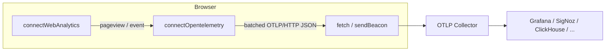
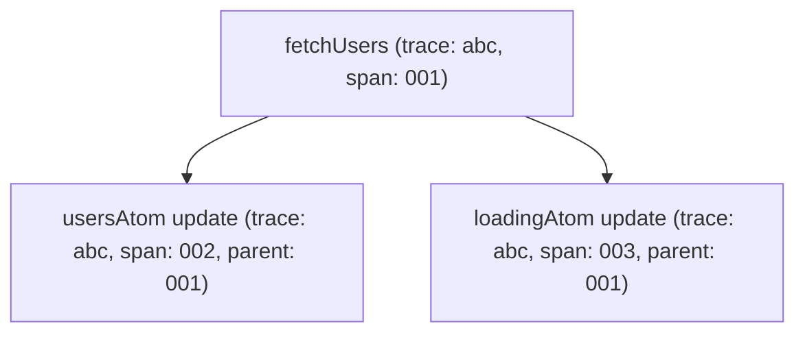

## Your Analytics Should Be Yours

Every click, every page view, every signup — these are the heartbeat of your product. Yet most teams hand that heartbeat to a third-party black box, pay a monthly fee, fight cookie banners, and still can't answer the one question that matters at 2 AM: _"is the deploy working?"_

Reatom ships a **zero-dependency, privacy-first web analytics client** that speaks the [OpenTelemetry](https://opentelemetry.io/) protocol. No vendor lock-in. No cookie consent popups. No extra `<script>` tag that adds 45 kB to your bundle. Just `connectWebAnalytics` in your setup file — and every OTLP-compatible backend (Grafana, SigNoz, Jaeger, Uptrace, your own collector) becomes your analytics dashboard.

One line to start. Full control forever.

---

## Quick Start

```typescript title="setup.ts"
import { connectWebAnalytics } from '@reatom/core'

const analytics = connectWebAnalytics({
  endpoint: 'https://otel-collector.example.com/v1/traces',
  headers: { Authorization: 'Bearer <INGEST_KEY>' },
  domain: 'myapp.com',
})
```

That is it. Pageviews, sessions, visitors, UTM campaigns, viewport sizes, referrers — everything is tracked automatically and sent as standard OTLP spans.

## Architecture Overview



`connectWebAnalytics` builds on top of `connectOpentelemetry` — the low-level OTLP transport that can also be used independently for developer tracing. The analytics layer adds session management, visitor identification, automatic pageview tracking via `urlAtom`, and a `trackEvent` action — all expressed as standard Reatom atoms and actions.

## Pageview Tracking

Pageviews are tracked automatically through Reatom's reactive `urlAtom`. Every time the URL changes (SPA navigation, `popstate`, programmatic `urlAtom.go()`), a new pageview span is created. When the user navigates away or the tab becomes hidden, the span is finalized with the real **time on page**.

```typescript
import { urlAtom, connectWebAnalytics } from '@reatom/core'

const analytics = connectWebAnalytics({
  endpoint: 'https://otel.example.com/v1/traces',
})

// SPA navigations are tracked automatically
urlAtom.go('/pricing')
// ^ creates a pageview span for /pricing

// Previous page's span is finalized with accurate duration
```

Each pageview span carries rich attributes:

| Attribute | Example | Description |
|---|---|---|
| `analytics.page.path` | `/pricing` | URL pathname (or hash path in hash mode) |
| `analytics.page.url` | `https://myapp.com/pricing?ref=home` | Full URL |
| `analytics.page.title` | `Pricing - MyApp` | Document title at the time of the pageview |
| `analytics.page.query` | `?ref=home` | Query string (when present) |
| `analytics.page.is_entry` | `true` | Whether this is the first page of the session |
| `analytics.page.referrer` | `google.com` | Referrer domain (external only) |
| `analytics.viewport.width` | `1440` | Browser viewport width |
| `analytics.viewport.height` | `900` | Browser viewport height |

Duplicate pageviews for the same path are suppressed — navigating to the current URL does not create a new span.

## Custom Event Tracking

Track goals, conversions, and user interactions with `trackEvent`:

```typescript
analytics.trackEvent('signup', {
  plan: 'pro',
  source: 'landing_cta',
})

analytics.trackEvent('purchase', {
  revenue: 49,
  currency: 'USD',
  item: 'annual_plan',
})

analytics.trackEvent('feature_used', {
  feature: 'dark_mode',
})
```

Each event becomes an OTLP span named `event:<name>` with your custom properties as attributes, plus the current page context (`analytics.page.url`, `analytics.page.path`).

Since `trackEvent` is a Reatom action, it integrates seamlessly with the rest of your state:

```typescript
import { action, wrap, connectWebAnalytics } from '@reatom/core'

const analytics = connectWebAnalytics({ endpoint: '...' })

const submitOrder = action(async (order: Order) => {
  const result = await wrap(api.createOrder(order))

  analytics.trackEvent('purchase', {
    order_id: result.id,
    total: result.total,
  })

  return result
}, 'submitOrder')
```

## Session & Visitor Management

### Sessions

A session groups user activity into a single visit. Sessions are stored in `sessionStorage` and automatically expire after **30 minutes** of inactivity (configurable via `sessionTimeout`).

The `session` atom is reactive — you can read it from anywhere in your app:

```typescript
const analytics = connectWebAnalytics({
  endpoint: '...',
  sessionTimeout: 15 * 60 * 1000, // 15 minutes
})

// Reactive session state
const session = analytics.session()
// { id: 'a1b2c3...', isNew: true, startedAt: 1710000000000, pageviews: 1 }
```

Session data exposed as OTLP resource attributes:

| Resource Attribute | Description |
|---|---|
| `analytics.session.id` | Unique session identifier |
| `analytics.session.is_new` | `true` for the first batch of a new session |

### Visitors

Each browser receives a persistent visitor ID stored in `localStorage`. It survives sessions, browser restarts, and tab closures — but never leaves the device.

| Resource Attribute | Description |
|---|---|
| `analytics.visitor.id` | Persistent 128-bit hex identifier |
| `analytics.visitor.is_new` | `true` when the visitor ID was just created |

No cookies. No fingerprinting. The ID is a random value that cannot be reversed to identify a person.

## UTM Campaign Tracking

UTM parameters are automatically extracted from the URL when a pageview is recorded:

```
https://myapp.com/signup?utm_source=google&utm_medium=cpc&utm_campaign=summer_sale
```

| Span Attribute | Extracted From |
|---|---|
| `analytics.utm.source` | `utm_source` |
| `analytics.utm.medium` | `utm_medium` |
| `analytics.utm.campaign` | `utm_campaign` |
| `analytics.utm.term` | `utm_term` |
| `analytics.utm.content` | `utm_content` |

## Resource Attributes

Every OTLP batch includes resource-level attributes that describe the browser environment:

| Resource Attribute | Example |
|---|---|
| `service.name` | `myapp.com` |
| `telemetry.sdk.name` | `reatom` |
| `telemetry.sdk.language` | `webjs` |
| `browser.language` | `en-US` |
| `user_agent.original` | `Mozilla/5.0 ...` |
| `screen.resolution` | `2560x1440` |

Resource attributes are evaluated dynamically per batch, so session changes are reflected immediately.

## Hash Mode

For applications using hash-based routing (`/#/path`), enable `hashMode` to extract the page path from the hash instead of the pathname:

```typescript
const analytics = connectWebAnalytics({
  endpoint: '...',
  hashMode: true,
})

// URL: https://myapp.com/#/settings/profile
// analytics.page.path → /settings/profile
```

## Flushing & Page Lifecycle

Spans are batched and sent periodically (default: every 5 seconds). In addition:

- **Visibility change** — when the tab becomes hidden (`document.visibilityState === 'hidden'`), all buffered spans are flushed immediately and the current pageview is finalized with accurate duration.
- **`sendBeacon` fallback** — when the page is hidden, the transport uses `navigator.sendBeacon` to reliably deliver data even during tab close or navigation away.
- **Manual flush** — call `analytics.flush()` to force-send all buffered data (also finalizes the current pageview span).

```typescript
// Force flush before a critical navigation
await analytics.flush()
window.location.href = 'https://payment-provider.com/checkout'
```

## Full Options Reference

```typescript
interface WebAnalyticsOptions {
  endpoint: string
  headers?: Record<string, string>
  domain?: string
  hashMode?: boolean
  batchInterval?: number   // default: 5000 ms
  sessionTimeout?: number  // default: 1800000 ms (30 min)
}

interface WebAnalytics {
  session: Atom<WebAnalyticsSession>
  trackEvent: Action<[name: string, props?: Record<string, string | number | boolean>], void>
  flush(): Promise<void>
  destroy(): void
}
```

| Option | Default | Description |
|---|---|---|
| `endpoint` | — | OTLP HTTP endpoint (e.g. `https://collector.example.com/v1/traces`) |
| `headers` | `{}` | Additional HTTP headers (e.g. auth tokens) |
| `domain` | `window.location.hostname` | Site domain for `service.name` resource attribute |
| `hashMode` | `false` | Extract page path from URL hash |
| `batchInterval` | `5000` | Milliseconds between batch sends |
| `sessionTimeout` | `1800000` | Milliseconds of inactivity before a new session starts |

## Low-Level: `connectOpentelemetry`

`connectWebAnalytics` is built on top of `connectOpentelemetry` — a general-purpose OTLP transport that can also be used directly for **developer observability** (tracing atoms and actions).

### Sending Custom Spans

```typescript
import {
  connectOpentelemetry,
  generateTraceId,
  generateSpanId,
} from '@reatom/core'

const otlp = connectOpentelemetry({
  endpoint: 'https://otel.example.com/v1/traces',
  resourceAttributes: {
    'service.name': 'my-app',
    'deployment.environment': 'production',
  },
})

const traceId = generateTraceId()
otlp.sendSpan({
  traceId,
  spanId: generateSpanId(),
  name: 'heavy-computation',
  startTimeMs: performance.now(),
  endTimeMs: performance.now() + 120,
  attributes: { 'compute.items': 10000 },
  status: { code: 'ok' },
})
```

### `withOpentelemetry` Extension

Apply the `withOpentelemetry` extension to individual atoms or actions to automatically trace their state changes and calls:

```typescript
import { atom, action, addGlobalExtension, connectOpentelemetry } from '@reatom/core'

const { withOpentelemetry } = connectOpentelemetry({
  endpoint: 'https://otel.example.com/v1/traces',
  resourceAttributes: { 'service.name': 'my-app' },
})

// Trace a specific atom
const counter = atom(0, 'counter').extend(withOpentelemetry)

// Trace a specific action
const fetchUsers = action(async () => {
  /* ... */
}, 'fetchUsers').extend(withOpentelemetry)

// Or trace everything globally
addGlobalExtension(withOpentelemetry)
```

When applied, each atom state change emits a span with `reatom.prevState` / `reatom.nextState` attributes, and each action call emits a span with `reatom.params` / `reatom.payload`. Trace context propagates automatically — nested action calls produce parent-child span relationships via `traceIdVar` and `spanIdVar`.



Private atoms and actions (names starting with `_`) are automatically skipped.

### `connectOpentelemetry` Options

```typescript
interface ConnectOpentelemetryOptions {
  endpoint: string
  headers?: Record<string, string>
  resourceAttributes?:
    | Record<string, string | number | boolean>
    | (() => Record<string, string | number | boolean>)
  batchInterval?: number   // default: 5000 ms
  maxBatchSize?: number    // default: 100
  scopeName?: string       // default: 'reatom'
}
```

`resourceAttributes` can be a plain object or a **function** that is evaluated on every flush — perfect for including dynamic state like session IDs.

## Why OTLP Over a Custom Protocol

Most analytics tools (Plausible, Fathom, Amplitude) define their own ingestion format. Using OpenTelemetry instead gives you:

- **Backend freedom** — switch between Grafana Cloud, self-hosted ClickHouse, SigNoz, Uptrace, or any OTLP-compatible backend without changing client code.
- **Unified observability** — your frontend analytics live in the same system as your backend traces, logs, and metrics. Correlate a slow API endpoint with a drop in conversion rate in a single query.
- **Standard tooling** — use `otel-cli`, OpenTelemetry Collector pipelines, Grafana Tempo, or any OTLP tool to inspect, filter, route, and transform your analytics data.
- **Future-proof** — OpenTelemetry is a CNCF graduated project backed by every major cloud vendor. The protocol is not going away.

## Practical Example: Full SPA Setup

```typescript title="setup.ts"
import { connectLogger, connectWebAnalytics } from '@reatom/core'

if (import.meta.env.MODE === 'development') {
  connectLogger()
}

export const analytics = connectWebAnalytics({
  endpoint: import.meta.env.VITE_OTEL_ENDPOINT,
  headers: {
    Authorization: `Bearer ${import.meta.env.VITE_OTEL_TOKEN}`,
  },
  domain: 'myapp.com',
})
```

```typescript title="features/checkout.ts"
import { action, wrap } from '@reatom/core'
import { analytics } from '../setup'

export const completeCheckout = action(async (cart: Cart) => {
  const order = await wrap(api.createOrder(cart))

  analytics.trackEvent('purchase', {
    order_id: order.id,
    total: order.total,
    items_count: cart.items.length,
  })

  return order
}, 'checkout.complete')
```

```typescript title="features/onboarding.ts"
import { action } from '@reatom/core'
import { analytics } from '../setup'

export const completeOnboardingStep = action((step: string) => {
  analytics.trackEvent('onboarding_step', { step })
}, 'onboarding.step')

export const skipOnboarding = action(() => {
  analytics.trackEvent('onboarding_skip')
}, 'onboarding.skip')
```

## Practical Example: Dev Tracing with `withOpentelemetry`

```typescript title="setup.ts"
import {
  connectOpentelemetry,
  addGlobalExtension,
  connectLogger,
} from '@reatom/core'

const { withOpentelemetry } = connectOpentelemetry({
  endpoint: import.meta.env.VITE_OTEL_ENDPOINT,
  resourceAttributes: {
    'service.name': 'my-app-frontend',
    'deployment.environment': import.meta.env.MODE,
  },
})

if (import.meta.env.MODE === 'development') {
  connectLogger()
  addGlobalExtension(withOpentelemetry)
}
```

Now every atom change and action call in development is visible in your OTLP backend — complete with timing, parameters, payloads, and parent-child relationships across async boundaries.

## Comparison with Plausible

| Feature | Plausible | Reatom Web Analytics |
|---|---|---|
| Protocol | Custom HTTP API | OpenTelemetry (OTLP/HTTP JSON) |
| Backend | Plausible Cloud / self-hosted | Any OTLP backend |
| Script size | ~1 kB external script | 0 kB extra (part of your Reatom bundle) |
| Cookie-free | Yes | Yes |
| Pageviews | Yes | Yes (reactive via `urlAtom`) |
| Time on page | Approximate | Precise (span start/end) |
| Custom events | Yes (name + single JSON prop) | Yes (name + typed key-value attributes) |
| UTM tracking | Yes | Yes |
| Session tracking | Server-side | Client-side (`sessionStorage`) |
| Visitor tracking | Server-side (IP hash) | Client-side (`localStorage`, no IP) |
| SPA support | Manual `pageview` call | Automatic via `urlAtom` integration |
| Dev tracing | No | Yes (`withOpentelemetry` extension) |
| Framework integration | None | Deep Reatom integration (atoms, actions) |
| Backend correlation | Not possible | Same OTLP pipeline as backend traces |

## Error Resilience

The analytics client is designed to never crash your application:

- **Storage unavailable** — if `localStorage` or `sessionStorage` throws (private browsing, quota exceeded), the client falls back to in-memory state and continues tracking.
- **Network failures** — failed batch sends are retried on the next flush cycle. Spans are buffered back into the queue.
- **Page unload** — `navigator.sendBeacon` ensures data delivery even during tab close.

## Cleanup

Call `destroy()` to stop tracking, unsubscribe internal effects, finalize the current pageview, and flush remaining data:

```typescript
const analytics = connectWebAnalytics({ endpoint: '...' })

// Later, when the app unmounts or analytics should stop:
analytics.destroy()
```
