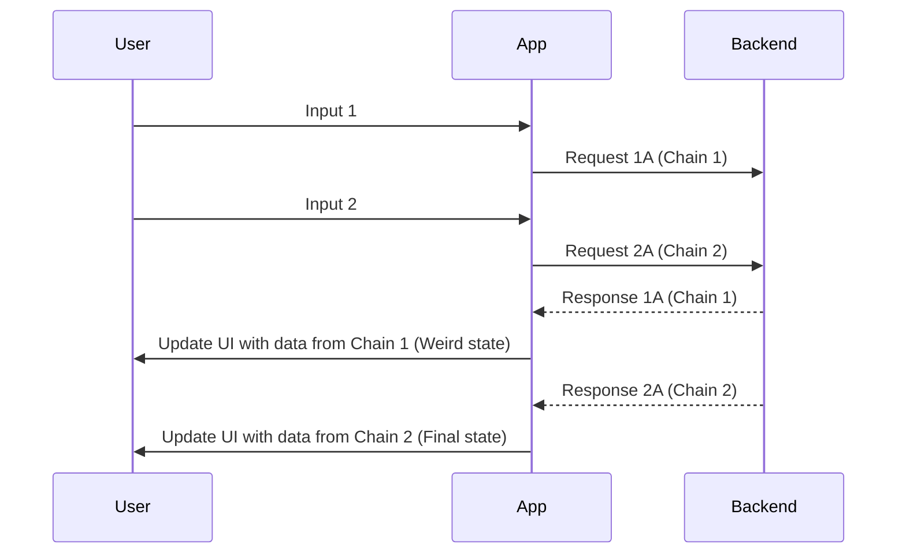
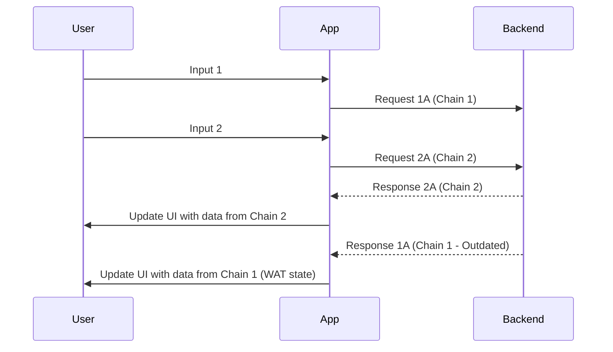
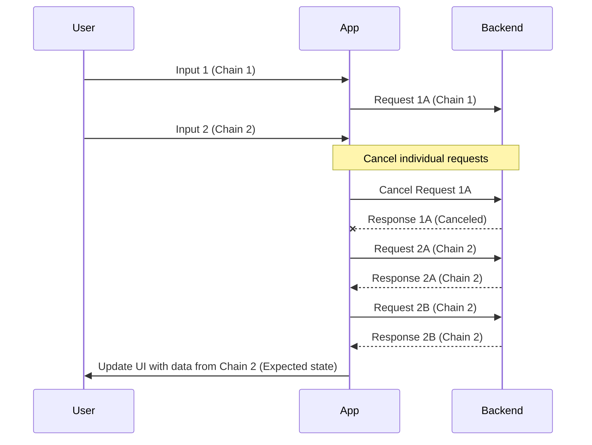
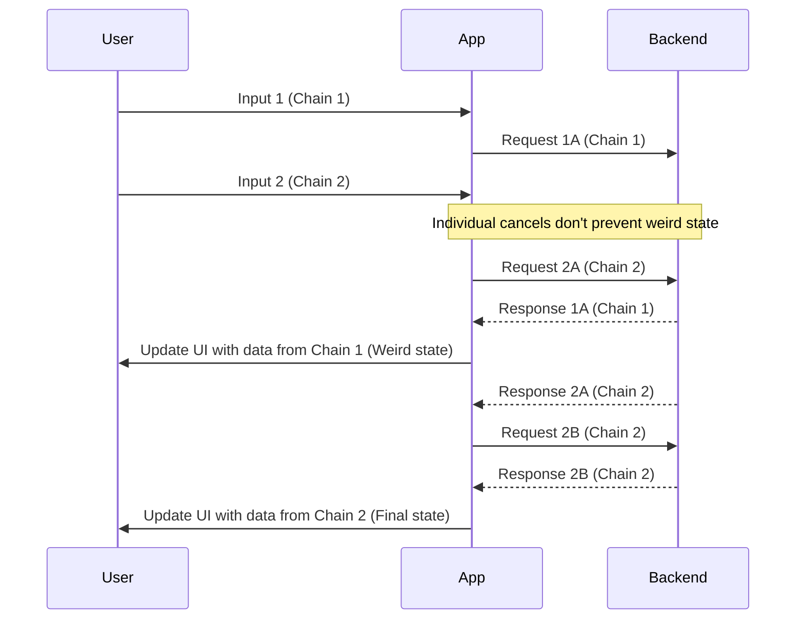
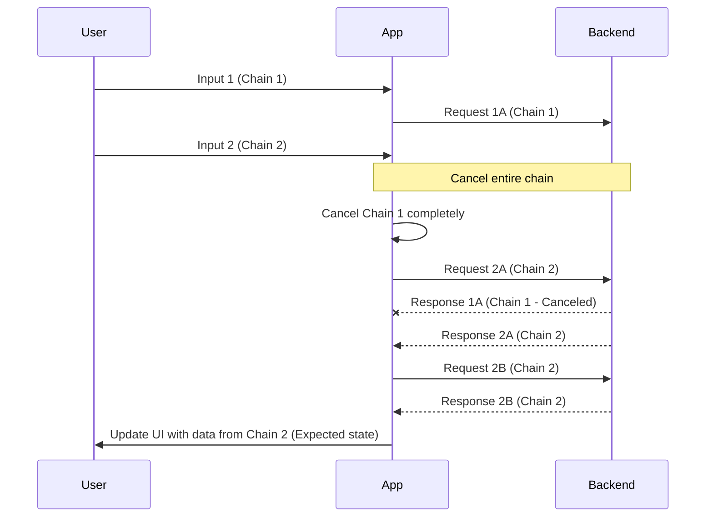

This article describes the main killer feature of redux-saga and rxjs and how you can now get it more simply, as well as about upcoming changes in the ECMAScript standard and Reatom.

We will talk about automatic cancellation of concurrent asynchronous chains - an essential property when working with any REST API and other more general asynchronous sequential operations.

## Basic Example

```javascript
const getA = async () => {
  const a = await api.getA()
  return a
}

const getB = async (params) => {
  const b = await api.getB(params)
  return b
}

export const event = async () => {
  const a = await getA()
  const b = await getB(a)
  setState(b)
}
```

The example is as basic as possible, most people have written such code: you need to first request some data from the backend, then based on that, request the final data from another endpoint. The situation is complicated if the first data depends on user input, most often these are some filters or sorting in a table. The user changes something, we make a request, the user changes something else, and we have already received a response from the previous request - this is a problem. Until the new request is completed, a "weird state" is displayed.

But this is still nonsense. The overwhelming majority of backend servers do not monitor the order of requests and can respond to the second request first, and then to the first - for the user, this will be reflected in data for old filters, and the new data will never appear - "WAT state".



How to avoid the WAT state from the example in the picture? It seems simple, cancel the last request.



It's not that difficult to cancel each specific request, although this code still needs to be written, not everyone has ready-made tools at hand. Axios itself doesn't provide such a feature out of the box; it has the ability to pass a cancellation signal, but you have to manage it yourself. No automation.

How could you do this yourself? The easiest way to add cancellation is through request versioning.

```javascript
let aVersion = 0
const getA = async () => {
  const version = ++aVersion
  const a = await api.getA()
  if (version !== aVersion) throw new Error('aborted')
  return a
}

let bVersion = 0
const getB = async (params) => {
  const version = ++bVersion
  const b = await api.getB(params)
  if (version !== bVersion) throw new Error('aborted')
  return b
}

export const event = async () => {
  const a = await getA()
  const b = await getB(a)
  setState(b)
}
```

Boilerplate? But that's not all. We only fixed the "WAT state", but what about the "weird state"?



Our attempts to cancel the previous request lead to nothing! Requests go one after another and do not overtake each other, so the final result will be correct, but what will flicker on the screen may still be unclear to the user. How to fix this? It is important to understand that an asynchronous process is not only a request to the backend, but also the entire logical chain that we describe - it is what needs to be canceled! It is very easy to imagine and visualize this - there should not be two parallel operations, only one at any given time. To do this, we will introduce a version for the entire chain.

```javascript
const getA = async (getVersion) => {
  const version = getVersion()
  const a = await api.getA()
  if (version !== getVersion()) throw new Error('aborted')
  return a
}

const getB = async (getVersion, params) => {
  const version = getVersion()
  const b = await api.getB(params)
  if (version !== getVersion()) throw new Error('aborted')
  return b
}

let version = 0
const getVersion = () => version
export const event = async () => {
  version++
  const a = await getA(getVersion)
  const b = await getB(getVersion, a)
  setState(b)
}
```

Here we do not use `getVersion` from the closure in each request, because in real code these functions can be scattered across different files, and we have to declare a common contract - passing the version function as the first argument.

But the problem is solved! Chain cancellation prevents "weird state".



"WAT state" - can no longer appear either.



But the code looks very verbose. We can simplify it a bit using the native AbortController, which is already well supported in browsers and node.js.

```javascript
const getA = async (controller) => {
  const a = await api.getA()
  controller.throwIfAborted()
  return a
}

const getB = async (controller, params) => {
  const b = await api.getB(params)
  controller.throwIfAborted()
  return b
}

let controller = new AbortController()
export const event = async () => {
  controller.abort('concurrent')
  controller = new AbortController()
  const a = await getA(controller)
  const b = await getB(controller, a)
  setState(b)
}
```

It got better and, I hope, clearer, but it still looks inconvenient and verbose, the controller has to be passed manually, is it worth it? In my practice, no one did this, because no one will rewrite all functions so that they interact normally with each other and the code is more consistent. Just as no one makes all functions async at all, you can read more about this in [How do you color your functions?](https://elizarov.medium.com/how-do-you-color-your-functions-a6bb423d936d). It is important to understand that the described example is as simplified as possible, and in real tasks, the data flow and the corresponding problem can be much more complex and serious.

What are the alternatives? rxjs and redux-saga allow you to describe code in their specific API, which under the hood automatically tracks concurrent calls of asynchronous chains and can cancel outdated ones. The problem with this is precisely in the API - it is very specific, both in appearance and behavior - the entry threshold is quite large. Although less than in $mol - yes, it also knows how to do automatic cancellation.

Here is an example with rxjs.

```javascript
import { from, Subject } from 'rxjs'
import { switchMap } from 'rxjs/operators'

const getA = async () => {
  const a = await api.getA()
  return a
}

const getB = async (params) => {
  const b = await api.getB(params)
  return b
}

export const event$ = new Subject()
event$
  .pipe(
    switchMap(() => from(getA())),
    switchMap((a) => from(getB(a))),
  )
  .subscribe((b) => setState(b))
```

In `@reduxjs/toolkit`, there is `createListenerMiddleware`, whose API has some features from redux-saga that allow solving primitive cases of this problem. But chain tracking is more local and not as well integrated into the entire toolkit API.

What other options do we have?

## Context

In this article, we've primarily discussed automatic cancellation of asynchronous chains, but this is actually a specific application of a more fundamental concept: **asynchronous context**. Async context is essentially the ability to access shared data across asynchronous boundaries, similar to how you can access variables in lexical scope, but preserved through asynchronous operations via call stack.

### Why Async Context Matters

On backend platforms, asynchronous context has been a crucial tool for building reliable systems for years. Node.js provides [AsyncLocalStorage](https://nodejs.org/api/async_context.html) which allows developers to store and retrieve data across async operations without explicitly passing it through every function call. This enables important functionality like request-scoped logging, distributed tracing, and—as we've seen—automatic cancellation of outdated operations.

The importance of async context is so well recognized that there's currently an active TC39 proposal to include it in the ECMAScript standard: [tc39/proposal-async-context](https://github.com/tc39/proposal-async-context). This proposal would bring native async context to all JavaScript environments, including browsers.

### From Manual Passing to Automatic Context

Let's see how our example would look using the proposed AsyncContext API:

```javascript
// https://github.com/tc39/proposal-async-context#proposed-solution

let prevAbort = new AbortController()
const abortVar = new AsyncContext.Variable()

const getA = async () => {
  const a = await api.getA()
  const controller = abortVar.get()
  controller.throwIfAborted()
  return a
}

const getB = async (params) => {
  const b = await api.getB(params)
  abortVar.get().throwIfAborted()
  return b
}

export const event = async () => {
  prevAbort.abort('concurrent')
  prevAbort = new AbortController()
  await abortVar.run(prevAbort, async () => {
    const a = await getA()
    const b = await getB(a)
    setState(b)
  })
}
```

The code is significantly cleaner than our previous manual implementations. The standard AbortController is stored in an AsyncContext.Variable, and each asynchronous function retrieves it automatically from the context rather than receiving it as an explicit parameter.

But is it possible to use this approach today? Unfortunately, not quite. The TC39 proposal is still in the early stages, and existing polyfills like zone.js (used by Angular) don't comprehensively cover all edge cases.

### Reatom's Implementation of Async Context

Reatom offers a pragmatic solution by implementing its own async context system that works today. At its core, Reatom provides:

1. A `variable()` function that emulates AsyncContext.Variable
2. A `wrap()` function that preserves context across async boundaries
3. A `withAbort()` extension that automatically handles cancellation (will study it later)

Here's how the same example looks using Reatom's API.

```javascript
import { variable, wrap } from '@reatom/core'

let prevAbort = new AbortController()
const abortVar = variable()

const getA = async () => {
  const a = await wrap(api.getA())
  const controller = abortVar.get()
  controller.throwIfAborted()
  return a
}

const getB = async (params) => {
  const b = await wrap(api.getB(params))
  abortVar.get().throwIfAborted()
  return b
}

export const event = async () => {
  prevAbort.abort('concurrent')
  prevAbort = new AbortController()
  await abortVar.run(prevAbort, async () => {
    const a = await wrap(getA())
    const b = await wrap(getB(a))
    setState(b)
  })
}
```

This code is remarkably close to our original synchronous-looking example, with just a few added calls to `wrap()` to maintain context across async operations.

And even more! Reatom has build in `abortVar` which automatically tracked by all `wrap` calls, so you don't need to check abort controller manually.

```javascript
import { abortVar, wrap } from '@reatom/core'

let prevAbort = new AbortController()

const getA = async () => {
  const a = await wrap(api.getA())
  return a
}

const getB = async (params) => {
  const b = await wrap(api.getB(params))
  return b
}

export const event = async () => {
  prevAbort.abort('concurrent')
  prevAbort = new AbortController()
  await abortVar.run(prevAbort, async () => {
    const a = await wrap(getA())
    const b = await wrap(getB(a))
    setState(b)
  })
}
```

Under the hood Reatom operates its own async context by wrapping the run callback into "action", a special function decorator, which creates a manageable frames for async stack emulation.

You can use actions by yourself to simplify codestyle. Also, Reatom has built-in actions extension to manage previous controller handling! Check the end example with idempotent reatom code.

```javascript
import { action, wrap, withAbort } from '@reatom/core'

const getA = async () => {
  const a = await wrap(api.getA())
  return a
}

const getB = async (params) => {
  const b = await wrap(api.getB(params))
  return b
}

export const event = action(async () => {
  const a = await wrap(getA())
  const b = await wrap(getB(a))
  setState(b)
}).extend(withAbort())
```

This final example shows the most elegant way to handle async request cancellation with Reatom. The `action` wrapper creates a special function that creates an async context frame for each call, while `withAbort()` extension automatically handles aborting previous executions when a new one starts. This approach completely eliminates the need for manual abort controller management - you don't need to create, store, or pass AbortController instances anymore. The cancellation happens automatically when concurrent calls are made to the same action.

What's particularly powerful is that this cancellation propagates through the entire chain of wrapped calls. When `event` is called concurrently, the entire previous execution chain (including both `getA` and `getB` calls) will be properly aborted, preventing any stale updates or race conditions. All of this is achieved with minimal additions to the original code structure, making it much more maintainable than alternatives.

### Advantages of Reatom's Approach

Reatom's implementation offers several key advantages over other solutions:

1. **Minimal API Surface**: Reatom's approach requires minimal additions to your code—just wrap async operations and apply the withAbort extension—unlike rxjs or redux-saga which require learning entirely new paradigms.

2. **Native AbortController Integration**: Reatom uses the standard AbortController that's already widely supported in browsers and node.js, as well as many libraries. This means you can easily connect Reatom's cancellation system to native APIs like fetch.

3. **Lightweight**: The bundle size overhead is significantly smaller than alternatives like rxjs.

4. **Developer Experience**: The code remains highly readable and close to standard async/await patterns, lowering the learning curve.

5. **Debuggability**: Reatom provides complete traceability for all actions and includes a built-in logging system that works out of the box. This makes tracking async workflows and identifying issues much easier than with traditional approaches, where you'd need to manually add logging throughout your code.

P.S. we have more features on top of async context, including transactions with automatic rollbacks! Come to our docs 🙌
