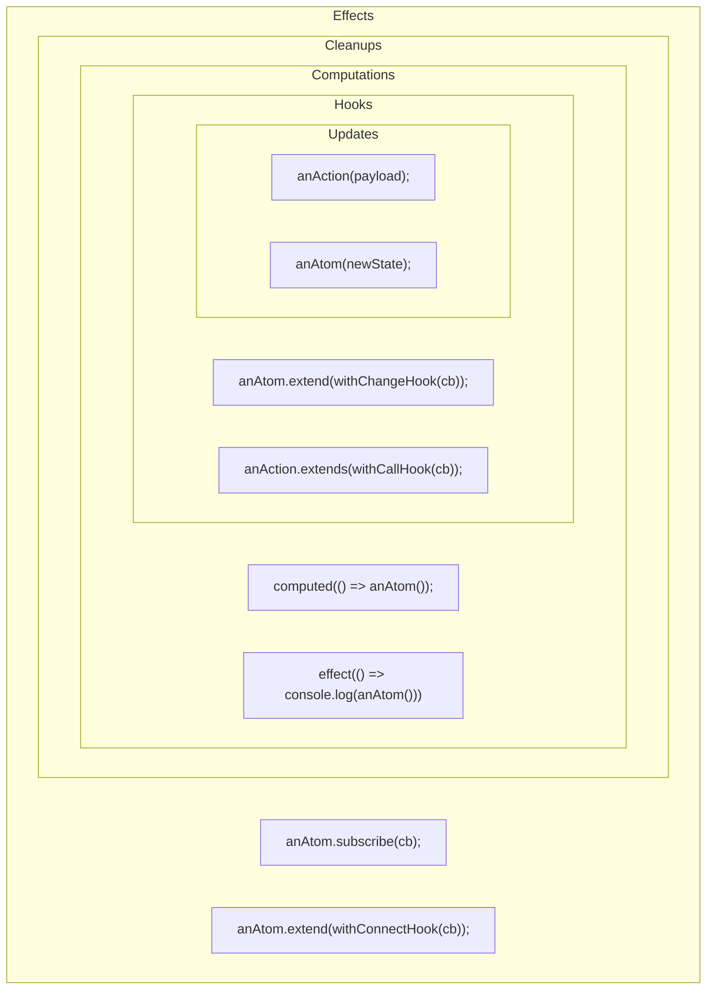

## Lifecycle

Reatom is heavily inspired by the [actor model](https://en.wikipedia.org/wiki/Actor_model), which emphasizes that each component of the system is isolated from the others.
This isolation is achieved because each component has its own state and lifecycle.

This concept is applied to atoms in Reatom.
We have an API allows you to create a system of components that are independent of each other and can be used in different modules with minimal setup.
This is one of Reatom's main advantages over other state management libraries.

For example, you can create a data resource that depends on a backend service and will connect to the service only when the data atom is used.
This is a very common scenario for frontend applications.
In Reatom, you can achieve this using lifecycle hooks.

```ts
import { atom, action, withConnectHook } from '@reatom/core'

export const fetchList = action(async () => {
  const data = await wrap(api.getList())
  list.set(data)
}, 'fetchList')
export const list = atom([], 'list').extend(withConnectHook(fetchList))
```

What happens here?
We want to fetch the list only when a user navigates to the relevant page and the UI subscribes to `list` atom.
This works similarly to `useEffect(fetchList, [])` in React.
Since atoms represent shared state, the connection status is "one for many" listeners, meaning an `withConnectHook` hook triggers only for the first subscriber and not for new listeners.

This is extremely useful because you can use `list` atom in multiple components to reduce props drilling, but the side effect is requested only once.
If the user leaves the page and all subscriptions are gone, the atom is marked as _unconnected_, and the `withConnectHook` will be called again only when a new subscription occurs.

An important aspect of atoms is that they are lazy.
This means they will only connect when they are used.
This connection is triggered by `ctx.subscribe`, but the magic of Reatom's internal graph is that ` also(establishes connections.

So, if you have a main data atom, compute other atoms from it, and use these computed atoms in some components, the main atom will only connect when one of those components is mounted.

```ts
const filteredList = computed(() => list().filter(somePredicate))
filteredList.subscribe(sideEffect)
```

The code above will trigger the `list` atom connection and the `fetchList` call as expected.

> Note that the relationships between computed atoms are unidirectional. This means `filteredList` depends on `list` atom. Therefore, `list` atom is unaware of `filteredList`. If you use `withConnectHook(filteredList)` and only `list` atom has a subscription, the callback will **not** be invoked.

When you use an adapter package like `react`, it utilizes `.subscribe` under the hood to listen to the atom's fresh state.
So, if you connect an atom using `reatomComponent`, the atom will be connected when the component mounts.

Now, you have lazy computations and **lazy effects**!

This pattern allows you to control data requirements in the view layer or any other consumer module implicitly, while being explicit for data models.
There's no need for additional _start_ actions or similar mechanisms.
This approach leads to cleaner and more scalable code, enhancing the reusability of components.

### Lifecycle scheme

Reatom operates a few queues to manage updates, hooks, computations, cleanups and effects with different priorities to achieve most intuitive and efficient execution order, with batching and transactions. We have a few nested loops, which works the same way as "tasks" and "microtasks" in a browser: a parent loop tick wait all children loops to complete.

- **Updates**
  > `anAction(payload);` `anAtom(newState);`
  - **Hooks**
    > `anAtom.extend(withChangeHook(cb));` `anAction.extends(withCallHook(cb));`
    - **Computations**
      > `computed(() => anAtom( + 1);` `effect(() => console.log(anAtom())`
    - **Cleanups** (for actions temporal state clearing)
      - **effects**
        > `anAtom.subscribe(cb);` `schedule(cb);` `anAtom.extend(withConnectHook(cb));`

In other words, each effect will be processed after all computations (and cleanups), and each computation will be processed after all hooks, and each hook will be processed after all updates, which archived by scheduling the hooks calling to the next microtask tick.

Here is a visual diagram:


