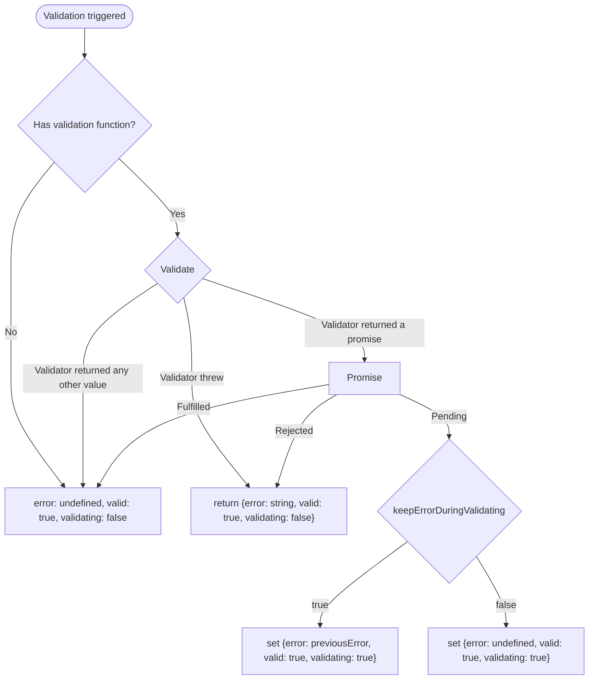

This is a general form library with a simple focus and validation management.

**The API is unstable and will be changed during minor updates!** Sorry for the semver mismatch, the first releases contained A LOT OF bugs and should have been released with an "experimental" tag. Until this note is present here, please don't consider the library stable.

The form API is designed for the best type-safety and flexibility. Instead of setting up the form state with a single object, each field is created separately, giving you the ability to fine-tune each field perfectly. As the field and its meta statuses are stored in atoms, you can easily combine them, define hooks, and effects to describe any logic you need.

The cherry on the cake is dynamic field management. You don't need to use weird string APIs like `form.${index}.property`. Instead, you can simply have a list of fields using [atomization](/handbook/atomization/).

## Usage

```ts
import { reatomForm, reatomField } from '@reatom/core'

// Create fields directly
export const nameField = reatomField('', 'nameField')
export const passwordField = reatomField('', {
  name: 'passwordField',
  validate({ state }) {
    if (state.length < 6)
      throw new Error('The password should have at least six characters.')
  },
})

// Create a form with the fields
export const loginForm = reatomForm({
  username: nameField,
  password: passwordField
}, {
  name: 'form',
  async onSubmit(state) {
    //           ^? ParseAtoms<typeof loginForm.fields>
    const user = await api.login({
      name: state.username,
      password: state.password,
    })
  },
})
```

### Form with Schema Validation
The `schema` option supports any schema that implements the [Standard Schema interface](https://github.com/standard-schema/standard-schema)

```ts
import { reatomForm, fieldArray } from '@reatom/core'
import { z } from 'zod'

// Create a form with schema validation
const userForm = reatomForm({
  username: '',
  email: '',
  addresses: fieldArray([
    {
      street: '',
      city: '',
      zipCode: ''
    }
  ])
}, {
  name: 'form',
  // Schema validation using zod
  schema: z.object({
    username: z.string().min(3, 'Username must be at least 3 characters'),
    email: z.string().email('Invalid email format'),
    addresses: z.array(
      z.object({
        street: z.string().min(1, 'Street is required'),
        city: z.string().min(1, 'City is required'),
        zipCode: z.string().regex(/^\d{5}$/, 'Invalid zip code format')
      })
    )
  }),
  async onSubmit(state) {
    //           ^? z.infer<typeof schema>
  }
})
```

## Field Initialization

When creating a form, you can initialize fields in several ways:

### Field Initialization Options

1. **Primitive Values**:

By passing a primitive value, you implicitly initialize a reatomField with that value as its default.
This way is suitable when no individual options are needed for the field.
```ts
const form = reatomForm({
  username: '', // String field
  age: 25, // Number field
  isActive: true, // Boolean field
  birthDate: new Date(), // Date field
}, 'form')
```

2. **Field Options Object**:

By passing an object with `initState` property, you can initialize a reatomField with a value as its default, and pass additional options for the field.
```ts
const form = reatomForm({
  username: { 
    initState: '', 
    validateOnChange: true,
    validate: ({ state }) => {
      if (state.length < 3) throw new Error('Too short')
    }
  },
  age: { 
    initState: 25, 
    validateOnBlur: true 
  }
}, 'form')
```

3. **Existing `reatomField` Instances**:

```ts
const usernameField = reatomField('', 'usernameField').extend(withLocalStorage())
const ageField = reatomField(25, 'ageField')

const form = reatomForm({
  username: usernameField,
  age: ageField
}, 'form')
```
You are free to attach existing fields to the form. However, note that in this case, the fields will not receive naming scoped to the form domain. 
For better debbuging experience, it is recommended to initialize fields directly within the form's field tree, initializing the name similar to how it is done in factories. 
For this purpose, the form's initState accepts a callback with the `name` parameter.

```ts
import { reatomForm, reatomField } from '@reatom/core'

const form = reatomForm(name => ({
  username: reatomField('', `${name}.username`),
  password: reatomField('', `${name}.password`),
}), 'form')
```

4. **Atoms Extended with `withField`**:

Also, you can extend existing smart atoms with the field functionality. In this case, the atom itself will become the state of the field, and any methods that mutate the extended atom will change the state of this field.
```ts
import { reatomBoolean } from '@reatom/primitives'
import { withField } from '@reatom/core'

const form = reatomForm(name => ({
  active: reatomBoolean(false, `${name}.active`).pipe(withField())
}), 'form')
```

## Array Fields

The `fieldArray` function allows you to create dynamic arrays of fields that can be added, removed, and manipulated.

### Array Fields Initialization

There are several ways to initialize array fields:

1. **Simple Array Literals**:
```ts
const form = reatomForm({
  // Empty array field
  tags: [],
  
  // Array with default item as a string field
  emails: ['default@example.com'],
  
  // Array with default item as a string field through options definition
  phones: [
    { initState: '123-456-7890', validateOnChange: true }
  ]
}, 'form')
```

2. **Empty Array with Type Information**:
```ts
const form = reatomForm({
  // Empty array with correct type information
  emails: new Array<string>(),
  contacts: new Array<{ name: string, phone: string }>()
}, 'form')
```

3. **Using fieldArray Function**:
```ts
const form = reatomForm({
  // Empty array field
  tags: fieldArray<string>([]),
  
  // Array with default values
  emails: fieldArray(['default@example.com']),
}, 'form')
```

4. **Complex Array Field Factory**:

If you want to configure the rules for creating fields in an array field, you should define a factory function that describes how each new field in this array field will be created.
```ts
const form = reatomForm({
  // Using initState and create
  phoneNumbers: fieldArray({
    initState: [{ number: '123-456-7890', priority: false }],
    create: ({ number, priority }, name) => ({
      number: { initState: number, validateOnChange: true },
      priority: reatomBoolean(priority, `${name}.priority`).pipe(withField())
    })
  }),
}, 'form')
```

### Basic Array Field Operations
Since `fieldArray` is syntactic sugar over `reatomLinkedList`, it provides several methods to manipulate the array of fields:

- `create(value)`: Adds a new field with the given value to the end of the array
- `remove(field)`: Removes a specific field from the array
- `clear()`: Removes all fields from the array
- `array()`: Returns an array of all fields, which you should use to iterate over the fields
- `swap(field1, field2)`: Swaps the positions of two fields in the array
- `move(field, targetField)`: Moves a field to a position after the target field (use null to move to the beginning)
- `find(predicate)`: Finds a field in the array that matches the predicate function

When rendering field arrays in UI components, you should always use the `.array()` method to iterate over the fields.

```ts
import { reatomForm, fieldArray } from '@reatom/core'

const contactForm = reatomForm({
  name: '',
  emails: fieldArray(['']) // Simple array of string fields
}, 'form')

// Add a new email field
contactForm.fields.emails.create('')

// Access the array of email fields
const emailFields = contactForm.fields.emails.array()

// Iterate over the fields to render them
// In React, this would look like:
// {emailFields.map((emailField) => (
//   <EmailFieldComponent key={emailField.name} field={emailField} />
// ))}

// Remove a specific email field
contactForm.fields.emails.remove(emailFields[0])

// Clear all email fields
contactForm.fields.emails.clear()
```

Since we use the "field as model" approach and each field is an object, we can achieve maximum type safety by working directly with objects. But the cherry on top is atomization, a principle used by array fields that allows maintaining a high-quality type-safe experience at any level of nesting in your forms.

### Complex Array Fields
You can create more complex array fields with custom structures:

```ts
import { reatomForm, fieldArray, withField } from '@reatom/core'
import { reatomBoolean } from '@reatom/primitives'

const contactForm = reatomForm({
  name: '',
  phoneNumbers: fieldArray({
    initState: new Array<{ number: string, priority: boolean }>(),
    create: ({ number, priority }, name) => ({
      number,
      priority: reatomBoolean(priority, `${name}.priority`).pipe(withField())
    })
  })
}, 'form')

// Add a new phone number
contactForm.fields.phoneNumbers.create({ 
  number: '123-456-7890', 
  priority: false 
})
```

### Nested Array Fields

You can also create nested array structures:

```ts
import { reatomForm, fieldArray } from '@reatom/core'

const userForm = reatomForm({
  name: '',
  addresses: fieldArray([
    {
      street: '',
      city: '',
      tags: fieldArray(['home'])
    }
  ])
}, 'form')

// Access nested fields
const addresses = userForm.fields.addresses.array()
const firstAddressTags = addresses[0]?.tags.array()
```

## Fields sets

Field sets allow you to group related fields together and manage them as a single unit. This is useful for organizing complex forms into logical sections, such as steps in a multi-step form, or for tracking the combined state of multiple fields without creating a full form.

### Creating and Using Field Sets in Multi-step Forms

A common use case for field sets is creating multi-step forms where each step has its own validation and state management:

```ts
import { reatomForm, reatomFieldSet } from '@reatom/core'

const checkoutForm = reatomForm({
  personal: {
    firstName: '',
    lastName: '',
    email: {
      initState: '',
      validate: ({ state }) => invariant(state.includes('@'), 'Invalid email format')
    }
  },
  shipping: {
    address: '',
    city: '',
    zipCode: {
      initState: '',
      validate: ({ state }) => invariant(/^\d{5}$/.test(state), 'Invalid zip code format')
    }
  }
}, 'checkoutForm')

// Create field sets for each step
const personalInfoSet = reatomFieldSet(checkoutForm.fields.personal, 'checkoutForm.personalInfoSet')
const shippingInfoSet = reatomFieldSet(checkoutForm.fields.personal, 'checkoutForm.shippingInfoSet')
```

Each field set (`personalInfoSet` and `shippingInfoSet`) provides access to:

- `fieldsState`: The combined state of all fields in the set
- `validation`: The combined validation status of all fields in the set
- `focus`: The combined focus status of all fields in the set
- Other methods like `reset`, `init` and properties as in the forms

Field sets are particularly useful for multi-step forms because they allow you to validate each step independently before allowing the user to proceed to the next step, or for reactive calculations for groups of fields.

## Recipes
By composing form and reatom primitives, you can solve long-standing problems in forms as effectively as other libraries do through configuration.

### Async default values

This recipe shows how to load form values from an API. It creates an async action that fetches data and resets the form with the retrieved values when the request completes. The `ready` atom can be used to show a loading state.

```ts
import { reatomForm, computed, withAsync, wrap } from '@reatom/core'

const profileForm = reatomForm({
  username: '',
  address: ''
}, 'profileForm')

const fetchFormValues = computed(
  async () => {
    const response = await wrap(fetch('/api/profile'));
    return wrap(response.json());
  },
  'fetchFormValues'
).extend(withAsync())

fetchFormValues.onFulfill.extend(
  withCallHook(defaultValues => profileForm.reset(defaultValues))
)

fetchFormValues.ready() // Use this atom to show loading state
```

### Async validation debounce

This recipe implements debounced validation for a field. Thanks to reatom's concurrency mechanism, each new validation call automatically cancels the previous one. The field waits 300ms before making an API request to check if a username is already taken.

```ts
import { reatomField, sleep, abortVar, wrap } from '@reatom/core'

const usernameField = reatomField('', {
  validate: async ({ value }) => {
    wrap(await sleep(300));
    const response = await wrap(fetch(`/api/usernames?username=${state}`, abortVar.getController()));
    const { taken } = await wrap(response.json());
    invariant(!taken, 'This username already taken');
  }
}, 'usernameField')
```

The `abortVar.getController()` provides an AbortController that automatically cancels previous fetch requests when a new validation is triggered, preventing race conditions and unnecessary network requests.

### Dependent validation

There are two approaches to implement validation that depends on other fields.

The first approach uses field-level validation. The `confirmPassword` field directly accesses the value of the `password` field to perform the comparison:

```ts
import { reatomForm } from '@reatom/core'

const loginForm = reatomForm(name => ({
  username: reatomField('', `${name}.username`),
  password: reatomField('', `${name}.password`),
  confirmPassword: reatomField('', {
    name: `${name}.confirmPassword`,
    validate: ({ value }) => {
      if (loginForm.fields.password.value() != value)
        throw new Error('Passwords do not match')
    }
  })
}), 'loginForm')
```

The second approach uses schema-level validation with Zod. This centralizes validation logic in the schema and uses the `refine` method to add a custom validation rule:

```ts
import { reatomForm } from '@reatom/core'
import { z } from 'zod'

const schema = z.object({
  username: z.string(),
  password: z.string(),
  confirmPassword: z.string(),
}).refine((values) => values.password === values.confirmPassword, {
  message: 'Passwords do not match',
  path: ['confirmPassword'],
});

const loginForm = reatomForm(name => ({
  username: reatomField('', `${name}.username`),
  password: reatomField('', `${name}.password`),
  confirmPassword: reatomField('', `${name}.confirmPassword`)
}), {
  name: 'loginForm',
  schema
})
```

### Autofocus on error

This recipe demonstrates how to automatically focus on the first field with a validation error after a form submission fails. This improves user experience by directing their attention to the field that needs correction.

Each field has an `elementRef` property that can be used to store a reference to the DOM element associated with the field. The `elementRef` interface matches the `HTMLElement` interface, allowing you to call standard DOM methods like `focus()`.

```ts
const form = reatomForm({
  email: '',
  age: 12
}, {
  schema: z.object({
    email: z.string().email(),
    age: z.number().min(18),
  })
})

form.submit.onReject.extend(
  withCallHook(() => {
    const errorField = form.fieldsList().find(field => !!field.validation().error);
    errorField?.elementRef()?.focus();
  })
)
```

You can extend the `elementRef` type using interface augmentation if you need to store additional data or custom properties. This is particularly useful when working with custom input components that might have their own API beyond the standard HTMLElement interface.

## Form API

The form created with `reatomForm` has the following properties:

- `fields`: Object containing all the fields created for this form.
- `fieldsState`: Atom with the state of the form, computed from all the fields.
- `focus`: Atom with focus state of the form, computed from all the fields.
- `init`: Action to initialize the form with a partial state.
- `reset`: Action to reset the state, the value, the validation, and the focus states.
- `submit`: Submit async handler. It checks the validation of all the fields, calls the form's `validate` options handler, and then the `onSubmit` options handler.
- `submitted`: Atom indicating if the form has been submitted.
- `validation`: Atom with validation state of the form, computed from all the fields.

### Form Options

- `name`: The name of the form (optional, auto-generated if not provided).
- `onSubmit`: The callback to process valid form data.
- `resetOnSubmit`: Should reset the state after successful submit? (default: `true`).
- `validate`: The callback to validate form fields.
- `schema`: A schema for validation (supports StandardSchemaV1 specification, like Zod, Valibot, etc).
- `validateOnChange`: Defines if validation should be triggered with every field change by default for all fields (default: `false`).
- `validateOnBlur`: Defines if validation should be triggered on field blur by default for all fields (default: `false`).
- `keepErrorDuringValidating`: Defines the default reset behavior of the validation state during async validation for all fields (default: `false`).
- `keepErrorOnChange`: Defines the default reset behavior of the validation state on field change for all fields (default: `!validateOnChange`).

### Form Validation Behavior

The `form.submit` call triggers the validation process of all related fields. If a schema is provided, it will be used to validate the form state. After that, the validation function from the options will be called. If there are no validation errors, the `onSubmit` callback in the options is called.

You can track the submitting process in progress using `form.submit.statusesAtom`.

## Field API

A field created with `reatomField` is an atom, and you can change it like a regular atom by calling it with the new value or reducer callback.

The field stores "state" data. However, there is an additional `value` atom that stores "value" data, which could be a different kind of state related to the UI. For example, for a select field, you might want to store the `string` "state" and `{ value: string, label: string }` "value," which will be used in the "Select" UI component.

Here is the list of all additional properties and methods:

- `initState`: The initial state of the field.
- `focus`: Record atom with all related focus statuses:
  - `active`: The field is focused.
  - `dirty`: The field's state is not equal to the initial state.
  - `touched`: The field has gained and lost focus at some point.
  - `in`: Action for handling field focus.
  - `out`: Action for handling field blur.
- `validation`: Record atom with all related validation statuses:
  - `error`: The field validation error text, undefined if the field is valid.
  - `meta`: Additional validation metadata.
  - `triggered`: The validation actuality status.
  - `validating`: The field async validation status.
  - `trigger`: Action to trigger field validation.
  - `setError`: Action to set an error for the field.
- `value`: Atom with the "value" data, computed by the `fromState` option.
- `change`: Action for handling field changes, accepts the "value" parameter and applies it to `toState` option.
- `reset`: Action to reset the state, the value, the validation, and the focus.
- `disabled`: Atom that defines if the field is disabled.
- `elementRef`: Atom with an element reference. Should be synchronized with the actual DOM element.
- `keepErrorDuringValidating`: Atom that defines the reset behavior of the validation state during async validation.
- `keepErrorOnChange`: Atom that defines the reset behavior of the validation state on field change.
- `validateOnChange`: Atom that defines if the validation should be triggered with every field change.
- `validateOnBlur`: Atom that defines if the validation should be triggered on the field blur.

By combining these statuses you can derive additional meta information:

- `!touched && active` - the field got focus for the first time
- `touched && active` - the field got focus again

### Disabled Fields Behavior

When fields are disabled, they no longer automatically trigger their own validation. In field sets, these disabled fields are excluded from the `validation` and `focus` computations, meaning they are not considered in the validation process according to the schema. This ensures that disabled fields do not affect the validation status of the form or field set they belong to.

### Field Options

- `name`: The name of the field (optional, auto-generated if not provided).
- `filter`: The optional callback to filter "value" changes (from the 'change' action). It should return 'false' to skip the update. By default, it always returns `true`.
- `fromState`: The optional callback to compute the "value" data from the "state" data. By default, it returns the "state" data without any transformations.
- `isDirty`: The optional callback used to determine whether the "value" has changed. Accepts context, the new value and the old value. By default, it utilizes `isDeepEqual` from reatom/utils.
- `toState`: The optional callback to transform the "state" data from the "value" data from the `change` action. By default, it returns the "value" data without any transformations.
- `validate`: The optional callback to validate the field.
- `contract`: The optional callback to validate field contract.
- `disabled`: Defines if the field is disabled by default.
- `elementRef`: Defines a default element reference accosiated with the field.
- `keepErrorDuringValidating`: Defines the reset behavior of the validation state during async validation (default: `false`).
- `keepErrorOnChange`: Defines the reset behavior of the validation state on field change (default: `!validateOnChange`).
- `validateOnBlur`: Defines if the validation should be triggered on the field blur (default: `false`).
- `validateOnChange`: Defines if the validation should be triggered with every field change (default: `false`).

### Field Validation Behavior

You can set a validation function and manage validation triggers using the options. The validation flow works as follows:

1. When validation is triggered, the system checks if a validation function exists
2. If no validation function exists, the field is marked as valid
3. If a validation function exists, it is executed
4. If the validator throws an error, the field is marked as invalid with the error message
5. If the validator returns a promise (async validation):
   - The field is marked as validating
   - If `keepErrorDuringValidating` is true, the previous error is preserved during validation
   - If `keepErrorDuringValidating` is false, the error is cleared during validation
   - When the promise resolves, the field is marked as valid
   - When the promise rejects, the field is marked as invalid with the error message


