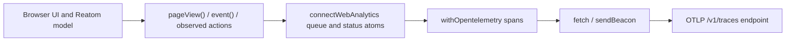

## A tiny hello from the observability department

Welcome, curious builders, Plausible admirers, dashboard minimalists, and everyone who ever thought:
"Why is my analytics SDK bigger than the feature it measures?"

This page introduces a small Reatom-first analytics layer that speaks raw OpenTelemetry protocol, keeps your model explicit, and stays close to the browser platform.

The rest of this article is technical.

## What it is

Reatom now provides two complementary APIs for browser analytics and telemetry:

- `withOpentelemetry` - a reusable extension for atoms and actions which turns Reatom activity into OTLP-compatible spans
- `connectWebAnalytics` - a browser analytics client built on top of `withOpentelemetry`, focused on page views, custom events, session state, queueing, and delivery

This gives you a lightweight alternative to Plausible-style analytics, but without a vendor SDK and without giving up structured telemetry.

## Why OTLP here

Most web analytics tools ask you to buy into a proprietary event model first and a transport format second.
This module starts from the opposite side:

- use a small product-friendly event surface for page views and custom events
- send the result through OpenTelemetry HTTP protocol
- keep the transport open for any backend that accepts OTLP traces

That means you can point the client to your own collector, a hosted observability platform, or a custom ingestion service.

## Architecture



## Quick start

```ts title="src/setup.ts"
import { connectWebAnalytics } from '@reatom/core'

export const analytics = connectWebAnalytics({
  endpoint: 'https://otel.example.com',
  serviceName: 'shop-web',
  serviceVersion: '1.4.0',
  environment: 'production',
})
```

This setup gives you:

- automatic initial page view
- SPA navigation tracking
- session state
- offline queueing
- reconnect flush
- `pagehide` and `visibilitychange` delivery
- raw OTLP trace payloads over HTTP

## Example: track product page views

```ts title="src/setup.ts"
import { connectWebAnalytics } from '@reatom/core'

export const analytics = connectWebAnalytics({
  endpoint: 'https://otel.example.com',
  serviceName: 'catalog-web',
  resourceAttributes: {
    'service.namespace': 'storefront',
    region: 'eu-central',
  },
})
```

```ts title="src/features/product/model.ts"
import { analytics } from '../setup'

analytics.pageView({
  source: 'manual',
  title: 'Product details',
})
```

Use manual page views when:

- you want to track virtual screens inside one URL
- you want custom titles or referrers
- you disable auto page views and fully control reporting yourself

## Example: track meaningful product events

```ts title="src/features/cart/model.ts"
import { action } from '@reatom/core'
import { analytics } from '../setup'

export const addToCart = action((productId: string, price: number) => {
  analytics.event('Add to cart', {
    productId,
    price,
    currency: 'USD',
  })
}, 'cart.addToCart')
```

The `event` action is intentionally small.
It is a good fit for product analytics data such as:

- signup started
- signup completed
- add to cart
- checkout submitted
- search executed
- pricing dialog opened

## Example: observe Reatom actions globally

If you want analytics on top of explicit product events, you can also instrument your model automatically.

```ts title="src/setup.ts"
import { connectWebAnalytics } from '@reatom/core'

export const analytics = connectWebAnalytics({
  endpoint: 'https://otel.example.com',
  serviceName: 'checkout-web',
  observe: {
    actions: true,
    states: false,
    match: (name) =>
      name.startsWith('checkout.') || name.startsWith('auth.'),
  },
})
```

This is useful when you want:

- product events for dashboards
- Reatom action spans for debugging funnels and business flows

In practice, many teams use both:

- `analytics.event(...)` for curated business events
- `observe` for low-level operational visibility

## Example: use `withOpentelemetry` directly

`connectWebAnalytics` is built on top of `withOpentelemetry`.
If you need a custom telemetry layer, you can use the extension directly.

```ts title="src/telemetry.ts"
import { action, atom, sendOtlpTraces, withOpentelemetry } from '@reatom/core'

const telemetry = withOpentelemetry({
  send: ({ spans, resourceAttributes }) =>
    sendOtlpTraces({
      endpoint: 'https://otel.example.com',
      spans,
      resourceAttributes,
    }),
})

export const pageAtom = atom('/', 'router.page').extend(
  telemetry({
    getSpanName: 'router.page',
    kind: 'client',
  }),
)

export const submitOrder = action(async (orderId: string) => {
  return { orderId, ok: true }
}, 'checkout.submitOrder').extend(
  telemetry({
    getSpanName: 'checkout.submit',
    kind: 'client',
    getAttributes: (event) =>
      event.type === 'action'
        ? { orderId: event.params[0] }
        : undefined,
  }),
)
```

Use `withOpentelemetry` when:

- you need spans without the higher-level analytics client
- you already have your own session/page model
- you want to instrument only a small part of your graph
- you want custom span names or attributes per target

## Feature overview

### `connectWebAnalytics`

`connectWebAnalytics(options)` returns a small analytics module with actions and atoms.

Main actions:

- `pageView(input?)`
- `event(name, attributes?)`
- `flush(reason?)`
- `connect()`
- `disconnect()`

Main state:

- `connected()`
- `enabled()`
- `online()`
- `session()`
- `page()`
- `status()`
- `queue()`
- `lastError()`
- `lastFlushAt()`

### Session state

`session()` contains a browser session snapshot:

- `sessionId`
- `startedAt`
- `landingHref`
- `referrer`
- `pageViews`
- `events`
- `lastEventAt`

This is useful for:

- joining events inside one session
- debugging session lifecycle in tests
- custom dashboards and enrichment on the server side

### Page state

`page()` contains the current page snapshot:

- `href`
- `origin`
- `pathname`
- `search`
- `hash`
- `title`
- `referrer`
- `source`
- `pageViewId`
- `timestamp`

This lets custom events inherit page context without recomputing URL metadata at each call site.

## Configuration options

### `connectWebAnalytics(options)`

Important options:

- `endpoint` - OTLP base URL or direct traces URL
- `serviceName` - required service identity
- `serviceVersion` - service release version
- `environment` - deployment environment marker
- `autoPageViews` - enable or disable automatic initial and SPA page views
- `enabled` - boot in enabled or disabled mode
- `batchDelay` - delay before queued spans are flushed
- `headers` - custom fetch headers for OTLP delivery
- `transport` - custom fetch implementation
- `sendBeacon` - custom beacon function for unload delivery
- `resourceAttributes` - extra OTLP resource attributes
- `observe` - global Reatom observation policy
- `scopeName` - OTLP instrumentation scope name
- `scopeVersion` - OTLP instrumentation scope version

### `withOpentelemetry(options)`

Important options:

- `send` - required transport callback
- `batchDelay` - delay before automatic batch sending
- `name` - base prefix for helper atoms and actions
- `canFlush` - runtime gate for flushing, useful for browser online checks
- `defaultResourceAttributes` - shared resource metadata for each batch

### Status machine

`status()` is a compact operational state for the client:

| Status | Meaning |
| --- | --- |
| `idle` | no queued spans, no active send |
| `scheduled` | data is queued and waiting for the batch delay |
| `sending` | a batch is in flight |
| `offline` | data is queued while browser connectivity is unavailable |
| `error` | last flush failed |
| `disabled` | analytics is switched off |

This state is handy both for tests and for shipping a diagnostics screen in internal tools.

### Delivery behavior

The client supports several browser-friendly delivery strategies:

- batched fetch delivery
- `sendBeacon` on `pagehide` and hidden tab transitions
- offline queueing
- reconnect flush on `online`
- manual `flush()` for explicit delivery points

### SPA navigation support

The client automatically listens to browser navigation signals:

- `history.pushState`
- `history.replaceState`
- `popstate`
- `hashchange`

This makes it suitable for Reatom routing and other client-side routers without requiring router-specific adapters for basic page-view tracking.

### Resource attributes

Use `resourceAttributes` to attach deployment metadata to every batch:

```ts title="src/setup.ts"
connectWebAnalytics({
  endpoint: 'https://otel.example.com',
  serviceName: 'docs-web',
  resourceAttributes: {
    'service.namespace': 'marketing',
    tenant: 'main-site',
    experiment: 'landing-v2',
  },
})
```

Typical resource attributes include:

- deployment environment
- service version
- region
- tenant
- product area

### Custom transport

The client accepts:

- `endpoint`
- `headers`
- `transport`
- `sendBeacon`
- `scopeName`
- `scopeVersion`

This allows you to:

- send directly to a collector
- route through a proxy
- test with a fake fetch
- tune OTLP scope metadata for your backend

## `withOpentelemetry` features

`withOpentelemetry` is the lower-level primitive.

It provides:

- atom and action instrumentation
- batching and explicit flushing
- span id and trace id generation
- OTLP request builder
- serialization for browser-safe attributes
- custom span name mapping
- custom attribute mapping
- custom status mapping
- target filtering with `match`

In other words, `connectWebAnalytics` gives you a product analytics layer, while `withOpentelemetry` gives you the protocol and instrumentation layer.

## What you win

Here are the practical wins of this approach.

### Smaller conceptual surface

Instead of learning one vendor event schema, one vendor SDK lifecycle, and one vendor retry model, you work with:

- Reatom actions and atoms
- a small analytics client
- the OpenTelemetry transport format

### Better ownership

You control:

- endpoint
- batching behavior
- event names
- payload enrichment
- what gets auto-observed

That makes the setup friendly for self-hosted analytics and internal product dashboards.

### Better debugging

Because the system is built on Reatom primitives, you can inspect:

- queue state
- page state
- session state
- flush errors
- observed action names

This makes tests and production diagnostics more transparent than "fire-and-forget" script tags.

### Better interoperability

OTLP is already understood by a large observability ecosystem.
You can forward the same client data into:

- custom collectors
- OTEL gateways
- hosted observability platforms
- your own ingestion API

### Better upgrade path

You can start with product analytics and later grow into richer telemetry:

- first add page views and business events
- then observe selected actions
- then attach custom `withOpentelemetry` spans to critical flows

The migration path stays additive.

## Recommended usage pattern

Use this split:

- `analytics.event(...)` for curated business signals
- `analytics.pageView(...)` for explicit screen/page tracking when needed
- `observe` for selected action instrumentation
- `withOpentelemetry` for custom low-level spans

This keeps your dashboards meaningful and your protocol layer flexible.

## Notes and tradeoffs

- `connectWebAnalytics` is browser-oriented
- the client is intentionally minimal, not a full BI platform
- OTLP traces are the transport model, so your backend should accept `/v1/traces`
- if you need richer ingestion semantics, keep `connectWebAnalytics` as the edge client and transform data server-side

## Suggested setup recipe

```ts title="src/setup.ts"
import { connectWebAnalytics } from '@reatom/core'

export const analytics = connectWebAnalytics({
  endpoint: 'https://otel.example.com',
  serviceName: 'app-web',
  serviceVersion: '2.0.0',
  environment: import.meta.env.MODE,
  observe: {
    actions: true,
    match: (name) =>
      name.startsWith('checkout.') ||
      name.startsWith('signup.') ||
      name.startsWith('pricing.'),
  },
})
```

Then keep product-facing events explicit:

```ts title="src/features/signup/model.ts"
import { action } from '@reatom/core'
import { analytics } from '../setup'

export const submitSignup = action((plan: string) => {
  analytics.event('Signup submitted', { plan })
}, 'signup.submit')
```

This gives you a healthy balance between:

- meaningful analytics
- technical observability
- low runtime cost
- no vendor lock-in
