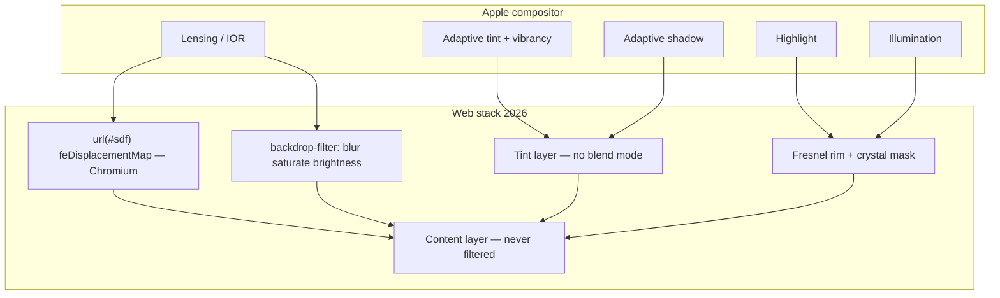
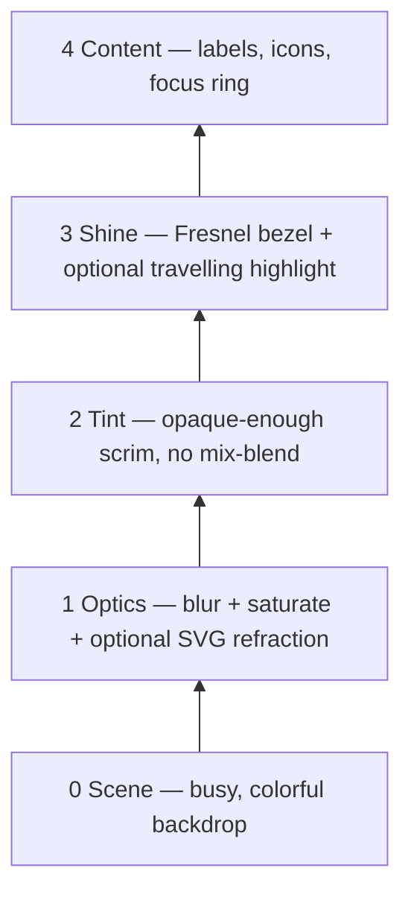
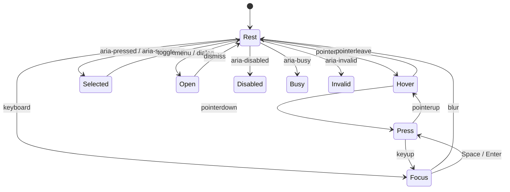

# Liquid Glass on the web

How to implement Apple’s Liquid Glass as a **real lens**, and how every interactive state should change that lens.

This note is for the gallery’s `glass` theme pack (`src/glass.ts`, `src/glassSurfaces.ts`, `src/components/GlassFilters.tsx`, `src/components/GlassDetails.ts`, `src/components/CrystalMaterial.ts`). It is a 2025–2026 research brief, not a library.

## TL;DR

- **Liquid Glass is lensing, not frost.** Apple’s material *bends and concentrates* light at curved edges. `backdrop-filter: blur()` is scattering — frosted glass. Realism comes from an **SDF / ray-traced displacement map** in `feDisplacementMap`, plus a **Fresnel rim**, a **neutral tint layer**, and **content sitting above every filter**.
- **Four layers, always.** Optics (blur + optional SVG refraction) → tint/scrim → specular rim → content. A single element cannot do all four. Text and icons must never sit inside `filter` / `backdrop-filter`.
- **Refraction is Chromium-only today.** `backdrop-filter: url(#filter)` with `feDisplacementMap` works in Chrome/Edge. Safari ([WebKit 245510](https://bugs.webkit.org/show_bug.cgi?id=245510)) and Firefox ignore SVG `url()` on backdrop. Ship blur + rim + tint everywhere; gate refraction with `@supports` and a runtime flag (`data-glass-refraction` in this app).
- **Peak bend is at the rim.** Naive maps (`½·sin 2θ`, or `feTurbulence`) peak mid-bezel or wobble randomly. A convex slab under Snell’s law displaces hardest at the grazing edge and is **neutral (128) in the interior**. That is the difference between “thick glass” and “jelly filter.”
- **States change optics, not just fill.** Hover brightens tint and rim — and only under `@media (hover: hover) and (pointer: fine)`. Press *illuminates from within*, slightly scales, and can tighten lensing. Focus is a **two-color ring outside the glass** ([WCAG C40](https://www.w3.org/WAI/WCAG22/Techniques/css/C40)), never an outline that clips the lens. Selected is a second crystal surface *inside* the shared platter — not glass-on-glass. Disabled drops refraction and chroma. Reduced transparency / contrast / motion must flatten the material the way Apple’s HIG does.
- **Apple does not publish IOR, blur px, or chromatic aberration.** Chroma in web ports is a flourish. Official docs never mention it. Disabled-glass and macOS hover are also unspecified — treat WWDC as a behavioral spec, not a token sheet.

---

## 1. What Apple actually specified

WWDC25 [Meet Liquid Glass (219)](https://developer.apple.com/videos/play/wwdc2025/219/) and [Adopting Liquid Glass](https://developer.apple.com/documentation/TechnologyOverviews/adopting-liquid-glass) define a **digital meta-material**, not a blur preset.

| Apple term | Meaning | Web equivalent |
| --- | --- | --- |
| **Lensing** | Background warps along the curved silhouette | SDF / Snell displacement map in `feDisplacementMap` |
| **Highlight** | Specular light that travels with geometry and (sometimes) motion | Inset shadows + masked gradient rim; optional `--light-angle` |
| **Shadow** | Adaptive separation; stronger over text, weaker over flat fill | Outer `box-shadow` whose alpha tracks backdrop contrast |
| **Illumination** | Material *glows from under the finger* on press | Inner radial / soft-light overlay; `.interactive` gel |
| **Regular** | Adaptive, frostier, text-safe | Higher blur (8–20px), stronger tint |
| **Clear** | Permanently more transparent; media only | ~2px blur, weak tint, **requires a dimming layer** |
| **Scroll edge effect** | Content dissolves under floating chrome | Masked fade / extra blur strip under toolbars |
| **Morph thickness** | Menu/popover is a *thicker* slab than the button it came from | Raise `depth` / `scale`, deepen shadow, soften scatter |

Rules Apple repeats and web ports keep breaking:

1. **Glass is the navigation layer**, not the content layer. Cards of photos are content; the toolbar, sidebar, and dialog are glass.
2. **Never glass-on-glass.** Nested `backdrop-filter` also fails technically: any ancestor with `isolation`, `transform`, `opacity < 1`, `mask`, `filter`, or `will-change` becomes a Backdrop Root and the child samples emptiness.
3. **Do not mix Regular and Clear** in one chrome set.
4. **Clear needs dimming** (HIG: **35%** dark) plus **bold, bright** labels. Three conditions: media-rich backdrop, dimming will not wreck the photo, labels are bold.
5. **Small** controls may flip light/dark from backdrop luminance. **Large** surfaces (menus, sidebars) must not — the flip is distracting.
6. **Tint is colored glass**, not a solid fill. It shifts hue/value with what is behind it. Tint only the primary action.
7. **Accessibility modifiers are part of the material:** Reduce Transparency → frostier/opaquer; Increase Contrast → near-solid + contrasting border; Reduce Motion → no elastic press / morph.

System APIs (`glassEffect(.regular.interactive())`, `UIGlassEffect`, `NSGlassEffectView`) do this in the compositor. The web has to fake the same layers.



---

## 2. How to make the glass look real

### 2.1 The failure mode everyone ships

```css
.fake-glass {
  background: rgba(255, 255, 255, 0.1);
  backdrop-filter: blur(20px);
  border: 1px solid rgba(255, 255, 255, 0.2);
}
```

That is 2018 glassmorphism. It reads as fog because:

- Uniform scatter, no edge bend.
- White 10% fill **vanishes on black** (and a dark fill vanishes on white). Measured Control Center glass follows a compressive lift, roughly `glass_L ≈ 0.58 × backdrop_L + 34` — black lifts, light barely moves.
- One 1px border cannot fake Fresnel (reflectance goes from ~4% at normal incidence to ~100% at grazing).
- Text often inherits the same stacking context as the blur, so glyphs smear.

### 2.2 Layer recipe (ordered stack)



**Layer 1 — optics** (sibling *behind* the label, or a `::before` that does not wrap text):

```css
.glass-optics {
  position: absolute;
  inset: 0;
  border-radius: inherit;
  pointer-events: none;
  backdrop-filter:
    blur(var(--glass-blur, 8px))
    saturate(180%)
    brightness(1.06)
    contrast(1.04);
}

@supports (backdrop-filter: url(#glass-pill)) {
  [data-glass-refraction='true'] .glass-optics {
    backdrop-filter:
      var(--glass-optics, url(#glass-pill))
      blur(1.5px)
      saturate(180%);
  }
}
```

Keep blur **small when refraction is on** (1.5–4px). Large blur fights the lens: you cannot see the warp. Regular / text-heavy surfaces without a map can go 12–20px (this gallery’s toolbar uses `blur(20px) saturate(1.15)` when refraction is off).

**Layer 2 — tint.** Neutral, slightly lifted, **no** `mix-blend-mode: overlay`:

```css
.glass-tint {
  position: absolute;
  inset: 0;
  border-radius: inherit;
  pointer-events: none;
  background: color-mix(in srgb, var(--liquid-solid) 18%, transparent);
}
```

Light mode: `rgba(255,255,255,.12–.40)`. Dark: `rgba(28,28,32,.16–.30)` for Clear, ~`.62` for Regular. Dialogs that must stay readable (this gallery’s `aside[role='dialog']`) mix a solid further: `color-mix(in srgb, var(--liquid-solid) 58%, transparent)`.

**Layer 3 — rim.** Two complementary tricks:

1. **Inset stack** (cheap, cross-browser) — `CrystalMaterial.crystalSurfaceCss` in this repo.
2. **Masked gradient ring** — `crystalRimCss`: a 3px padded gradient with `mask-composite: exclude`, so only the bezel paints.

```css
/* crystalSurfaceCss — cheap convex read */
border: 1px solid rgba(255, 255, 255, 0.88);
box-shadow:
  0 12px 24px #00000020,
  0 2px 4px #00000018,
  inset 0 1px 1px #fff,
  inset 1px 0 2px #ffffffc0,
  inset -1px -1px 2px #ffffffc0,
  inset 4px 5px 7px #ffffff65,
  inset -4px -4px 6px #ffffff45,
  inset 0 0 0 5px #ffffff12;
```

Measured Control Center rims are **bright on the horizontal edges, dark on the flanks**, not a single conic swept around the box. Use a travelling conic only on **interactive** surfaces (Apple moves the highlight on press / pointer, not at rest).

**Layer 4 — content.** Own stacking context, no filter. If you need vibrancy, saturate the *optics* layer, not the type.

### 2.3 Displacement maps that look like glass

`feDisplacementMap` reads an image: **R = Δx, G = Δy, 128 = rest**. Values above 128 push right/down.

| Map source | Looks like | Use |
| --- | --- | --- |
| `feTurbulence` + blur | Wobbly liquid / heat haze | Hero decoration, not chrome |
| Hand-painted Figma gradient | Soft generic warp | One-off buttons with fixed size |
| Rounded-rect **SDF** (this gallery) | Thick lens, bend at the rim | Production chrome |
| **Snell / IOR ray trace** through a convex squircle slab | Closest to iOS 26 | Hero + per-element lens |

**Gallery SDF (already shipped).** `roundedRectSignedDistance` → gradient → rim bell `sin²(π · edge/rimWidth)` raised to `40 / curvature`. Interior is left at 128. Quadrants are mirrored so the vector field points **inward** (convex magnification). See `src/glass.ts`.

**2026 physics upgrade** (what the best ports do now — [@sohumsuthar/liquid-glass](https://www.npmjs.com/package/@sohumsuthar/liquid-glass)):

```
f(x)  = (1 − (1−x)⁴)^(1/4)          convex squircle bezel profile
θs    = atan(f'(x))                 incidence
θr    = asin(sin(θs) / n)           Snell, n ≈ 1.5168 (BK7)
t(x)  = T0 + B·f(x)                 local thickness
d(x)  = t(x) · tan(θs − θr) · (1−R) Fresnel-weighted lateral shift
```

Older `d = ½·sin 2θ` maps **die at the rim** — exactly where real glass bends hardest. If a recreation looks “soft in the middle and dead at the edge,” this is why.

**Scale units.** `filterUnits="objectBoundingBox"` wants tiny scales (~0.1–0.45). `userSpaceOnUse` / pixel maps (this gallery) want **~6–36**. Do not copy a number across unit systems.

**Always** `color-interpolation-filters="sRGB"`. Linear RGB makes 128 drift and the whole backdrop slides.

**Inline the PNG as a data URL.** `feImage` from a zero-size `<svg>` silently fails on external hrefs. `generateGlassDisplacementMap` already does `canvas.toDataURL('image/png')`.

**Resize the map to the live box.** A 96×44 pill map stretched over a 720×78 toolbar looks like melted plastic (anisotropic bezel: fat caps, thin long edges). `bindGlassSurfaces` clones `#glass-pill`, observes the toolbar / sidebar / dialog, and rebuilds the map from `clientWidth`, `clientHeight`, and computed `border-radius`. That is the single highest-leverage trick in this codebase.

**Negative `scale`** on `feDisplacementMap` magnifies (sample toward center — the Apple convex read). Positive scale inverts the lens. Do not copy a number across unit systems: `objectBoundingBox` wants ~0.08–0.35; this gallery’s pixel maps want **6–36**.

**Backdrop-root killers** (nested glass goes blank, silently): `isolation`, `contain: paint`, `content-visibility`, `transform`, `opacity < 1`, `mask`, `filter`, `will-change` on an **ancestor**. Test over **stripes**, not a gradient. Chrome also refuses nested `backdrop-filter` — put optics on a `::before`, never on a child of another glass node (lightbox already does this in `ThemeViewerDetails.ts`).

### 2.4 Chromatic aberration

Apple never specifies this. Real BK7 fringe at UI scale is ~1% — invisible. UI chroma is **exaggerated split-channel displacement** (this gallery: `chroma * scale * 0.35` on R/B). `GlassFilters.tsx` runs three `feDisplacementMap` passes, isolates channels with `feColorMatrix`, then `feComposite` arithmetic add.

Cost: the graph is ~3× a single pass. Ports that measured Chrome compositor stalls keep chroma **off on the fleet** (every toolbar button) and **on for 1–3 hero surfaces**. This gallery already sets `chroma: 0` on live `bindGlassSurfaces` maps and keeps chroma on the small circle/pill presets.

### 2.5 Shape: squircles and concentric corners

Apple chrome is continuous-curvature, not CSS `border-radius` circular arcs.

```css
.glass {
  border-radius: 22px;
  corner-shape: squircle; /* Chrome 139+; ignored elsewhere */
}
```

WebKit is still fixing `backdrop-filter` clipping against `corner-shape` ([PR 72420](https://github.com/WebKit/WebKit/pull/72420)). Until that ships everywhere, generate the SDF with the **same radius the element paints**, and keep nested radii concentric:

```css
--glass-radius-inner: calc(var(--glass-radius) - var(--glass-pad));
```

### 2.6 Browser and performance matrix

| Capability | Chrome / Edge | Safari | Firefox |
| --- | --- | --- | --- |
| `backdrop-filter: blur() saturate()` | Yes | Yes (`-webkit-` still useful) | Yes |
| `backdrop-filter: url(#svg)` | Yes | No ([245510](https://bugs.webkit.org/show_bug.cgi?id=245510)) | No |
| `filter: url(#svg)` on the element itself | Yes | Yes | Yes |
| `corner-shape: squircle` | 139+ | Partial | No |

`filter: url(#svg)` on the *element* warps the **element’s own pixels**, not the backdrop — useless for a lens, useful only for a duplicated scene layer ([dpawlikowski](https://github.com/dpawlikowski/liquid-glass), [courtsimas/glass-lens](https://github.com/courtsimas/glass-lens), [Aave](https://aave.com/design/building-glass-for-the-web)). Heavier DOM, more portable.

Five incompatible backdrop strategies, pick one per surface:

| # | Strategy | Backdrop | Browsers |
| --- | --- | --- | --- |
| 1 | `backdrop-filter: url(#svg)` | Live | Chromium |
| 2 | `filter: url()` on an owned / cloned scene | You own it | All |
| 3 | WebGL + DOM snapshot | Stale | All |
| 4 | WebGL + owned background (video, canvas) | Perfect optics | All |
| 5 | HTML-in-Canvas `copyElementImageToTexture()` | Live DOM → GPU | Chrome flag / origin trial |

Safari: [WebKit PR 68614](https://github.com/WebKit/WebKit/pull/68614) is the software-fallback path (capture backdrop, run the SVG graph). Until it ships, blur-only. Also: `filter: url()` can be **ignored when `backdrop-filter` is on the same element** ([WebKit 297770](https://bugs.webkit.org/show_bug.cgi?id=297770)) — keep refraction and frost on **sibling layers**, not one declaration. LightningCSS has dropped the unprefixed `backdrop-filter` when `url()` and `-webkit-` were collapsed into one rule (Chrome 152 reports).

Performance rules that held up in 2026 ports:

- Glass **only** on floating chrome (toolbar, sidebar, dialog, a few overlay buttons). Not every card.
- Cap concurrent SVG-backdrop surfaces. This gallery binds four selectors, not the image grid.
- Prefer 2px blur + refraction over 28px blur. Cost is in the blur kernel and cache invalidation, not the map.
- Do not animate `feTurbulence` on scrolling surfaces. Pause on `prefers-reduced-motion` and battery saver.
- Avoid `will-change: transform` on a glass **ancestor** — it creates a Backdrop Root and kills nested sampling.
- Gate with `data-glass-refraction` / `FPSGuard`-style fallback. `@supports (backdrop-filter: url(#x))` is necessary but not sufficient (Safari may parse and no-op).

### 2.7 Shaders — when they are worth it

Three.js `MeshPhysicalMaterial` (`transmission`, `thickness`, `ior`, `attenuationColor`, `dispersion` from r164) and screen-space refraction are the only way to get **true** IOR and environment lighting. Use them for a marketing hero or a 3D product shot. Do **not** drive an entire gallery chrome stack through WebGL: you lose semantic HTML, text selection, and you must re-implement every state + a11y yourself. CSS + one SVG filter graph is the production path.

Press/hover in shader glass is **uniforms + a spring**, not CSS transitions: tween `scale` / `bezelWidth` / `u_strength` / `u_mouseSpring` on rAF. Same idea if you ever animate `feDisplacementMap[scale]`.

---

## 3. States: what must change optically

Apple’s line: *“responds to interaction by instantly flexing and energizing with light… illumination starts under the finger and spreads.”* Resting chrome stays quiet; the lens **comes alive on contact**. Sliders/toggles stay visually quiet until grab, then the knob *becomes* glass.

Do not implement states as “darken the fill 4%.” Change the **material**.



### 3.1 Optical deltas

Values are starting points for a Regular toolbar control on a busy photo backdrop. Animate with `transition` on tint / shadow / transform only — **do not** regenerate the SDF every frame. If you animate lensing, tween `feDisplacementMap[scale]` or a CSS variable that the filter reads.

| State | Blur | Refraction scale | Tint | Rim / specular | Shadow | Transform | Notes |
| --- | --- | --- | --- | --- | --- | --- | --- |
| **Rest** | 8–20px Regular, ~2px Clear | Base | 12–18% | Measured bezel, static | Soft, adaptive | `none` | Quiet. No travelling highlight. |
| **Hover** (`:hover` + `@media (hover: hover) and (pointer: fine)`) | +0 | +5–10% or unchanged | +4–8% lightness (M3-style ~8% overlay) | Rim +10–15% | Slightly deeper | Optional `translateY(-0.5px)` | Apple has **no dedicated hover spec** — pointer uses the same `.interactive()` language, more subdued than touch ([HIG: Motion](https://developer.apple.com/design/human-interface-guidelines/motion)). Brighten **tint**, not a second backdrop-filter. |
| **Press** (`:active`, `[data-pressed]`) | −1px (clearer) | −10–20% (thinner gel) **or** +illumination | Brighter, more opaque | Energize; conic may travel | Shallower (closer to the plane) | `scale(0.97–0.98)` | Apple illuminates *from under the contact point*. A radial gradient at `--press-x/--press-y` beats a uniform flash. Spring 120–180ms; no bounce if reduced-motion. |
| **Focus-visible** | Rest | Rest | Rest | Unchanged | **Add an outer ring** | None | See §3.2. Never `outline` that insets into the lens. |
| **Selected** (`[aria-pressed=true]`, `[aria-selected=true]`, `[aria-current]`) | Rest of *parent* platter | Off on the child | Crystal fill (this repo: `crystalSurfaceCss`) | Child gets its own inset rim | Inner, not a second drop shadow | None | Child is **opaque-ish overlay**, not a second `backdrop-filter`. |
| **Open / expanded** (`[aria-expanded=true]`, menu, dialog) | +4–8px | **Up** (thicker slab) | Stronger | Softer scatter | Deeper, richer | Morph radius / height | Apple: larger glass = thicker material. Gallery dialog already uses a heavier blur (`blur(6px)` vs toolbar `1.5px`) when refraction is on. |
| **Disabled** | Off or tiny | **Off** | Flatter, 62% opacity | Dim rim | None | None | `pointer-events: none` + `aria-disabled`. No hover brighten (`:disabled:hover` reset). |
| **Busy** (`aria-busy`, `[data-submitting]`) | Rest | Off | Rest | Rest | Rest | None | Spinner on the content layer. Do not animate the displacement seed. |
| **Invalid** (`:user-invalid`, `[aria-invalid=true]`) | Rest | Rest | Warm / red **tint** (colored glass, still translucent) | Rim takes the error hue | Solid error ring **outside** | None | Use `:user-invalid`, not `:invalid` (the latter paints “broken” on load). Sync `aria-invalid`. Do not replace the lens with a solid red fill. |
| **Dragging** | − | Slightly up | + | Travelling highlight follows pointer | Lifts | `scale(1.02)` | Same illumination language as press, but the surface *rises*. |
| **Window / group inactive** | — | Down | Recede (lower contrast) | Dim | Weaker | None | Mac-like: unfocused chrome visually steps back. `:not(:focus-within)` on the toolbar is the cheap version. |

### 3.2 Focus rings on glass

A single-color 2px `outline` on the frosted box fights the rim and fails [WCAG 1.4.11](https://w3c.github.io/wcag/understanding/non-text-contrast.html) over photos. Use **[C40](https://www.w3.org/WAI/WCAG22/Techniques/css/C40)**: two bands, **≥2px each**, **≥9:1 between the two colors** so one of them always hits 3:1 against the backdrop.

```css
.glass-control:focus:not(:focus-visible) {
  outline: none;
}

.glass-control:focus-visible {
  outline: 2px solid #fff;
  outline-offset: 3px;
  box-shadow:
    var(--liquid-shadow),
    0 0 0 5px #2563eb;
}

@media (forced-colors: active) {
  .glass-control:focus-visible {
    outline: 2px solid Highlight;
    box-shadow: none;
  }
}
```

This gallery currently uses a single `outline: 2px solid var(--accent); outline-offset: 3px`. Upgrade to the two-color pair on photo backdrops. Parent toolbars may add a `:focus-within` lift; that is **not** a substitute for the child’s ring.

`:focus-within` on a card (gallery: `.glass-card:focus-within .grid-image-overlay { opacity: 1 }`) is the right way to reveal chrome when a child control is keyboard-focused — do not wait for hover.

### 3.3 Selector and attribute pattern

Prefer **ARIA the platform already has** over invented classes. The gallery already does this for view-mode and favorites.

```css
.glass-control { /* rest tokens */ }

@media (hover: hover) and (pointer: fine) {
  .glass-control:hover:not(:disabled):not([aria-disabled='true']) {
    background: var(--hover-bg);
  }
}

.glass-control:active:not(:disabled) {
  transform: scale(0.98);
}

.glass-control:focus-visible { /* ring */ }

.glass-control[aria-pressed='true'],
.glass-control[aria-selected='true'],
.glass-control[aria-current='page'] {
  /* crystal overlay, not a second backdrop-filter */
}

.glass-control:disabled,
.glass-control[aria-disabled='true'] {
  opacity: 0.62;
  filter: grayscale(0.18);
}

.glass-control:disabled:hover {
  background: inherit;
  transform: none;
}

.glass-group:focus-within {
  /* lift the whole platter’s shadow; do not glow every child */
}

@media (prefers-reduced-motion: reduce) {
  .glass-control { transition: none; }
}

@media (prefers-reduced-transparency: reduce) {
  .glass {
    background: var(--liquid-solid);
    backdrop-filter: none;
  }
  .glass::after { display: none; } /* rim */
}

@media (prefers-contrast: more), (forced-colors: active) {
  .glass {
    background: Canvas;
    color: CanvasText;
    border: 1px solid CanvasText;
    backdrop-filter: none;
  }
}
```

`@media (hover: hover) and (pointer: fine)` is mandatory. iOS sticky `:hover` after tap will otherwise leave every button in the “energized” state. This gallery’s `--hover-bg` rules are **not** gated yet.

Dock / toolbar group hover (pointer only):

```css
@media (hover: hover) and (pointer: fine) {
  .gallery-toolbar:has(button:hover) button:not(:hover) {
    opacity: 0.72;
  }
}
```

Do not write `body:has(*:hover)` — selector thrash.

For press illumination that tracks the finger, set `--press-x` / `--press-y` on `pointerdown` and clear on `pointerup` / `pointerleave`. Keep that on the **shine** layer (`mix-blend-mode: screen` or a white radial). Do not put it on the optics layer (it would re-rasterize the backdrop). Apple’s `.interactive()` is the native name for this gel; they do not publish a disabled-glass look — drop glow, bounce, and refraction.

### 3.4 Grouped glass vs individual controls

Apple groups toolbar actions onto **one** piece of glass (`NSGlassEffectContainerView` / `GlassEffectContainer`). Different *kinds* of control (segmented, search, pop-up) get their own platter.

Web translation:

- One `backdrop-filter` on `.gallery-toolbar`.
- Inner buttons are **transparent** at rest (`background: transparent` in `GlassDetails.ts`).
- The selected sibling becomes a **crystal chip** (`crystalSurfaceCss` + `--active-bg`), not a nested lens.
- Hover is a light wash (`--hover-bg`), not a new blur.

That is why the gallery’s `surfaces` selector is the toolbar / sidebar / dialog — not every `button`.

### 3.5 Adaptive light / dark (the honest version)

Apple Regular glass **reads backdrop luminance** and can flip a *small* control independently of appearance settings. CSS cannot sample backdrop pixels (and should not — that is a readback / privacy hole; see [svgwg#1142](https://github.com/w3c/svgwg/issues/1142)).

Do this instead:

- Honor `data-theme-mode` / `prefers-color-scheme` for the **large** surfaces (sidebar, dialog). Apple does not flip those anyway.
- For tiny overlay buttons on photos (`.glass-overlay-control`), use a **dark chip + light icon** that does not flip. Contrast is then independent of the photo.
- If you truly need per-control flip, approximate with a tiny offscreen sample **you already own** (the thumbnail bitmap), never `drawWindow` / `getImageData` of foreign content.

### 3.6 Contrast of ink on glass

WCAG is defined on rendered pixels. A 4.5:1 label over a **moving photo** is not one ratio — it is a distribution.

Practical rules:

- Regular glass: keep a tint intercept high enough that the worst-case photo still clears 4.5:1 (gallery `--liquid-ink` / `--liquid-muted` on a lifted solid).
- Clear glass: dim the media (`--lg-dimmed` ~ 35%) **or** restrict labels to bold white / black with a text-shadow. Apple requires this; Wired / a11y write-ups of iOS 26 called out Control Center for failing it.
- Never rely on the warped backdrop to “create” contrast. Lensing is decoration; the tint + ink pair is the contract.
- `prefers-contrast: more` and `forced-colors` must snap to `Canvas` / `CanvasText` (already in `GlassDetails.ts`).

---

## 4. Copy-paste primitives

### 4.1 Cross-browser Regular control (no SVG)

```css
.glass-button {
  position: relative;
  border: 1px solid rgba(255, 255, 255, 0.55);
  border-radius: 999px;
  background: rgba(255, 255, 255, 0.14);
  backdrop-filter: blur(12px) saturate(180%) brightness(1.06);
  -webkit-backdrop-filter: blur(12px) saturate(180%) brightness(1.06);
  box-shadow:
    0 8px 22px #00000020,
    inset 0 1px 1px #fff,
    inset 0 -1px 1px #ffffff4d;
  transition: background 160ms, box-shadow 160ms, transform 120ms;
}

.glass-button::after {
  content: '';
  position: absolute;
  inset: 3px;
  border-radius: inherit;
  pointer-events: none;
  background: linear-gradient(
    122deg,
    #fff 0%,
    #ffffff14 8%,
    #ffffff08 23%,
    #ffffffb0 35%,
    #ffffff10 48%,
    #ffffffc0 84%,
    #fff
  );
  mask: linear-gradient(#000 0 0) content-box, linear-gradient(#000 0 0);
  mask-composite: exclude;
  padding: 2px;
}

.glass-button > * { position: relative; z-index: 1; }
```

### 4.2 Chromium lens (matches this repo)

```svg
<filter id="glass-pill" x="0" y="0" width="1" height="1"
        filterUnits="objectBoundingBox"
        color-interpolation-filters="sRGB">
  <feImage href="…data-url…" result="map" preserveAspectRatio="none"/>
  <feDisplacementMap in="SourceGraphic" in2="map" scale="28"
                     xChannelSelector="R" yChannelSelector="G"/>
</filter>
```

```css
.glass-optics {
  backdrop-filter: url(#glass-pill) blur(1.5px) saturate(1.15);
}
```

Rebuild the `feImage` href whenever width, height, or radius change (`bindGlassSurfaces`).

### 4.3 State tokens

```css
:root {
  --glass-blur: 12px;
  --glass-tint: 255 255 255;
  --glass-tint-a: 0.14;
  --glass-scale: 1;
  --glass-refract: 28;
}

.glass-button:hover {
  --glass-tint-a: 0.20;
}

.glass-button:active {
  --glass-scale: 0.98;
  --glass-tint-a: 0.26;
  --glass-refract: 22;
}

.glass-button:disabled {
  --glass-refract: 0;
  --glass-tint-a: 0.08;
}
```

Tweening `--glass-refract` only helps if the SVG `scale` attribute is bound to it (JS) or you keep several named filters. For most chrome, **skip animating scale** and only tween tint + transform.

---

## 5. How this gallery maps to the research

| Recommendation | Where it already lives | Gap |
| --- | --- | --- |
| SDF rim lens, 128-neutral interior | `src/glass.ts` (`lensDisplacementAt`) | Still a bell-weighted SDF, not Snell/IOR. Rim is strong; physics ports would move the peak even closer to the edge. |
| Per-surface live maps | `src/glassSurfaces.ts` | Good. Keep chroma at 0 on large surfaces. |
| Split-channel chroma | `src/components/GlassFilters.tsx` | Correct graph; use only on small presets. |
| Crystal rim + inset Fresnel | `src/components/CrystalMaterial.ts` | Static; no travelling highlight on press. |
| Regular-ish toolbar / thicker dialog | `GlassDetails.ts` (`blur(1.5px)` vs `blur(6px)`) | No explicit Regular vs Clear token pair. |
| Selected = crystal chip, not nested glass | `button[aria-pressed='true']` | Good. |
| Hover wash | `--hover-bg` | Not gated on `(hover: hover)` yet — iOS sticky hover risk. |
| Focus ring | `button:focus-visible` outline + offset | Solid. Could add the spacer-shadow recipe on photo backdrops. |
| Reduced transparency / contrast / motion | bottom of `GlassDetails.ts` | Good. Pair with a user-visible “refraction off” control (already `data-glass-refraction`). |
| Press illumination from contact point | — | Missing. `:active` scale exists on some generic toolbar buttons, not the glass pack. `glow`, `edgeHighlight`, `specularAngle` on `GlassLens` are unused. |
| Scroll edge dissolve | — | Missing under the floating toolbar as images scroll. |
| Adaptive luminance flip | theme `data-theme-mode` only | Correct for large surfaces. |
| Hover media query | — | `--hover-bg` is not behind `(hover: hover) and (pointer: fine)`. |
| Per-control lenses | `glass-lens` class, `toggle` preset | Class has **zero CSS**. Settings toggles do not use `#glass-toggle`. |
| Dead tokens | `--liquid-rim`, `--glass-specular`, `--glass-chroma-*` | Set in `theme.tsx` / `GlassDetails.ts`, never read. |
| Refraction gate | Chrome UA sniff in `AppShell` | `@supports` is not enough (Safari parses and no-ops); UA sniff matches today’s engines. Pair with a user toggle. |
| Lightbox optics | `ThemeViewerDetails.ts` `::before` | Correct: text sits above the filtered layer. |

---

## 6. Implementation order

1. **Ship the four-layer Regular surface** over a busy photo (frost + tint + rim + content). If it does not read as glass *without* refraction, the tint/rim are wrong.
2. **Add SDF maps** for a handful of floating surfaces; resize with `ResizeObserver`.
3. **Gate refraction**; Safari/Firefox keep layer 1 as blur-only.
4. **State table** on real `<button>` / ARIA attributes. Hover media query. Focus-visible ring outside the lens. Selected = inner crystal. Press = scale + inner glow.
5. **A11y triad:** `prefers-reduced-transparency`, `prefers-contrast`, `prefers-reduced-motion`. Test a sunset photo under the toolbar.
6. Only then: Snell maps, chroma on heroes, `corner-shape: squircle`, scroll-edge fade.

---

## Sources

### Apple

- [Meet Liquid Glass — WWDC25 219](https://developer.apple.com/videos/play/wwdc2025/219/)
- [Get to know the new design system — WWDC25 356](https://developer.apple.com/videos/play/wwdc2025/356/)
- [Adopting Liquid Glass](https://developer.apple.com/documentation/TechnologyOverviews/adopting-liquid-glass)
- [Applying Liquid Glass to custom views](https://developer.apple.com/documentation/SwiftUI/Applying-Liquid-Glass-to-custom-views)
- [Materials — HIG](https://developer.apple.com/design/human-interface-guidelines/materials) (Clear dimming = 35%)
- [Color — Liquid Glass tint](https://developer.apple.com/design/human-interface-guidelines/color)
- [Motion — HIG](https://developer.apple.com/design/human-interface-guidelines/motion) (touch vs pointer)
- [Build a SwiftUI app with the new design — WWDC25 323](https://developer.apple.com/videos/play/wwdc2025/323/)
- [Build an AppKit app with the new design — WWDC25 310](https://developer.apple.com/videos/play/wwdc2025/310/)
- [Build a UIKit app with the new design — WWDC25 284](https://developer.apple.com/videos/play/wwdc2025/284/)

### Web technique (2025–2026)

- [Liquid Glass: refraction with CSS and SVG — kube.io](https://kube.io/blog/liquid-glass-css-svg) — Snell + squircle maps
- [Getting Clarity on Apple’s Liquid Glass — CSS-Tricks](https://css-tricks.com/getting-clarity-on-apples-liquid-glass/)
- [How to create Liquid Glass effects with CSS and SVG — LogRocket](https://blog.logrocket.com/how-create-liquid-glass-effects-css-and-svg/) (2025-12-08)
- [Liquid glass in CSS — WebTricks](https://webtricks.dev/blog/liquid-glass-css)
- [Liquid Glass in CSS and SVG — ekino](https://www.ekino.fr/publications/liquid-glass-in-css-and-svg/)
- [Building glass for the web — Aave](https://aave.com/design/building-glass-for-the-web)
- [@sohumsuthar/liquid-glass](https://www.npmjs.com/package/@sohumsuthar/liquid-glass) — Snell maps, Regular/Clear, measured rim, `.lg-interactive`
- [dpawlikowski/liquid-glass](https://github.com/dpawlikowski/liquid-glass) — scene-layer refraction (no `backdrop-filter: url()`)
- [W3C C40 — two-color focus indicator](https://www.w3.org/WAI/WCAG22/Techniques/css/C40)
- [W3C svgwg#1142](https://github.com/w3c/svgwg/issues/1142) — no interoperable backdrop displacement
- [WebKit 245510](https://bugs.webkit.org/show_bug.cgi?id=245510) — Safari `backdrop-filter: url(#feDisplacementMap)`
- [WebKit 297770](https://bugs.webkit.org/show_bug.cgi?id=297770) — `filter: url()` dropped when `backdrop-filter` is present
- [Alastair — Apple private `-apple-visual-effect`](https://alastair.is/apple-has-a-private-css-property-to-add-liquid-glass-effects-to-web-content/) (WKWebView only; not Safari)

### This repo

- `src/glass.ts` — SDF displacement
- `src/glassSurfaces.ts` — live map binding
- `src/components/GlassFilters.tsx` — chroma graph
- `src/components/CrystalMaterial.ts` — rim / inset light
- `src/components/GlassDetails.ts` — theme tokens and states
