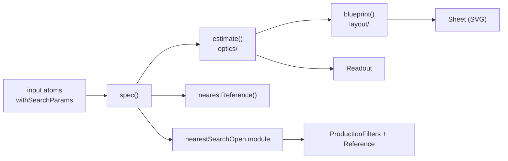

# Prime — lens envelope estimator

A `@reatom/jsx` example that estimates the **approximate** size and weight of a prime (fixed focal length) photographic lens from a handful of editable characteristics, and draws an engineering-style cross-section of the result.

Every input lives in the URL (`?f=85&n=1.4&tier=flagship`), so any configuration is a shareable link.

## What it estimates

| Output                       | Basis                                                                                               |
| ---------------------------- | --------------------------------------------------------------------------------------------------- |
| Front element, filter thread | Entrance pupil (`focal / f-number`) inflated by the vignetting target and angle of view             |
| Barrel diameter, length      | Glass envelope plus wall, focus drive and mount allowances; retrofocus / telephoto track ratios     |
| Element and group count      | Grows with speed, angle of view, design tier and iris asymmetry                                     |
| Iris position                | Pushed back it deepens the entrance pupil (bigger front group); pulled forward the rear group grows |
| Mass budget                  | Glass volume × density, barrel shell by material, plus iris, focus motor, stabilizer, mount         |
| Angle of view, back focus    | Sensor format and mount flange distance                                                             |

The model is a first-order fit calibrated against ~30 production lenses (see `referenceLenses` in `src/optics/`). Expect ±25 % — it is a design envelope, not a datasheet.

## Inputs

- **Optics** — focal length, aperture (⅓-stop steps), iris position along the train, corner illumination target (vignetting).
- **System** — sensor format (Micro 4/3 → medium format), body type (mirrorless / SLR / rangefinder).
- **Build** — design tier (classic / modern / flagship), barrel material, autofocus, stabilization.

## Structure



- `src/optics/` — pure estimation model and reference dataset. No Reatom.
- `src/layout/` — turns an estimate into SVG geometry: element profiles, barrel outline, iris unit, axial and corner beams, dimension lines, callouts.
- `src/model/` — input atoms (search-params synced) with relative actions via `.extend`, computed `spec` (reset / presets / isDefault), `estimate`, `blueprint`.
- `src/components/` — `Controls`, `Sheet`, `Readout`, `Header`, article notes.
- `src/nearest-production/` — lazy 2,901-lens catalog. Loaded by `nearestSearchOpen.module` when the readout asks.

## Reatom patterns shown

- `withSearchParams` with custom parse / serialize for numbers, enums and booleans; defaults are omitted from the URL.
- Relative state grouped on the parent: `focal.fromSlider`, `spec.reset`, `nearestSearchOpen.module`.
- Computed chains (`spec → estimate → blueprint`) recomputed only on relevant input changes.
- `computed(async () => await wrap(import(...))).extend(withAsyncData())` for the catalog chunk.
- Reactive SVG built from a computed blueprint: paths, dimension lines and callouts are plain functions of an atom.
- `css` prop with CSS variables for theming, `attr:hidden` for conditional rows, `prop:value` + `on:input` on ranges, `model:checked` on toggles.
- A generic `Segmented<T>` control component typed over an enum atom.

## Run

```sh
pnpm install
pnpm dev
```
