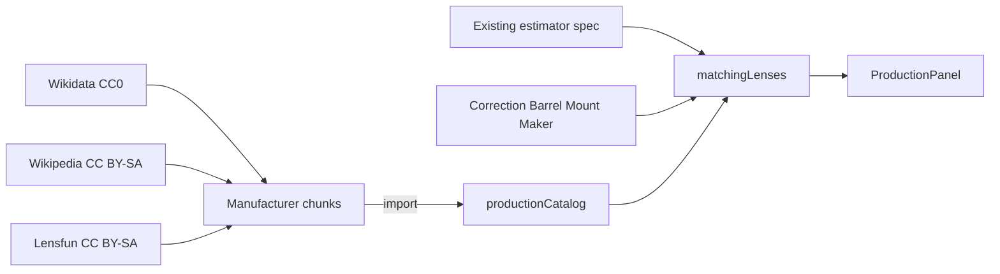

# Nearest production lens

Standalone catalog (**2,901** lenses) + UI for the estimator's "Nearest production lens" hint.

The estimator readout lazy-loads this module:

```ts
export const nearestSearchOpen = reatomBoolean(false, 'nearestSearchOpen').extend(
  (target) => ({
    module: computed(async () => {
      if (!target()) return null
      return await wrap(import('../nearest-production'))
    }, `${target.name}.module`).extend(withAsyncData({ initState: null })),
  }),
)
```

After "Find nearest", the readout mounts `ProductionFilters` and `ProductionReference`. Isolated preview (same atoms, no estimator chrome): [http://localhost:5173/nearest-production.html](/nearest-production.html)

Manufacturer chunks are a second `computed` + `withAsyncData` split inside `catalog/load.ts`.

## Filters

- **System / mount** sits on the nearest-lens list and includes **Any**
- **Correction** and **Barrel** include **Any** (search params `ncor` / `nbar`)

## Catalog licenses

The merged `catalog/data/*.ts` file is **CC BY-SA 4.0**. See [LICENSE](./LICENSE).

| Source | License | What we took |
| --- | --- | --- |
| [Wikidata](https://query.wikidata.org/) | CC0 1.0 | Name, maker, mount, focal, aperture, mass, length, diameter |
| English Wikipedia list tables | CC BY-SA 4.0 | Spec tables from the pages listed in `catalog/meta.ts` |
| [Lensfun](https://lensfun.github.io/) database | CC BY-SA 3.0 | Maker, model, mount, crop, focal, aperture |

Not used (incompatible or closed):

- Luminoid/lens-db — CC BY-NC-SA 4.0
- lens-database.com, DPReview, LensTip, OpticalLimits, DXOMARK — do not scrape

Refresh the catalog:

```sh
node src/nearest-production/scripts/build-catalog.mjs
```

Barrel material is almost never published; values are inferred from line/era so the Barrel filter has something to match. Correction tier is likewise classified from name/year.


