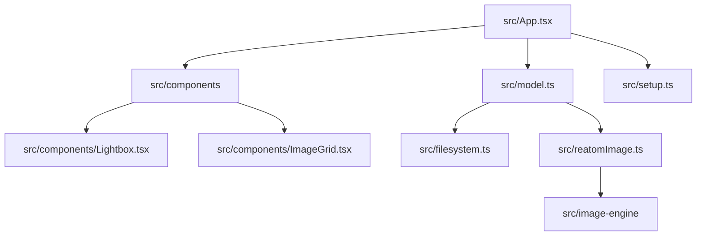

# Reatom JSX Gallery PWA

A modern, feature-rich Progressive Web App (PWA) image gallery built with **Reatom** and **JSX** (not React). Leverages the **File System Access API** to browse and display images from local folders with deep recursive parsing and extensive customization options.

## Features

### Implemented
- **Folder selection** with the File System Access API.
- **Recursive parsing** with progress state and cancellation.
- **Grid, list, and table views** with configurable columns, preview fit, gap, names, and file sizes.
- **Sorting and filtering** by name, size, date modified, type, dimensions, file type, size range, filename, and subfolder scope.
- **Lightbox** with zoom, pan, fullscreen, details panel, thumbnail strip, filtered navigation, folder scrubber, slideshow, download, and copy-as-JPEG.
- **Navigation preferences** for folder-end wrapping, keeping zoom/pan while navigating, and showing the folder scrubber.
- **Metadata-aware thumbnails** through JPEG EXIF previews, RAW embedded previews, generated browser thumbnails, EXIF orientation handling, and camera detail display.
- **Selection and favorites** persisted per image id.
- **Theme packs** with light, dark, and system modes.

### Planned from the research docs
- IndexedDB thumbnail cache with file size and mtime keys.
- XMP/IPTC metadata read paths.
- Histogram, channel inspection, and compare-at-zoom.
- Batch ZIP export and guarded metadata/write workflows.

## 🚀 Getting Started

### Prerequisites

- **Node.js** 22+
- **pnpm** 10+
- **Modern Browser** (Chrome, Edge, Opera recommended for File System Access API)
  - Firefox and Safari have limited support (fallback available)

### Installation

```bash
# Navigate to the project directory
cd examples/reatom-jsx-gallery

# Install dependencies from the workspace root
pnpm install
```

### Development

```bash
# Start the development server
pnpm dev
```

Open [http://localhost:5173](http://localhost:5173) in your browser.

### Building

```bash
# Build for production
pnpm build

# Preview the production build
pnpm preview
```

## 📖 Usage

### Opening a Folder

1. Click the **"Open Folder"** button on the welcome screen
2. Select a folder containing images from the file picker dialog
3. The app will recursively scan all subfolders for images
4. Wait for parsing to complete (progress shown in overlay)

### Navigating Images

- **Grid View**: Click any image to open in lightbox
- **Lightbox**: Use arrow keys, side buttons, thumbnail strip, or folder scrubber to navigate the filtered visible set.
- **Slideshow**: Click play and choose 1s, 3s, 5s, 10s, or 30s intervals.

### Customizing the Grid

Use the **Settings** panel (toolbar gear icon) to adjust:
- **Columns**: 0-12, where 0 enables auto columns.
- **Gap**: Spacing between images
- **Image Fit**: How images fit in their containers
- **Lightbox**: Wrap navigation, keep zoom while navigating, and folder scrubber visibility.

### Sorting & Filtering

Use the toolbar controls to:
- **Sort**: Click sort controls to change field and order
- **Filter**: Use type chips, size range, subfolder scope, and search box
- **Reset**: Clear all filters with one click

### Keyboard Shortcuts

- `←` / `→` - Previous/next image (in lightbox)
- `Escape` - Close lightbox or exit slideshow
- `Space` - Play/pause slideshow
- `F` - Toggle favorites for selected grid images
- `T` - Toggle light/dark theme

## 🛠️ Tech Stack

- **State Management**: [Reatom](https://reatom.js.org/) - Efficient reactive state
- **UI**: Reatom JSX - React-like JSX without React
- **Build Tool**: Vite - Fast development and optimized builds
- **TypeScript**: Full type safety
- **File System Access API**: Local folder access
- **IndexedDB**: Directory handle persistence

## 📁 Project Structure



## 🎨 Customization

Theme packs and defaults live in `src/theme.tsx` and persisted UI atoms live in `src/model.ts`.

## 🔧 Browser Support

### Full Support
- **Chrome** 86+ (recommended)
- **Edge** 86+ (recommended)
- **Opera** 72+

### Limited Support
- **Firefox and Safari**: File System Access API support is limited.
- **Mobile**: Directory picking and persistent handles vary by browser.

## 📝 Notes

### File System Access API
- Requires HTTPS or localhost
- Permissions are granted per-folder and may be revoked by the user
- Browser may prompt for permission on each page reload
- Some file systems may not support recursive access

### Research references
- `docs/nomacs-porting-playbook.md` tracks metadata, thumbnail, performance, and test priorities.
- `docs/oculante-porting-playbook.md` tracks scrubber, keep-view, cache, histogram, and compare-mode ideas.

### Privacy
- All image processing happens locally in your browser
- No data is uploaded to any server
- File handles and permissions are managed by the browser

## 🤝 Contributing

This is an example project for demonstrating Reatom JSX capabilities. Feel free to fork and customize for your needs!

## 📄 License

MIT

## 🔗 Resources

- [Reatom Documentation](https://artalar.github.io/reatom/)
- [Reatom JSX Guide](https://github.com/artalar/reatom/tree/master/packages/jsx)
- [File System Access API](https://developer.chrome.com/docs/file-system-access/)
- [PWA Documentation](https://web.dev/progressive-web-apps/)

## 🙏 Acknowledgments

Built with [Reatom](https://reatom.js.org/) - a lightweight state manager with a powerful reactivity system.