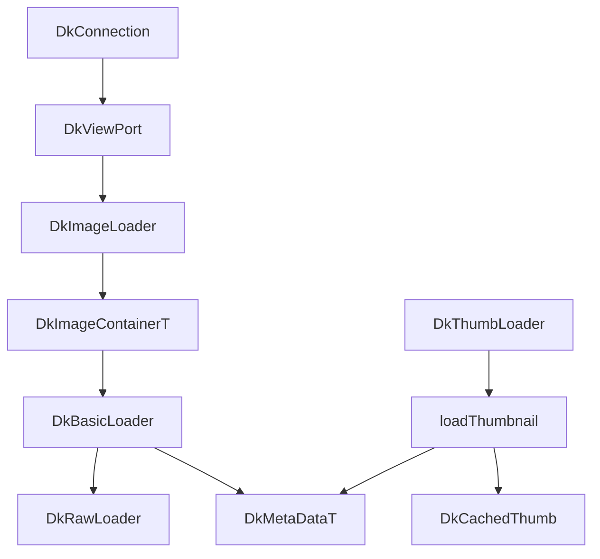

## Nomacs Codebase

Research target: `/Users/artalar/code/nomacs` (nomacs / Image Lounge 3.x, Qt6, optional LibRaw, OpenCV, Exiv2, Quazip, KImageFormats). Comparison baseline: `/Users/artalar/code/reatom/examples/reatom-jsx-gallery` plus `/Users/artalar/code/reatom/nomacs-exif-reference.md`.

---

### Architecture

nomacs is organized as a single desktop application (`ImageLounge/`) with a thin `main.cpp`, a **core library** (`DkCore/`), a **GUI layer** (`DkGui/`), optional **plugins** (`ImageLounge/plugins/`), unit tests (`ImageLounge/tests/`), and build/install assets (`scripts/`, `installer/`, `xgd-data/`). Third-party code lives in git submodules under `3rd-party/` (LibRaw, OpenCV, Exiv2, Quazip, etc.).

| Layer   | Path                       | Responsibility                                                                       |
| ------- | -------------------------- | ------------------------------------------------------------------------------------ |
| Entry   | `ImageLounge/src/main.cpp` | App bootstrap, calls `DkCachedThumb::cleanupAsync()` on shutdown                     |
| Core    | `ImageLounge/src/DkCore/`  | Loading, metadata, thumbnails, image math, settings, plugins API, batch metadata     |
| GUI     | `ImageLounge/src/DkGui/`   | Main window (`DkNoMacs`), viewport, thumb strip, metadata panels, batch UI, TCP sync |
| Plugins | `ImageLounge/plugins/`     | Paint, Composite, Affine Transform, Fake Miniatures, Page Extraction, template       |
| Tests   | `ImageLounge/tests/`       | `DkMetaData_test`, `DkNativeImage_test`, `DkBaseViewPort_test`, `DkUtils_test`       |

**Core class graph (simplified):**

- **`DkImageLoader`** (`DkImageLoader.h` / `.cpp`): folder model, `QFileSystemWatcher`, current image, save/copy, folder keyword filter (`mFolderFilterString`), memory cacher (`updateCacher`), threaded directory sort.
- **`DkImageContainer` / `DkImageContainerT`**: per-file state (`not_loaded`, `loading`, …), lazy `DkBasicLoader`, file buffer prefetch (`fetchFile` → `QtConcurrent`), scaled-image LRU (`scaledImages`, max 10 heights).
- **`DkBasicLoader`**: format dispatch, edit history (`DkEditImage`), multipage TIFF index, save to buffer with metadata merge.
- **`DkMetaDataT`**: Exiv2 wrapper (read/write, previews, orientation, XMP crop sidecar).
- **`DkThumbs` + `DkCachedThumb`**: async thumbnail pipeline + optional XDG disk cache.
- **`DkConnection`**: TCP protocol for multi-instance sync (zoom, pan, file change, window geometry).
- **`DkPluginManager`**: dynamic plugins (viewport, batch, simple).
- **`DkProcess` / `DkBatch`**: batch rename/convert and plugin batch runs.

Build-time feature flags (from root `README.md`): `ENABLE_RAW` (LibRaw + OpenCV), `ENABLE_TIFF`, `ENABLE_QUAZIP`, `ENABLE_OPENCV`, `ENABLE_PLUGINS`, `ENABLE_TESTING`. Runtime adds Qt/KImageFormats for HEIC, AVIF, JXL, WebP, etc.

**reatom-jsx-gallery** mirrors a subset in TypeScript:

| nomacs                           | Gallery                                               |
| -------------------------------- | ----------------------------------------------------- |
| `DkBasicLoader` + format plugins | `image-engine/header.ts` + `formats/*`                |
| `DkMetaDataT`                    | `formats/exif.ts`, `exifDisplay.ts`, `orientation.ts` |
| `DkRawLoader` / Exiv2 preview    | `formats/raw.ts`, `rawPreviewScan.worker.ts`          |
| `DkThumbs`                       | `thumbnail.ts`, `reatomImage.ts`                      |
| `DkImageLoader` + folder UI      | `model.ts`, `filesystem.ts`, components               |
| TCP sync, plugins, batch         | Not present (browser + File System Access API)        |

---

### Image Pipeline

#### Loader precedence (`DkBasicLoader::loadGeneral`, ~lines 264–537 in `DkBasicLoader.cpp`)

nomacs uses an explicit **suffix-ordered chain** (comments at 288–301):

1. **DRIF** (`drif`, `yuv`, `raw` custom format).
2. **LibRaw** for known RAW extensions (`nef`, `cr2`, `dng`, `arw`, …) — **before** Qt TIFF plugin (RAW often TIFF-container).
3. **Custom TGA** (Qt 5.15 silent corruption).
4. **Qt `QImageReader`** with `setAutoTransform(false)` (`loadQt`, 540–598).
5. **LibTIFF** multipage.
6. **PSD** (platform-specific).
7. **LibRaw retry** for unknown suffix if MIME ≠ `image/jpeg` (#435).
8. **Qt by content** if extension wrong.
9. **Samsung panorama JPEG fix** (`DkImage::fixSamsungPanorama`).
10. **ROH / OpenCV vec** niche loaders.

Byte arrays are preferred over path when provided (zip members, network). Symlinks are resolved before load; zip paths use `DkFileInfo` + Quazip (`#/member` encoding, KIO-compatible).

#### Orientation policy (419–495, `DkBasicLoader.cpp`)

After load:

1. If Qt loader reports `supportsTransform`, map `QImageIOHandler::Transformations` → degrees/mirror via `getOrientationDegrees` / `isOrientationMirrored` (170–208).
2. Else read EXIF via `DkMetaDataT::getOrientationDegrees` / `isOrientationMirrored` (317–380 in `DkMetaData.cpp`).
3. Detect **double-rotation risk** (`maybeTransformed`): HEIC/HEIF/AVIF/JXL and Qt RAW plugins may rotate pixels without advertising transform (#1174).
4. If `DkSettings::MetaData::ignoreExifOrientation`, skip manual rotate; set loader flag `ignored_orientation`.
5. Apply `DkImage::rotateImage` + `flipImage` when enabled.
6. `unpremultiply`, assign sRGB if missing, convert CMYK → sRGB (Qt 6.8+).

Gallery equivalent: `resolveImageOrientationStyle` uses CSS `image-orientation: from-image` on `` (`orientation.ts`, `reatomImage.ts`); embedded EXIF/RAW previews and **generated** thumbnails bake orientation in `thumbnail.ts` when EXIF is valid and not ignored (`orientationBaked` avoids double-apply).

#### Edit history

`DkEditImage` tracks pixel vs metadata edits; `undo`/`redo` on loader. Pixel edits call `clearOrientation()` → tag 1 (`DkMetaData.cpp` 1128–1134). Gallery: read-only metadata today (`nomacs-exif-reference.md` documents save behavior for future).

#### Memory cacher (`DkImageLoader::updateCacher`, 1639–1699)

When `cacheMemory` enabled: keep current + adjacent indices; **preload next** via `loadImageThreaded()`; **fetch file buffer** for near indices; clear distant/edited containers. Tunables: `maxImagesCached`, `cacheMemory` MB (`DkSettings.h` 325–346).

Gallery: no full-image cache; `reatomImage` holds one `File`/`Blob` per model; `activeThumbnailRequests` caps parallel thumb decodes (`reatomImage.ts`).

---

### EXIF/Metadata

**Engine:** Exiv2 (`DkMetaDataT` in `DkMetaData.h` / `DkMetaData.cpp`). Initialization enables BMFF when built (`Exiv2::enableBMFF(true)` at 2051–2058).

#### Read path (`readMetaData`, 96–150)

- Opens file path or memory buffer.
- `readMetadata()`; empty EXIF+XMP+IPTC → `no_data`.
- Sidecar mode: `loadSidecar()` when `mUseSidecar`.
- File stat cached early in `loadGeneral` for UI (`origFileInfo.stat()`).

#### Tag lookup (`getExifValue`, 533–571)

Short keys try **`Exif.Image.<key>` first**, then **`Exif.Photo.<key>`** — same precedence documented in `nomacs-exif-reference.md` and gallery `exif.ts`.

#### Orientation (317–380, 1142–1224)

- States: `or_invalid` (-2), `or_not_set` (-1), valid 1–8.
- Invalid: non-numeric, 0, 9+ (Qt JPG loader breaks on 0).
- **`setOrientation(int o)`**: composes new TIFF orientation from current tag × rotation delta (lossless metadata rotate) — state machine switch on cases 1–8 (1184–1217).

#### Display helpers (`DkMetaDataHelper`, ~1628–1900)

- Flash modes: `QMap<int,QString>` (fixes array-index bug noted in reference doc).
- Compression: manufacturer codes including Sony ARW 32767, Samsung 32770, Kodak 65000, Pentax 65535.
- Exposure time: reciprocal display for ≤1s (#496).
- GPS → Google Maps URL.
- Large values: `count >= 2000` → translated “data too large” (481–498).

#### Previews (`getPreviewImage`, 758–799)

`Exiv2::PreviewManager`: pick **largest** preview with `width > minPreviewWidth` (used for RAW fast path with `minWidth = 1920` when `raw_thumb_if_large`).

#### Save guards (`saveMetaData`, 224–288)

- Rewrites in-memory buffer via Exiv2.
- **Reject** if new buffer ≤ **50%** of original size (Hasselblad 3FR / Exiv2 #995).
- `clearOrientation()` writes **1**, not 0.

#### Embedded thumbnail write cap

`setThumbnail(DkImage::createThumb(img, 200))` — max 200px when embedding (Exiv2 crash avoidance, `DkMetaData.cpp` ~1325).

**Gallery parity (`formats/exif.ts`, `exifDisplay.ts`, `nomacs-exif-reference.md`):**

- Custom TS TIFF parser (no Exiv2); adaptive read up to **512KB** (`EXIF_READ_BYTES` in `types.ts`).
- `LARGE_TAG_DISPLAY_COUNT = 2000`, flash/compression maps ported.
- Multi-APP1: scan largest TIFF block (documented in reference).
- No XMP rating, BMFF HEIC EXIF, IPTC, write, or sidecar yet.

---

### RAW

#### Fast vs full (`DkRawLoader`, `DkBasicLoader::loadRAW`)

**Preview cascade** (`load`, 2049–2215):

1. `loadPreview`: Exiv2 `getPreviewImage(minWidth)` if settings `loadRawThumb` is `always` or `if_large` (1920 threshold when LibRaw available).
2. `loadPreviewRaw`: LibRaw `unpack_thumb()` + `QImage::loadFromData` if thumb width policy matches.
3. Full develop: `unpack` → optional `raw2image` (LibRaw version guard) → `dcraw_process` → `dcraw_make_mem_image` **or** custom OpenCV path.

**LibRaw params** (2064–2078): `use_camera_wb`, `output_color=1` (sRGB), 8 bps, `four_color_rgb`, `user_flip=0`. Optional quality: `user_qual=3`, `dcb_enhance_fl`, `fbdd_noiserd` when `filterRawImages`.

**Custom develop path** (demosaic → white balance → gamma → noise):

- **`demosaic`**: normalize to black point, Bayer demosaic via OpenCV `CV_Bayer*2RGB` by filter bitmask (2296–2341).
- **`prepareImg`**: direct RGB copy when not chromatic (Phase One IQ260 Achromatic sets `mIsChromatic=false`, 2285–2286).
- **`whiteBalance`**: camera multipliers + `rgb_cam` matrix (2427–2459).
- **`gammaCorrection`**: per-camera hack — **IQ260 Achromatic doubles gamma table** (2404–2424); linear toe for values ≤5 (2462–2479). This is the closest nomacs has to “DNG/RAW brightness” tuning — not a separate DNG tag reader but **empirical gamma/white-point pipeline**.
- **`reduceColorNoise`**: ISO-dependent median on Cb/Cr (2482–2519).
- **`raw2Img`**: pixel aspect resize, CV_8U, sRGB `QImage` (2522–2537).

**IIQ**: `open_file` not buffer (LibRaw 0.17 buffer bug, 2268–2270).

**Settings** (`DkSettings.h`): `loadRawThumb` enum, `filterRawImages`, `filterDuplicats`, `preferredExtension` (default `*.jpg`).

#### RAW + JPEG “pairing”

nomacs does **not** maintain explicit RAW+JPEG pairs in code. Instead **`filterDuplicateNames`** (`DkFileInfo.cpp` 390–413): when `filterDuplicats` is true, same **basename** keeps the file whose extension matches `preferredExtension` (typically JPG). Applied in `readDirectory` after suffix filter (566–567). This is the practical “show JPG instead of CR2 when both exist” behavior.

**Gallery (`formats/raw.ts`):**

- Supports **DNG + ARW** TIFF containers; tags: `PreviewImageStart/Length`, Sony `0x94b4/0x94b5`, JPEG interchange, SubIFDs, DNG version, heuristic JPEG scan (up to 64MB), worker pool for range scan (`rawPreviewScanPool.ts`, max 2 workers).
- Picks preview by IFD priority + largest blob; validates via `createImageBitmap`.
- **No** LibRaw develop or duplicate-name filter; CR2/NEF/ORF/SR2 are handled as TIFF-like RAW by extension plus IFD preview/scan paths.
- Lightbox/full view: embedded preview only (`reatomImage.ts`); throws if RAW thumb missing.

---

### Thumbnails

#### `loadThumbnail` (`DkThumbs.cpp` 86–175)

Order:

1. **Disk cache** (`DkCachedThumb`) if `thumbDiskCache` — skip save if load &lt;10ms.
2. Read metadata (file or zip buffer).
3. **`loadThumbnailFromMetadata`**: Exiv2 embedded thumb + orientation transform + **black border crop** (`removeBlackBorder`, 177–223: scan 10% rows, threshold RGB&gt;50).
4. If `force_size` and EXIF thumb too small → fall back to **full image** via `loadGeneral(..., fast=true)`.
5. Log: exif yes/no, dimensions, timing.

#### `DkThumbLoader` (251–366)

- `QThreadPool` sized `qBound(1, thumbThreads, cpu-2)` (226–233).
- In-memory `QCache` by cost bytes (`thumbCacheMemory` MiB).
- **Refcount queue** for duplicate requests; cancel decrements count; in-flight jobs not aborted.
- `QtConcurrent::run(loadThumbnailLocal)` → `DkImage::createThumb`.

#### `createThumb` (`DkImageStorage.cpp` 2241–2310)

- `ScaleConstraint`: longest_side, shortest_side, width, height.
- High quality: OpenCV `INTER_AREA` if `highQualityThumbs`.
- Else two-step Qt scale (2× fast, then smooth).
- Output **sRGB**.

#### Disk cache (`DkCachedThumb.cpp`)

- XDG-style cache dirs; PNG with `tEXt` **Software=nomacs** marker.
- LRU trim by atime/mtime vs `thumbDiskSpace` MiB.
- Windows: `FILE_ATTRIBUTE_NOT_CONTENT_INDEXED`.
- Async cleanup on exit (`cleanupAsync`).

#### Preload (`DkThumbsWidgets.cpp` ~2044)

`preloadThumbs` loads neighbors in thumb scrollbar.

**Gallery (`thumbnail.ts`):**

- JPEG: EXIF thumb → else decode+scale.
- RAW: embedded preview only (no full RAW decode for grid).
- `OffscreenCanvas` + JPEG blob URL; `revokeThumbnail` for GC.
- Orientation bake on embedded thumbs only.
- Parallelism: `MAX_PARALLEL_THUMBNAILS = hardwareConcurrency - 2` (min 2).
- **No** disk cache, black-border crop, or preload-ahead strip.

---

### UI/UX Patterns

| Pattern       | nomacs                                                                                                                                    | Gallery                                    |
| ------------- | ----------------------------------------------------------------------------------------------------------------------------------------- | ------------------------------------------ |
| Views         | Single image viewport + thumb dock + metadata dock                                                                                        | Grid / list / table + lightbox             |
| Zoom          | `DkViewPort::zoom`, log slider in `DkZoomWidget`, `interpolateZoomLevel` for smooth upscale                                               | CSS `object-fit`, `imageFit` setting       |
| Sync          | Alt+action or `syncActions`; `NEWTRANSFORM`, `NEWFILE`, `NEWPOSITION` over TCP (`DkConnection.cpp`, `DkViewPort::tcpSynchronize` 535–551) | N/A                                        |
| Slideshow     | `DkSettings::SlideShow`, player HUD                                                                                                       | `Slideshow.tsx`                            |
| Metadata UI   | `DkMetaDataWidgets`, translated camera/description tags                                                                                   | `ImageInfoPanel.tsx`, `buildCameraHudRows` |
| Batch         | `DkBatch.cpp`, plugins, rename patterns                                                                                                   | N/A                                        |
| File filter   | Keywords + regex + glob (`filterInfoList`, 436–468); folder filter string in loader                                                       | `FilterPanel`, table filters               |
| Sort          | Filename, date, size, random (`DkImageContainer::compareFunc`)                                                                            | Sort panel in model                        |
| Duplicates    | `filterDuplicats` + preferred JPG                                                                                                         | Not implemented                            |
| GPS map       | `showOnMap` slot on loader                                                                                                                | Not implemented                            |
| Edit warnings | Orientation save warnings, prompt save before unload                                                                                      | Read-only                                  |

**Zoom/sync detail:** `DkViewPort` can emit normalized image coordinates for remote display mode; wheel zoom vs file skip modulated by `zoomOnWheel` + Ctrl (`DkViewPort.cpp` ~1163–1312). Gallery keyboard shortcuts in `shortcuts.tsx` (local only).

---

### Performance

| Technique          | nomacs location                     | Notes                                                   |
| ------------------ | ----------------------------------- | ------------------------------------------------------- |
| Threaded file read | `DkImageContainerT::fetchFile`      | `QtConcurrent::run(loadFileToBuffer)`                   |
| Threaded load      | `loadImageThreaded`                 | Buffer then image decode                                |
| Thumb thread pool  | `DkThumbsThreadPool`                | Configurable `thumbThreads`                             |
| Thumb memory cache | `DkThumbLoader::mThumbnailCache`    | Byte-cost LRU                                           |
| Thumb disk cache   | `DkCachedThumb`                     | Only if load ≥10ms to write                             |
| Directory scan     | `DkFileInfo::readDirectory`         | Suffix hash set; optional content sniff if no extension |
| EXIF perf cap      | count &lt; 2000 per tag             | Avoid MakerNote blobs in UI                             |
| Gamma-aware resize | `DkImage::resizeImage`              | Linearize → OpenCV/Qt → color space                     |
| ICO load           | `loadQt`                            | Jump frames without full decode (563–586)               |
| Spinner delay      | `updateSpinnerSignalDelayed(700ms)` | Avoid flicker on fast loads                             |

**Gallery:**

- Header 32KB + adaptive EXIF slice (cheaper than full file for JPEG).
- RAW preview scan in **Web Worker** (transferable `ArrayBuffer`).
- `throwAbort()` when thumb concurrency exceeded (backpressure).
- No memory/disk thumb cache; relies on browser decode cache.

---

### Plugins/Extensions

Built-in plugins under `ImageLounge/plugins/`:

- **PaintPlugin** — draw on image.
- **CompositePlugin** — channel composite UI.
- **AffineTransformations** — shear/scale transforms.
- **FakeMiniaturesPlugin** — tilt-shift effect.
- **PageExtractionPlugin** — document segmentation (OpenCV).
- **SIMPLE_PLUGIN** — template for third-party dev.

`DkPluginManager` loads JSON metadata, types: `simple`, `batch`, `viewport` (`DkPluginManager.h` 98–105). `DkViewPort::applyPlugin` runs plugin, replaces container from result (554–568). Requires `ENABLE_OPENCV` + `ENABLE_PLUGINS`.

**Batch plugins** integrate with `DkBatch` GUI (convert, resize, plugin pipeline, optional “no image output” for sidecar-only plugins).

Gallery has no plugin host; features would be npm modules or built-in TS functions.

---

### Porting Priority Matrix

#### High (strong nomacs value, feasible in browser, partial gap)

| Item                                                        | Rationale                                                                 | nomacs source                                                              | Gallery status                                                                          |
| ----------------------------------------------------------- | ------------------------------------------------------------------------- | -------------------------------------------------------------------------- | --------------------------------------------------------------------------------------- |
| **Duplicate basename filter (RAW+JPG)**                     | Avoid duplicate grid entries when `IMG_1234.CR2` + `IMG_1234.jpg` coexist | `filterDuplicateNames` `DkFileInfo.cpp` 390–413, setting `filterDuplicats` | Missing; port as optional setting in `model.ts` / `filesystem.ts`                       |
| **RAW preview: more formats + Exiv2-style largest preview** | CR2/NEF/ORF as TIFF; pick largest embedded JPEG                           | `getPreviewImage`, `loadPreview`                                           | Partial: DNG/ARW/CR2/NEF/ORF/SR2 via TIFF IFD + bounded JPEG scan; exotic RAW still gap |
| **Black border crop on EXIF thumbs**                        | Cleaner film-scan thumbs                                                  | `removeBlackBorder` `DkThumbs.cpp` 177–223                                 | Missing                                                                                 |
| **`force_size` thumb fallback**                             | Use full decode when embed too small                                      | `DkThumbs.cpp` 137–139                                                     | Partial: `acceptSmallPreview` for RAW only                                              |
| **Double-orientation detection**                            | HEIC/AVIF/JXL/RAW plugin may bake rotation                                | `maybeTransformed` `DkBasicLoader.cpp` 437–450                             | Partial: `orientationBaked` flag; extend per-format in `header.ts`                      |
| **Exposure display helpers**                                | Aperture 2^(AV/2), 1/N sec exposure                                       | `DkMetaDataHelper`                                                         | Ported in `exifDisplay.ts`                                                              |
| **IndexedDB/session thumb cache**                           | nomacs disk cache dramatically speeds rescans                             | `DkCachedThumb`                                                            | Missing; high impact for large folders                                                  |

#### Medium (valuable, heavier effort)

| Item                                   | Rationale                     | nomacs source                             | Gallery status                                                 |
| -------------------------------------- | ----------------------------- | ----------------------------------------- | -------------------------------------------------------------- |
| **Folder keyword + glob filter**       | Power-user file finding       | `filterInfoList` `DkFileInfo.cpp` 436–468 | Basic filters only                                             |
| **Multi-page TIFF / animated formats** | Loader page index             | `indexPages`, `loadPage`                  | Not supported                                                  |
| **XMP sidecar / crop rect**            | Non-destructive crop metadata | `saveRectToXMP` `DkMetaData.cpp`          | Not supported                                                  |
| **Rating / description edit**          | Workflow                      | `setRating`, `setDescription`             | Read-only                                                      |
| **BMFF (HEIC/AVIF) EXIF**              | Modern phone photos           | `enableBMFF`                              | Browser decodes image; limited EXIF in engine                  |
| **Color-managed thumb resize**         | Gamma-correct downscale       | `DkImage::resizeImage` + `createThumb`    | Canvas/sRGB only                                               |
| **Adjacent image preload**             | Faster navigation             | `updateCacher`, `preloadThumbs`           | Could prefetch `parseImageMeta` + thumb for lightbox neighbors |
| **Samsung panorama JPEG fix**          | Real-world broken files       | `DkBasicLoader.cpp` 383–396               | Not ported                                                     |

#### Low (desktop-specific or poor web fit)

| Item                                                     | Rationale                                                                       |
| -------------------------------------------------------- | ------------------------------------------------------------------------------- |
| **TCP multi-instance sync**                              | Core nomacs differentiator; no web analogue without custom sync server          |
| **LibRaw full develop + demosaic**                       | Requires WASM LibRaw or server; huge bundle; gallery intentionally preview-only |
| **OpenCV manipulators** (exposure, unsharp, tiny planet) | Possible via WASM OpenCV.js but large; nomacs `DkManipulatorsIpl`               |
| **Batch convert/rename**                                 | Desktop file write; could be File System Access API + worker (complex)          |
| **Quazip in-archive viewing**                            | Zip `#/` paths; gallery would need zip.js                                       |
| **Plugin ecosystem**                                     | Qt C++ plugins; not portable                                                    |
| **Print / native save dialogs**                          | OS integration                                                                  |
| **DRIF / ROH / vec loaders**                             | Scientific/niche formats                                                        |

---

### Algorithm reference (key files)

| Algorithm                      | File:lines (approx.)                                |
| ------------------------------ | --------------------------------------------------- |
| Loader order + orientation     | `DkBasicLoader.cpp` 264–537                         |
| Qt load, ICO frame pick        | `DkBasicLoader.cpp` 540–598                         |
| RAW preview cascade            | `DkBasicLoader.cpp` 649–655, 2049–2258              |
| Demosaic + gamma + noise       | `DkBasicLoader.cpp` 2296–2537                       |
| EXIF orientation read          | `DkMetaData.cpp` 317–380                            |
| EXIF orientation write compose | `DkMetaData.cpp` 1142–1224                          |
| EXIF tag precedence            | `DkMetaData.cpp` 533–571                            |
| Largest Exiv2 preview          | `DkMetaData.cpp` 758–799                            |
| Save size guard 50%            | `DkMetaData.cpp` 276–279                            |
| Thumbnail pipeline             | `DkThumbs.cpp` 44–175, 251–366                      |
| Thumb scaling                  | `DkImageStorage.cpp` 2241–2310                      |
| Directory + duplicate filter   | `DkFileInfo.cpp` 390–413, 511–572                   |
| Memory cacher                  | `DkImageLoader.cpp` 1639–1699                       |
| TCP sync messages              | `DkConnection.cpp` 58–200, `DkViewPort.cpp` 535–551 |
| Gallery EXIF parse             | `formats/exif.ts`                                   |
| Gallery RAW IFD scan           | `formats/raw.ts` 550–656, 841+                      |
| Gallery thumb paths            | `thumbnail.ts` 69–199                               |
| Gallery orientation CSS        | `orientation.ts` 110–118                            |

---

### Summary comparison

reatom-jsx-gallery already implements a **faithful subset** of nomacs metadata semantics (documented in `nomacs-exif-reference.md`): orientation states, IFD0 vs Photo precedence, flash/compression maps, large-tag cap, embedded JPEG thumbnails, and CSS-first orientation for full display. The RAW path mirrors nomacs’s **preview-first** strategy (Exiv2/largest embed, LibRaw thumb, no full develop) but with a **custom TIFF walker** instead of Exiv2 and **worker-based** scanning for large files.

The largest functional gaps for a web gallery aiming at nomacs parity are: **duplicate extension filtering**, **persistent thumbnail cache**, **broader RAW container support**, **embedded-thumb black-border crop**, and **explicit baked-orientation detection per modern codec**. Full **LibRaw develop**, **TCP sync**, and **plugins** remain desktop-only unless the project scope expands to WASM or backend services.

---

### Settings and persistence (`DkSettings`)

`DkSettingsManager` centralizes INI-style persistence (platform paths, portable mode). Structs map directly to preference UI in `DkPreferenceWidgets.cpp`:

| Struct      | Keys relevant to gallery port                                                                                                                                                       | Default / notes                                         |
| ----------- | ----------------------------------------------------------------------------------------------------------------------------------------------------------------------------------- | ------------------------------------------------------- |
| `MetaData`  | `ignoreExifOrientation`, `saveExifOrientation`                                                                                                                                      | Gallery mirrors ignore via `ignoreExifOrientation` atom |
| `Resources` | `maxThumbSize`, `thumbThreads`, `thumbCacheMemory`, `thumbDiskSpace`, `preloadThumbs`, `thumbDiskCache`, `filterDuplicats`, `preferredExtension`, `loadRawThumb`, `filterRawImages` | `preferredExtension = *.jpg` drives duplicate hiding    |
| `Global`    | `sortMode`, `sortDir`, `sortSeed`, `searchHistory`                                                                                                                                  | Random sort uses seed; gallery lacks random sort        |
| `Sync`      | `syncAbsoluteTransform`, `switchModifier`, `syncActions`                                                                                                                            | TCP sync toggles; web analogue is `BroadcastChannel`    |
| `Display`   | `zoomOnWheel`, `doubleClickForFullscreen`, icon sizes                                                                                                                               | Lightbox has partial overlap                            |

`loadRawThumb` (enum in settings) gates whether `DkRawLoader::loadPreview` asks Exiv2 for a large embedded preview (1920 px threshold when LibRaw is compiled). Gallery has no equivalent setting—always hunts largest embed in `raw.ts`.

---

### Multi-instance sync (`DkSyncManager`, `DkConnection`)

nomacs synchronizes multiple desktop windows over **localhost TCP** (ports `45454–45484`, `DkNetwork.h`). `DkSyncManager::inst().client()` returns `DkLocalClientManager` or remote `DkClientManager` depending on build.

**Wire protocol** (`DkConnection.cpp`): length-prefixed messages with token `SeparatorToken`. Message types include:

- `STARTSYNCHRONIZE` / `STOPSYNCHRONIZE` — peer group membership
- `NEWTRANSFORM` — viewport `QTransform` + image transform + canvas size (zoom/pan sync)
- `NEWFILE` — navigate folder index (`qint16` op + filename)
- `NEWPOSITION` — window geometry for tiled layouts
- `NEWTITLE` — window title for menu list

`DkViewPort::tcpSynchronize` emits transforms when Alt+sync or `syncActions` is enabled (`DkSettings::Sync`). `DkNoMacsSync` subclasses the main window to hook drag/drop and arrange instances on one monitor.

**Gallery port:** `BroadcastChannel('reatom-gallery')` can mirror `NEWFILE` (lightbox index) and theme without firewall setup. Do not replicate TCP peer discovery; document as desktop-only in playbook §5.6.

---

### Folder model (`DkImageLoader`, `DkFileInfo`)

`DkImageLoader` owns the current directory list, `QFileSystemWatcher`, folder keyword filter (`mFolderFilterString`), and **memory cacher** (`updateCacher`). Directory enumeration flows through `DkFileInfo::readDirectory`:

1. Collect files matching open-filter suffix hash.
2. Optional **content sniff** if extension empty.
3. Apply `filterInfoList` (keywords, regex, glob).
4. If `filterDuplicats`, call `filterDuplicateNames` — keep basename with `preferredExtension` (usually JPG over CR2).

There is **no** graph linking RAW to JPEG as paired assets; [#1587](https://github.com/nomacs/nomacs/issues/1587) requests that product behavior. Today’s code only collapses duplicates by extension preference.

`DkImageContainerT` lazy-loads: `fetchFile` → buffer in thread → `loadImageThreaded` → `DkBasicLoader::loadGeneral`. Status enum prevents duplicate loads. Scaled-image LRU keeps up to 10 height variants per file.

Gallery `filesystem.ts` + `model.ts` flatten recursively with FSA; no duplicate filter; sort rebuilds `reatomLinkedList` on change.

---

### Tests and regression anchors

| Test file                                                    | What it guards                         |
| ------------------------------------------------------------ | -------------------------------------- |
| `ImageLounge/tests/DkMetaData_test.cpp`                      | EXIF read, orientation compose, rating |
| `DkNativeImage_test.cpp`                                     | Image ops                              |
| `DkBaseViewPort_test.cpp`                                    | Viewport math                          |
| Gallery `exif.test.ts`, `orientation.test.ts`, `raw.test.ts` | TS parser parity                       |

When nomacs fixes land (e.g. [#1228](https://github.com/nomacs/nomacs/issues/1228) mirrored orientations, [#1238](https://github.com/nomacs/nomacs/issues/1238) thumb loader refactor), diff `DkMetaData.cpp` / `DkThumbs.cpp` and extend gallery golden fixtures—not the C++ itself.
