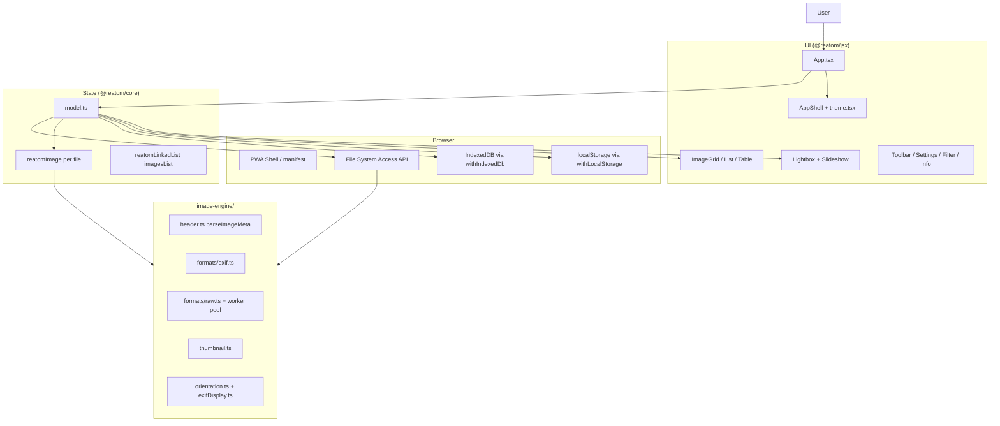
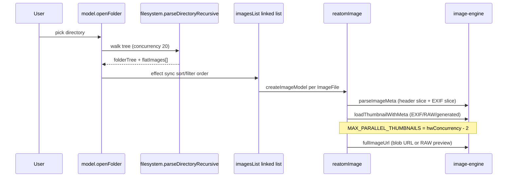
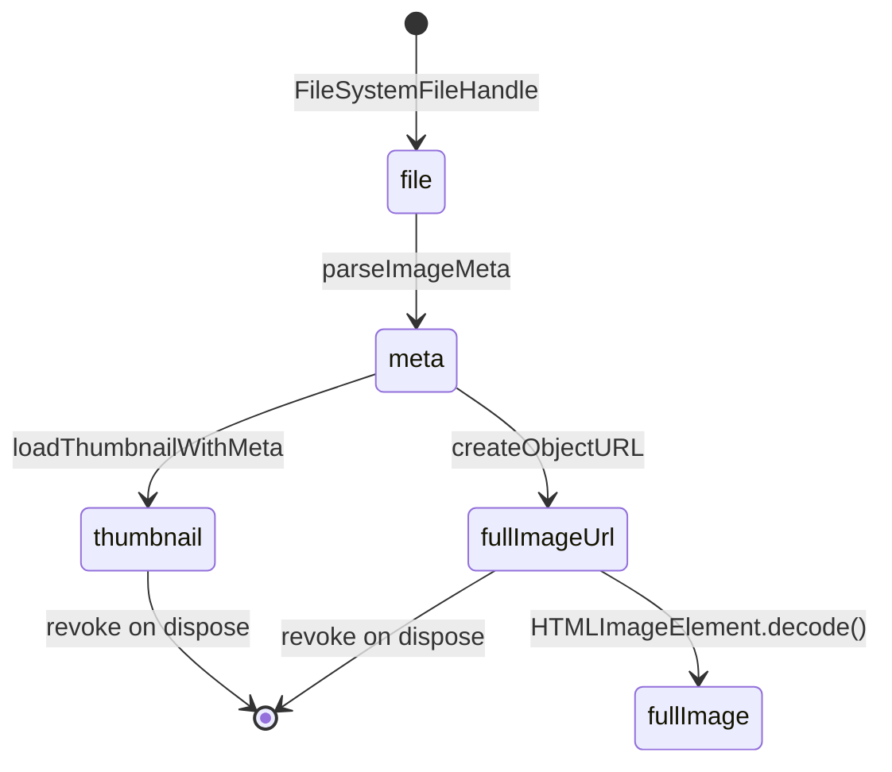
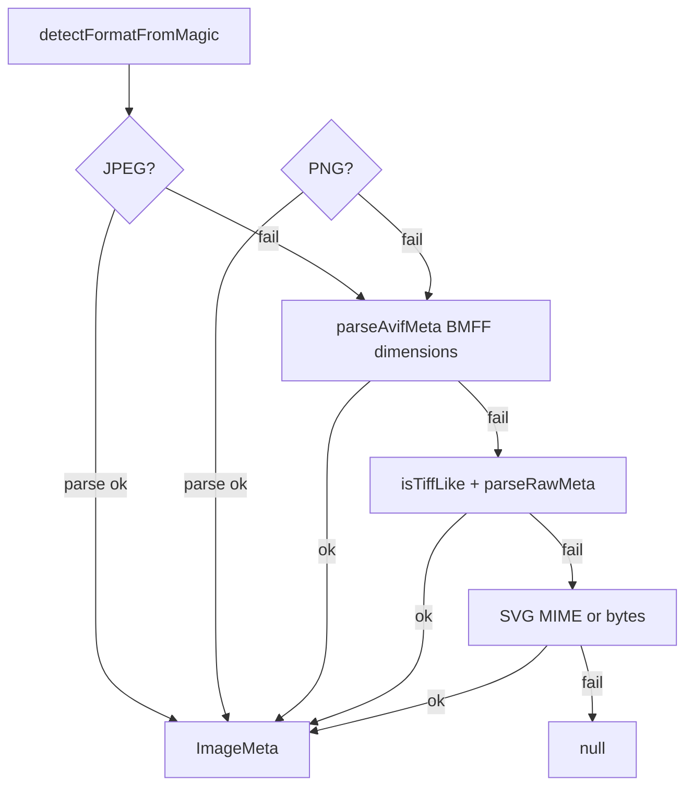
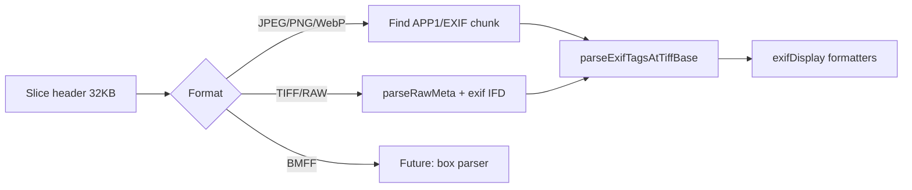
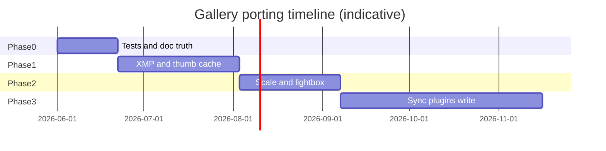
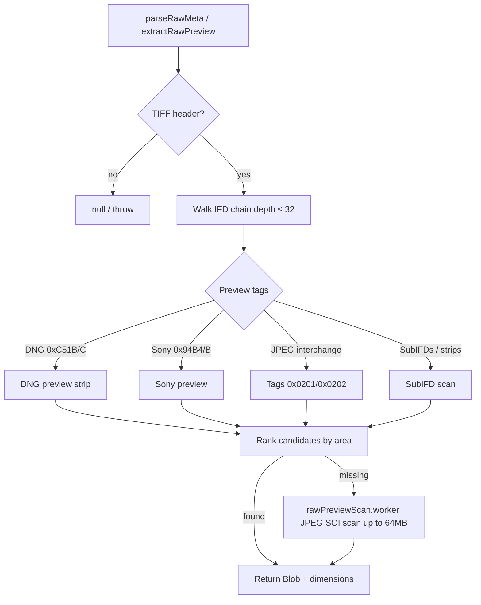
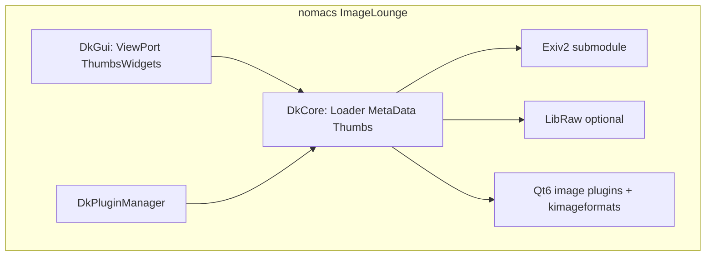
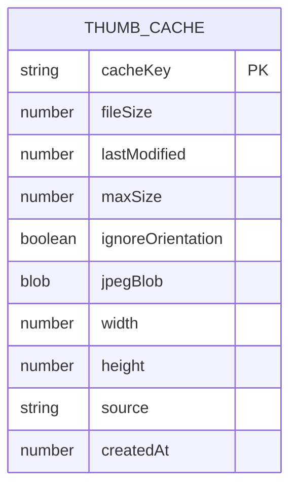

# nomacs → Reatom JSX Gallery: Porting Playbook

**Version:** 1.0 (June 2026)  
**Audience:** Engineers extending the gallery toward desktop-grade viewing while staying web-native.  
**Sources:** Live codebase at `examples/reatom-jsx-gallery`, nomacs tree at `~/code/nomacs`, and the [research pack](./nomacs-exif-reference.md) in `docs/`.

### See also (research pack)

| Document | Contents |
|----------|----------|
| [oculante-porting-playbook.md](./oculante-porting-playbook.md) | Oculante vs nomacs vs gallery; cache, flipbook, analysis, compare |
| [oculante-codebase-deep-dive.md](./oculante-codebase-deep-dive.md) | Rust loaders, operator stack, quickraw, priority matrix |
| [oculante-issues-backlog.md](./oculante-issues-backlog.md) | Oculante GitHub taxonomy + 28-item backlog |
| [oculante-dependency-stack.md](./oculante-dependency-stack.md) | Rust crates vs web equivalents |
| [oculante-readme-snapshot.md](./oculante-readme-snapshot.md) | Upstream README scrape |
| [nomacs-codebase-deep-dive.md](./nomacs-codebase-deep-dive.md) | Loader chain, EXIF/RAW/thumbs, sync, priority matrix |
| [nomacs-issues-backlog.md](./nomacs-issues-backlog.md) | GitHub issue taxonomy + 30-item backlog |
| [nomacs-dependency-stack.md](./nomacs-dependency-stack.md) | Qt/Exiv2/LibRaw vs web equivalents |
| [nomacs-exif-reference.md](./nomacs-exif-reference.md) | EXIF/orientation behavior spec |

---

## 1. Executive Summary

The **Reatom JSX Gallery** is a browser-first Progressive Web App that demonstrates Reatom v1001 reactive state, JSX UI without React, and a custom **image-engine** written in TypeScript. It opens local folders via the **File System Access API**, walks directories recursively, and renders thousands of images with per-file reactive models (`reatomImage`), linked-list ordering, and a multi-path thumbnail pipeline (EXIF embed → RAW preview → `createImageBitmap` fallback).

**nomacs** (Image Lounge) is a mature GPLv3 desktop viewer (Qt6, Exiv2, optional LibRaw/OpenCV/kimageformats) with deep format support, metadata editing, batch plugins, multi-instance TCP sync, disk thumbnail caches, and a large translation surface. The gallery deliberately **does not** port nomacs wholesale: there is no pixel editor, no Exiv2 write path, and no native RAW demosaic—only embedded JPEG previews inside DNG/ARW and browser decode where possible.

**Strategic thesis:** Treat nomacs as a **behavioral specification** for metadata fidelity, orientation policy, thumbnail precedence, and viewer UX patterns—while exploiting web-only strengths (URL sharing of logic via PWA, zero-install demos, reactive fine-grained updates, theme packs, Storybook/a11y CI). Gaps to close for “nomacs parity” on the web are: broader RAW/HEIC/AVIF, XMP/IPTC, persistent thumbnail cache, folder change detection, batch export, and optional metadata write behind explicit user consent.

**Effort snapshot (person-weeks, one senior engineer):**

| Phase | Focus | Estimate |
|-------|--------|----------|
| 0 | Hardening current engine + docs/tests | 2–3 |
| 1 | Metadata & cache parity (read-mostly) | 4–6 |
| 2 | Viewer UX + performance at 10k+ images | 3–5 |
| 3 | Web differentiators + optional write | 6–10 |

---

## 2. Reatom JSX Gallery — Current Architecture

### 2.1 System context



### 2.2 Data flow: folder open → visible cell



### 2.3 State model (`model.ts`)

Central atoms and computeds:

| Concern | Primitives | Persistence |
|---------|------------|-------------|
| Folder | `folderTree`, `currentFolder`, `flatImages`, `selectedFolderHandle` | IndexedDB handle |
| View | `viewMode` (grid/list/table), `gridColumns`, preview widths | localStorage |
| Sort/filter | `sortField`, `sortOrder`, `filterTypes`, `searchQuery`, size range, `includeSubfolders` | — |
| Selection | per-image `selected`, `favorite` | favorites → localStorage |
| Lightbox | `lightboxOpen`, `lightboxImage`, zoom/pan, `thumbnailWindow`, preload URL | — |
| Theme | `themePack` (10 packs), `themeMode`, `resolvedThemeMode` | localStorage |
| EXIF policy | `ignoreExifOrientation` | localStorage |

**`imagesList`** is a `reatomLinkedList` keyed by `id`. An effect rebuilds order when sort changes (full clear + `createMany` if order diverges). **Visibility** is a per-model `computed` (not DOM `display:none` on a static list)—lightbox navigation walks the linked list skipping `!visible()` nodes.

**Lightbox neighbor algorithm:** `findVisibleLightboxNeighbor` wraps the list; if no neighbor in direction, wraps to first/last visible—similar in spirit to nomacs “skip filtered” navigation but implemented on linked nodes, not QFileSystem index.

### 2.4 Per-image pipeline (`reatomImage.ts`)



- **Concurrency gate:** `activeThumbnailRequests` + `throwAbort()` when `>= hardwareConcurrency - 2` (min 2).
- **RAW:** `fullImageUrl` prefers `meta.embeddedPreview.blob` then `extractRawPreview`.
- **Orientation:** `resolveImageOrientationStyle` sets CSS `image-orientation: from-image` unless ignored or thumbnail already baked orientation via canvas.

### 2.5 Image engine modules

| Module | Responsibility |
|--------|----------------|
| `header.ts` | Magic-byte format detect; orchestrates format parsers; **falls through** when a magic-matched parser fails (AVIF BMFF, TIFF-like RAW, SVG); adaptive EXIF read up to **512 KB** (`EXIF_READ_BYTES`) |


| `formats/jpeg.ts` | SOF dimensions, progressive flag, APP1 EXIF thumbnail extract |
| `formats/exif.ts` | TIFF IFD walk (IFD0 → Exif → GPS → Interop); multi-APP1 “largest TIFF” strategy; `LARGE_TAG_DISPLAY_COUNT` |
| `formats/raw.ts` | DNG/ARW/CR2/NEF/ORF/SR2 TIFF IFD preview tags, Sony preview tags, bounded 64 MB heuristic JPEG scan for all supported RAW formats; worker offload |
| `formats/rawPreviewScanPool.ts` | Up to 2 workers scan 64 MB for JPEG SOI markers |
| `thumbnail.ts` | Path order: JPEG EXIF embed → RAW embed → `createImageBitmap` resize |
| `orientation.ts` | Tags 1–8, `composeOrientation` for future lossless rotate write |
| `exifDisplay.ts` | Camera HUD, flash/compression maps (nomacs-aligned), GPS Maps URL |

**Supported extensions** (`types.ts`): `.jpg`, `.jpeg`, `.png`, `.gif`, `.webp`, `.svg`, `.avif`, `.bmp`, `.dng`, `.arw`, `.cr2`, `.nef`, `.orf`, `.sr2`.

**AVIF:** `formats/bmff.ts` reads **dimensions** from `ispe` boxes; there is **no BMFF EXIF** parser yet (browser decode still handles thumbnails).

**RAW:** CR2/NEF/ORF/SR2 are TIFF-like RAW classified by extension + IFD preview tags; DNG/ARW add DNG-version / Sony-Make heuristics and share the same bounded 64 MB JPEG scan when IFD preview is missing.

### 2.6 UI composition

```
App.tsx
├── AppShell (theme CSS variables)
├── RestoreSelectedFolder
├── KeyboardShortcuts
├── Toolbar
├── GalleryWorkspace (grid | list | table)
├── Lightbox (+ Slideshow, ImageInfoPanel toggle)
├── SettingsPanel (grid, theme, EXIF ignore)
└── FilterPanel
```

**`theme.tsx`:** ~1.5k lines of CSS-in-JS variables for 10 theme packs × light/dark—far beyond nomacs’ Light/Dark/System CSS. This is a deliberate product differentiator.

**Testing:** Storybook 10 + Vitest browser + `@storybook/addon-a11y` (see `CONTRIBUTING.md`). Unit tests exist for `model`, `exif`, `orientation`, `raw`.

### 2.7 Intentional divergences from README/plan

The README still mentions masonry, virtual scrolling, IndexedDB thumbnail cache, and Workbox—**not fully implemented** in code. `plan.md` defers ZIP download tests. Treat README as aspirational; this playbook tracks **code truth**.

---

## 3. nomacs Strengths to Emulate

### 3.1 Metadata depth (Exiv2-backed)

nomacs loads EXIF, IPTC, and XMP via Exiv2 (`DkMetaDataT`), with:

- **Orientation precedence:** IFD0 `Orientation` before Exif.Photo (`getExifValue` order)—mirrored in gallery `exif.ts` IFD walk order.
- **Rich display maps:** Flash bitmasks, compression manufacturer codes, exposure modes (`DkMetaData.cpp` ~1628–1900)—ported into `exifDisplay.ts` using `Map` lookups (fixes nomacs array-index flash bug).
- **GPS:** DMS + Google Maps link—implemented in gallery.
- **UserComment:** 8-byte encoding header—parser should follow `exif.ts` USER_COMMENT handling.
- **Large tags:** count ≥ 2000 → placeholder string—gallery constant `DATA_TOO_LARGE_PLACEHOLDER`.
- **Save guards:** abort if buffer shrinks ≤50% (Exiv2 #995); `clearOrientation()` on pixel edit—document for future write API.

Reference: `nomacs-exif-reference.md`, `ImageLounge/src/DkCore/DkMetaData.cpp`.

### 3.2 Thumbnail policy (`DkThumbs.h`)

nomacs `LoadThumbnailOption`:

- Default: try EXIF thumb, fall back to full decode.
- `force_exif`, `force_size`, `force_full`.

Gallery equivalent in `thumbnail.ts`:

1. JPEG → `tryExifPath` (orientation baked on embedded EXIF JPEG when needed)
2. RAW (DNG/ARW/CR2/NEF/ORF/SR2) → `tryRawPreviewPath` (accepts smaller previews; orientation baked on embedded preview when needed)
3. → `generateThumbnailFromBlob` (orientation baked from `meta.exif` when valid and not ignored)

**Emulate:** nomacs `maxThumbSize`, `thumbThreads`, `thumbCacheMemory`, `thumbDiskCache`, `preloadThumbs` (`DkSettings.h` Resources struct). Gallery should add IndexedDB cache keyed by `(handle.id, mtime, maxSize, ignoreOrientation)`.

### 3.3 Loader / transform policy (`DkBasicLoader.cpp`)

- Respect `ignoreExifOrientation` setting (gallery: `ignoreExifOrientation` atom).
- Qt/plugins may pre-rotate HEIC/RAW while tag remains—gallery uses CSS `from-image` first, canvas bake only for EXIF JPEG thumbs.

### 3.4 Viewer UX

- **Lightbox/HUD:** zoom, pan, fullscreen, slideshow timing, filename overlay.
- **Thumbnail strip** in lightbox (`thumbnailWindow` ±5 visible neighbors)—nomacs thumb dock analog.
- **Sort/filter:** nomacs `sortMode`, extension filters, RAW filter, duplicate filter (`filterDuplicats`).
- **Multi-select + batch:** `DkThumbsWidgets::batchProcessFiles`, print—gallery has selection + download/copy JPEG; batch pipeline shallow.

### 3.5 Multi-instance sync (desktop-only pattern)

`DkNoMacsSync`, `DkNetwork`, `tcpSynchronize` on viewport—useful **concept** for multi-tab sync via `BroadcastChannel` (see §7).

### 3.6 Format breadth

nomacs via Qt + kimageformats + LibRaw: PSD, RAW family, HEIC/AVIF/JXL, TIFF, etc. Gallery should document **which** nomacs paths map to web decoders vs WASM LibRaw vs preview-only.

### 3.7 i18n and accessibility

nomacs: 30+ Crowdin locales. Gallery: English UI; emulate with message catalog before GA.

---

## 4. nomacs Weaknesses to Avoid

Derived from nomacs source comments, Exiv2 edge cases, and desktop UX debt—not from live GitHub API (rate-limited during research).

### 4.1 Metadata / save path

| Issue | nomacs behavior | Gallery stance |
|-------|-----------------|----------------|
| Exiv2 write crashes | `writeMetadata()` TODO crash on some JPEGs | No write until sandboxed pipeline |
| Buffer shrink false save | Reject ≤50% size drop | Same guard if write added |
| Unicode paths on Windows | FIXME in metadata open | FSA uses browser handles—less path encoding pain |
| XMP sidecar confusion | Partial TODO for sidecar types | Explicit “sidecar required” UX |
| MicrosoftPhoto.Rating | Percent mislabeled as stars | Do not copy; use XMP `xmp:Rating` |
| Flash lookup by array index | Wrong labels for some values | Already using `Map` in gallery |

### 4.2 Thumbnail / performance

| Issue | nomacs | Avoid |
|-------|--------|-------|
| EXIF thumb >200px | Exiv2 crash risk | Cap embed decode size in gallery |
| Blocking UI thread | Qt threads help; still heavy | Keep workers + abortable computeds |
| Unbounded disk cache | `thumbDiskSpace` settings needed | Quota + LRU in IndexedDB |

### 4.3 UX / product

- **Feature sprawl:** plugins, pong, print dialogs—avoid porting low-value modules to web MVP.
- **Native modal dependency:** `nativeDialog` setting—web should use consistent in-app pickers.
- **Duplicate README drift:** nomacs wiki vs code; gallery should keep this playbook as source of truth.
- **GPL coupling:** nomacs GPLv3—gallery MIT/reatom example; do not copy nomacs C++ verbatim; port **behavior** only.

### 4.4 Known GitHub themes

See [nomacs-issues-backlog.md](./nomacs-issues-backlog.md). High-signal open issues: [#1593](https://github.com/nomacs/nomacs/issues/1593) find/filter, [#1592](https://github.com/nomacs/nomacs/issues/1592) sort scroll-sync, [#1590](https://github.com/nomacs/nomacs/issues/1590) fullscreen filmstrip, [#1587](https://github.com/nomacs/nomacs/issues/1587) RAW+JPEG pairing, [#1585](https://github.com/nomacs/nomacs/issues/1585) overview sync, [#1578](https://github.com/nomacs/nomacs/issues/1578) DNG brightness, [#987](https://github.com/nomacs/nomacs/issues/987) project future.

---

## 5. Porting Playbook by Domain

### 5.1 Metadata

**Current:** TypeScript TIFF parser; EXIF/GPS/Interop tag names; custom formatters; no IPTC/XMP; no write.

**Target behaviors (nomacs parity):**

1. **Tag coverage:** Add IPTC (APP13) and XMP (APP1 XML + sidecar `.xmp` via handle sibling read).
2. **BMFF:** HEIC/AVIF `meta` boxes—align with nomacs `enableBMFF` / Exiv2 BMFF; browser `createImageBitmap` + optional exifr WASM for tags only.
3. **MakerNote:** Display “opaque” for large blobs; never stringify binary in UI.
4. **Rating:** Parse `xmp:Rating` and `MicrosoftPhoto:Rating` with correct percent→stars math.
5. **Date/time:** Prefer `DateTimeOriginal` over `DateTime`; show timezone offset if present.

**Implementation steps:**



**Files:** extend `formats/exif.ts`, new `formats/xmp.ts`, `ImageInfoPanel.tsx` sections.

**Risk:** Parser divergence from Exiv2—maintain golden files from `DkMetaData_test.cpp` and gallery `exif.test.ts`.

---

### 5.2 RAW

**Current:** DNG/ARW/CR2/NEF/ORF/SR2; preview from IFD tags + Sony tags + worker JPEG scan (64 MB); no demosaic.

**nomacs:** LibRaw + Qt RAW loader + `loadRawThumb` setting.

**Port strategy:**

| Tier | Approach | Effort |
|------|----------|--------|
| A (now) | Embedded JPEG/large TIFF preview only | Done |
| B | WASM LibRaw or `@jsquash` for select formats | High |
| C | Server-side proxy (out of scope for local PWA) | — |

**Emulate nomacs:**

- `filterRawImages` preference—toggle to hide `.arw`/`.dng` from grid.
- Preview size ladder like `LoadThumbnailOption::force_size`.
- Cache preview blob hash in IndexedDB—expensive scan runs once.

**Files:** `raw.ts`, `rawPreviewScan.worker.ts`, `rawPreviewScanPool.ts`, `reatomImage.ts`.

---

### 5.3 Thumbnails

**Precedence (keep):** EXIF → RAW embed → decode+scale.

**Add from nomacs:**

- Disk/memory cache (`DkCachedThumb`, Resources settings).
- `preloadThumbs`: when lightbox opens, prefetch neighbors’ thumbnails (gallery already preloads **full** URL via `lightboxPreloadImageUrl`—extend to thumbs).
- `sharedThumbs`: N/A on web; use Cache Storage API for blob URLs if same-origin.

**Performance knobs:**

- Expose `maxSize` and `quality` in Settings (today constants `DEFAULT_MAX_SIZE=800`, `quality=0.75`).
- Honor `ignoreExifOrientation` in thumb path (done).

---

### 5.4 Lightbox

**Current:** Zoom/pan, fullscreen guard, controls fade, copy JPEG, download, info panel, slideshow, orientation CSS, thumbnail strip.

**nomacs gaps to close:**

- **Fit modes:** 100% vs fit vs screen (map to `lightboxZoom` presets).
- **Histogram:** nomacs `DkHistogramEngine`—web Canvas from `fullImage` pixels (Phase 2).
- **Metadata overlay HUD** on image (camera lines) like nomacs optional OSD.
- **Gesture:** pinch-zoom (Pointer Events); gallery has pan start—verify mobile Storybook stories.

**Files:** `Lightbox.tsx`, `Slideshow.tsx`, `model.ts` lightbox atoms.

---

### 5.5 Batch

**nomacs:** `batchProcessFiles`, batch print, plugin batch interface (`DkBatchPluginInterface`).

**Gallery today:** `selectAllImages`, `selectedCount`, `download.ts`, `copyImage.ts`—no ZIP batch in code despite README.

**Roadmap:**

1. ZIP export via JSZip (streams from handles).
2. Batch rename (needs `readwrite` permission on directory).
3. Batch EXIF strip/tag (only with write pipeline + confirmations).

Use `action` + `withAbort` pattern from `openFolder` for cancellable batch jobs; surface progress in `ProgressBar.tsx`.

---

### 5.6 Sync

**nomacs:** TCP sync between instances (`DkViewPort::tcpSynchronize`).

**Web port:**

- `BroadcastChannel('reatom-gallery')` for open folder path, lightbox index, theme—multi-tab demo.
- **Not** cross-device sync (no server).

Avoid nomacs complexity (peer IDs, firewalls).

---

### 5.7 Search / filter

**Current:** Extension set filter, substring search, size min/max, folder scope, subfolder toggle.

**nomacs extras:**

- Search history (`searchHistory` in settings).
- Duplicate detection (`filterDuplicats`)—hash first 64 KB + size.
- Date range filter (README claims; wire `lastModified` in `visible` computed).
- Random sort (plan.md; add `sortField: 'random'` with seeded `sortSeed` like nomacs).

---

### 5.8 Performance

| Technique | Gallery | nomacs | Next step |
|-----------|---------|--------|-----------|
| Parallel folder read | 20 concurrent | thread pool | Tune via atom |
| Thumb concurrency | hw-2 | `thumbThreads` | Expose setting |
| List virtualization | None | Qt model/view | CSS `content-visibility` or virtual window |
| Abort stale loads | `withAbort`, `throwAbort` | cancel futures | Per-image generation tokens |
| Memory | revoke object URLs on dispose | QImage cache limits | Audit leak on fast scroll |

**Target:** 10k images—benchmark `imagesList` resort cost; consider incremental reorder (merge) vs full rebuild.

---

### 5.9 Accessibility

**Current:** `a11y.ts` helpers (`focusableCardAttrs`, sr-only), Storybook a11y addon, lightbox focus management.

**Emulate nomacs keyboard map** via `DkShortcuts.h`—document in-app shortcut overlay (partially in `shortcuts.tsx`).

**Checklist:**

- [ ] Grid cells: `role="button"`, visible focus ring in all theme packs
- [ ] Lightbox: trap focus, `aria-modal`, live region for counter
- [ ] Slideshow: pause on `visibilitychange`
- [ ] Respect `prefers-reduced-motion` for theme animations

---

### 5.10 Mobile / PWA

**Current:** `public/manifest.json`, responsive layout, touch-oriented lightbox.

**Gaps:**

- File System Access API limited on mobile Safari—fallback `<input webkitdirectory>` (plan.md).
- Service worker not wired in vite config (README claim).
- Install prompt + offline shell without caching user photos (privacy-preserving).

**nomacs:** no mobile app—gallery can exceed nomacs here with installable PWA and touch gestures.

---

## 6. Implementation Roadmap

### Phase 0 — Foundation (2–3 person-weeks)

**Goal:** Truth in docs, regression safety, orientation/EXIF edge cases.

- [ ] Align README with implemented features
- [ ] Expand `exif.test.ts` / `orientation.test.ts` from `nomacs-exif-reference.md` matrix
- [ ] AVIF: either parse BMFF EXIF or remove from `IMAGE_EXTENSIONS` until ready
- [ ] IndexedDB persistence design doc for thumbs (no implementation required in 0 if timeboxed)

**Acceptance:** CI unit tests green; EXIF orientation 0/9+ invalid; multi-APP1 pick largest TIFF.

---

### Phase 1 — Read parity (4–6 person-weeks)

**Goal:** Metadata + cache + RAW stability.

- [ ] XMP sidecar read + minimal tag panel
- [ ] IndexedDB thumbnail cache with LRU quota (MiB setting like nomacs `thumbDiskSpace`)
- [ ] Date range + random sort
- [ ] Duplicate filter (size + quick hash)
- [ ] HEIC/AVIF: decode + EXIF when kimageformats-equivalent available in browser

**Acceptance:** Re-open 5k folder second time &lt;30% thumb CPU; Info panel shows XMP rating; DNG/ARW grid without scan timeout.

---

### Phase 2 — Viewer & scale (3–5 person-weeks)

**Goal:** Lightbox pro features and 10k+ grid.

- [ ] Virtualized grid window or `content-visibility: auto`
- [ ] Histogram panel
- [ ] Pinch zoom + reduced-motion
- [ ] Batch ZIP download
- [ ] Folder change polling (`navigator.storage` or periodic `handle.queryPermission` + diff)

**Acceptance:** Lighthouse perf ≥85 on 3k grid; ZIP 50 files; lightbox gestures on mobile Chromium.

---

### Phase 3 — Differentiators & optional write (6–10 person-weeks)

**Goal:** Web-only value + guarded metadata write.

- [ ] Multi-tab `BroadcastChannel` sync
- [ ] Theme pack import/export JSON
- [ ] Share link / demo mode (blob URLs—ephemeral)
- [ ] Lossless rotate: `composeOrientation` + JPEG re-write in worker (with 50% shrink guard)
- [ ] Plugin hook API (JS modules, not nomacs DLLs)

**Acceptance:** Rotate saves new file with user-chosen suffix; no silent data loss; plugin demo in Storybook.

---



---

## 7. Creative Web-Only Differentiators

Features nomacs **cannot** match without becoming a different product:

1. **Reactive granularity:** Each image is an independent Reatom frame—scroll grid without re-rendering entire collection (nomacs QWidget tree relayout).
2. **Theme packs:** 10 art-directed skins with CSS variables (`theme.tsx`) vs nomacs Light/Dark/System.
3. **Zero-install share:** Deploy gallery as static demo on any CDN; open sample folder via File System Access in one click.
4. **Storybook contract:** Every panel component has a11y + interaction tests—nomacs relies on manual QA.
5. **URL-addressable state (future):** Serialize `viewMode`, `sortField`, `themePack` into query string for reproducible bug reports.
6. **BroadcastChannel sync:** Multi-tab lightbox follow-along without TCP setup.
7. **Privacy default:** No telemetry, no cloud upload—market as “local-first viewer.”
8. **Embed in Reatom docs:** Living example for `reatomLinkedList`, `withIndexedDb`, `withAsyncData`.
9. **WASM sandbox:** Run heavy parsers in worker with deterministic memory cap—safer than Exiv2 in-process on desktop.
10. **Copy image as JPEG to clipboard** (`copyImage.ts`)—web clipboard API; nomacs uses OS pasteboard via Qt.

---

## 8. Appendix: File Mapping (nomacs → gallery)

| nomacs path | Role | Gallery path | Status |
|-------------|------|--------------|--------|
| `ImageLounge/src/DkCore/DkMetaData.cpp` | EXIF/IPTC/XMP read/write | `image-engine/formats/exif.ts`, `exifDisplay.ts` | Read partial |
| `ImageLounge/src/DkCore/DkMetaData.h` | Metadata model | `image-engine/types.ts` (`ExifData`) | Partial |
| `ImageLounge/src/DkCore/DkBasicLoader.cpp` | Load + orientation | `reatomImage.ts`, `orientation.ts` | Parity |
| `ImageLounge/src/DkCore/DkThumbs.h` | Thumb pool/options | `thumbnail.ts`, `reatomImage.ts` | Partial |
| `ImageLounge/src/DkCore/DkCachedThumb.*` | Thumb cache | — | Missing |
| `ImageLounge/src/DkCore/DkSettings.h` | Preferences | `model.ts` + localStorage | Partial |
| `ImageLounge/src/DkCore/DkImageLoader.*` | Save guards | — | Document only |
| `ImageLounge/src/DkGui/DkViewPort.*` | Viewer/zoom | `Lightbox.tsx` | Partial |
| `ImageLounge/src/DkGui/DkThumbsWidgets.*` | Thumb UI + batch | `ImageGrid.tsx`, `GridImage.tsx` | Partial |
| `ImageLounge/src/DkGui/DkNetwork.*` | TCP sync | — | Use BroadcastChannel |
| `ImageLounge/src/DkGui/DkPreferenceWidgets.*` | Settings UI | `SettingsPanel.tsx` | Partial |
| `ImageLounge/src/DkGui/DkShortcuts.h` | Keys | `shortcuts.tsx` | Partial |
| `ImageLounge/tests/DkMetaData_test.cpp` | Golden tests | `exif.test.ts`, `orientation.test.ts` | Growing |
| `3rd-party/libraw` (submodule) | RAW develop | `formats/raw.ts` preview only | Subset |
| Exiv2 (via submodule) | Metadata | Custom TS parser | Subset |
| kimageformats | HEIC/AVIF/JXL | Browser decode | Partial |

### Gallery file index (quick reference)

| Path | Purpose |
|------|---------|
| `src/model.ts` | App state, linked list, lightbox |
| `src/reatomImage.ts` | Per-file async pipeline |
| `src/filesystem.ts` | Recursive directory walk |
| `src/image-engine/header.ts` | Meta orchestration |
| `src/image-engine/thumbnail.ts` | Thumb strategies |
| `src/image-engine/formats/raw.ts` | DNG/ARW/CR2/NEF/ORF/SR2 previews |
| `src/components/Lightbox.tsx` | Fullscreen viewer |
| `src/components/ImageInfoPanel.tsx` | Metadata UI |
| `src/theme.tsx` | Theme packs |
| `src/a11y.ts` | A11y helpers |

---

## 9. References and Issue Links

### Primary references

- nomacs repository: https://github.com/nomacs/nomacs  
- nomacs README (build, kimageformats, LibRaw): `~/code/nomacs/README.md`  
- EXIF behavior digest: `/Users/artalar/code/reatom/nomacs-exif-reference.md` (also `examples/reatom-jsx-gallery/docs/` when copied)  
- Exiv2 issue **#995** (save buffer shrink): cited in `DkMetaData.cpp` ~279  
- Gallery implementation plan: `examples/reatom-jsx-gallery/plan.md`  
- Reatom JSX: `packages/jsx/README.md`  

### nomacs source anchors (line ranges approximate)

| Topic | File |
|-------|------|
| Orientation read/write | `DkMetaData.cpp` 317–380, 1128–1224 |
| Loader transform | `DkBasicLoader.cpp` 170–208, 419–495 |
| Display maps | `DkMetaData.cpp` 1628–1716, 1719–1900 |
| Meta settings | `DkSettings.h` 320–322 (`ignoreExifOrientation`) |
| Thumb options | `DkThumbs.h` 60–104 |
| Resources/cache | `DkSettings.h` 325–346 |

### External standards

- TIFF 6.0 / EXIF 2.32 orientation tag `0x0112`  
- ExifTool Flash table (nomacs comment reference)  
- File System Access API: https://developer.mozilla.org/en-US/docs/Web/API/File_System_API  
- CSS `image-orientation`: https://developer.mozilla.org/en-US/docs/Web/CSS/image-orientation  

### GitHub issues (nomacs)

Full triage and 30-item backlog: [nomacs-issues-backlog.md](./nomacs-issues-backlog.md). Researched via GitHub API (June 2026); `gh` CLI was unavailable in the research environment.

| ID | State | Theme | Gallery note |
|----|-------|-------|--------------|
| [#1587](https://github.com/nomacs/nomacs/issues/1587) | open | RAW+JPEG pairing | Post-process `flatImages`; not in nomacs C++ yet |
| [#1593](https://github.com/nomacs/nomacs/issues/1593) | open | Find/filter shortcut | Ctrl+F must open filter, not clear |
| [#1592](https://github.com/nomacs/nomacs/issues/1592) | open | Sort scroll-sync | Recompute active index on resort |
| [#1590](https://github.com/nomacs/nomacs/issues/1590) | open | Fullscreen filmstrip | Recoverable chrome in lightbox |
| [#1585](https://github.com/nomacs/nomacs/issues/1585) | open | Overview sync | Minimap + linked panes |
| [#1578](https://github.com/nomacs/nomacs/issues/1578) | open | DNG brightness | Label embedded preview |
| [#1576](https://github.com/nomacs/nomacs/issues/1576) | open | Selection filmstrip | `filterToSelection` atom |
| [#1563](https://github.com/nomacs/nomacs/issues/1563) | open | X3F embedded JPEG | Extend `raw.ts` |
| [#1549](https://github.com/nomacs/nomacs/issues/1549) | open | Metadata on thumb nav | Bind panel to `lightboxImage` |
| [#1510](https://github.com/nomacs/nomacs/issues/1510) | open | Thumb orientation | Never strip EXIF on cache |
| [#1438](https://github.com/nomacs/nomacs/issues/1438) | open | Batch orientation | Future batch export guard |
| [#1059](https://github.com/nomacs/nomacs/issues/1059) | open | Thumb pane layout | Fixed filmstrip + safe-area |
| [#257](https://github.com/nomacs/nomacs/issues/257) | open | HEIC support | Browser decode + exifr |
| [#987](https://github.com/nomacs/nomacs/issues/987) | open | Project maintenance | PWA positioning |
| [#1228](https://github.com/nomacs/nomacs/issues/1228) | closed | Mirrored orientation | Covered in `orientation.ts` |
| [#1238](https://github.com/nomacs/nomacs/issues/1238) | closed | Thumb loader refactor | Test `orientationBaked` |
| [#1482](https://github.com/nomacs/nomacs/issues/1482) | closed | XMP rating container | Sidecar write via FSA |
| [#1503](https://github.com/nomacs/nomacs/pull/1503) | closed | HEIC landed | kimageformats → browser codecs |
| [#1459](https://github.com/nomacs/nomacs/issues/1459) | closed | iPhone 16 HEIC | CI matrix on Safari/Chrome |
| [#754](https://github.com/nomacs/nomacs/issues/754) | closed | DNG too dark | Preview-only UX |
| [#533](https://github.com/nomacs/nomacs/issues/533) | closed | Thumb orientation | EXIF embed rotate |
| [#1511](https://github.com/nomacs/nomacs/issues/1511) | closed | Edit + EXIF thumb | Read-only gallery OK |
| [#1453](https://github.com/nomacs/nomacs/pull/1453) | closed | 90° rotation | `composeOrientation` for write |

Search queries: [orientation](https://github.com/nomacs/nomacs/issues?q=is%3Aissue+orientation), [exiv2](https://github.com/nomacs/nomacs/issues?q=is%3Aissue+exiv2), [RAW](https://github.com/nomacs/nomacs/issues?q=is%3Aissue+RAW), [HEIC](https://github.com/nomacs/nomacs/issues?q=is%3Aissue+HEIC), [thumbnail](https://github.com/nomacs/nomacs/issues?q=is%3Aissue+thumbnail).

### Gallery follow-ups

- [x] Copy `nomacs-exif-reference.md` into `docs/`  
- [ ] Link Phase 0 tests to nomacs `DkMetaData_test` vectors where extractable  

---

## 2.8 Component layer (detailed)

### Toolbar and workspace chrome

`Toolbar.tsx` hosts folder open, view mode toggles (grid/list/table), filter/settings triggers, selection summary, and theme toggle entry. `GalleryWorkspace.tsx` gates three content modes: `empty` (welcome + `EmptyState`), `parsing` (while `openFolder` or `restoreSelectedFolder` in flight), and `gallery` (folder tree sidebar + breadcrumb + `SortPanel` + main scroller).

The folder tree (`FolderTree.tsx`) sets `currentFolder` on node click; combined with `includeSubfolders` this drives per-image `visible` without re-parsing the filesystem—an efficient pattern compared to nomacs re-filtering QFileSystemModel rows.

### Grid, list, and table views

| Component | Rendering strategy | Thumbnail source |
|-----------|-------------------|------------------|
| `ImageGrid.tsx` | CSS grid; `gridColumns` atom | `GridImage` → `model.thumbnail` async |
| `ImageList.tsx` | Rows with variable preview width | Same pipeline |
| `ImageTable.tsx` + `ImageTableRow.tsx` | Tabular metadata columns | Same + inline EXIF columns optional |

`GridImage.tsx` binds to `ImageModel.thumbnail` and `fullImage` states, shows loading/error chrome, handles selection checkbox and double-click → `openLightbox`. Image fit (`contain`/`cover`/`fill`/`none`) applies at cell level—nomacs uses viewport-level fit; gallery splits cell vs lightbox concerns.

### Lightbox and slideshow internals

`Lightbox.tsx` (~700+ lines) manages:

- Zoom wheel and button clamps tied to `lightboxZoom`
- Pan with pointer capture when zoom &gt; 1 (`lightboxPanX`/`lightboxPanY`)
- Fullscreen API with 500 ms exit guard to avoid accidental Escape churn
- Controls auto-hide after 2.5 s inactivity (`controlsFadeDelay`)
- Neighbor preload via `lightboxPreloadImageUrl` computed
- Filmstrip from `thumbnailWindow` (5+current+5 visible nodes)
- Copy JPEG (`copyImage.ts`) and download actions

`Slideshow.tsx` toggles `slideshowPlaying` and uses `slideshowInterval` from localStorage (default 3000 ms)—maps to nomacs `SlideShow.time` but without silent fullscreen or custom background color yet.

### Settings and filter panels

`SettingsPanel.tsx`: grid columns, gap enum, image fit, theme pack/mode, `ignoreExifOrientation`, show names/sizes. `FilterPanel.tsx`: extension chips, search box, size sliders. `SortPanel.tsx`: field + order—no random seed yet (nomacs `sortSeed`).

### Persistence hooks

| Key | Mechanism | nomacs analog |
|-----|-----------|---------------|
| `gallery.selectedFolderHandle` | `withIndexedDb` | Recent folders list |
| `gallery.favorites.{id}` | per-image localStorage | Star rating in thumb model |
| `gallery.viewMode`, theme, grid | localStorage | QSettings ini |

IndexedDB for **directory handles** enables `RestoreSelectedFolder` on reload—critical PWA UX nomacs achieves via native recent files.

---

## 2.9 Image-engine deep dive

### EXIF parsing algorithm (`formats/exif.ts`)

1. Scan for TIFF header `II` / `MM` + magic 42 inside JPEG APP1, PNG `eXIf` chunk, or WebP `EXIF` chunk.
2. When multiple APP1 segments exist, select the **largest** TIFF block (nomacs/Exiv2 merge behavior).
3. Walk IFD0; follow pointers `0x8769` (Exif IFD), `0x8825` (GPS), `0xA005` (Interop).
4. Resolve tag types 1–12; rationals as `num/den` strings for display pipeline.
5. Skip thumbnail tags `0x0201`/`0x0202` in main tag map (handled in jpeg path).
6. Tags with `count >= 2000` → `DATA_TOO_LARGE_PLACEHOLDER`.

Orientation tag `0x0112` stored as human name `Orientation` with numeric string value; `orientation.ts` validates 1–8, rejects 0 and 9+.

### JPEG path (`formats/jpeg.ts`)

- Parses SOF0/SOF2 for dimensions and progressive flag.
- `extractExifThumbnailFromView` reads compressed EXIF thumbnail offset/length.
- Used by thumbnail fast path before full file decode.

### RAW path (`formats/raw.ts`) — decision tree



Worker pool (`rawPreviewScanPool.ts`) limits to **2 workers** to avoid mobile thermal throttling; transfers `ArrayBuffer` with zero-copy `postMessage` transfer list.

### Thumbnail orientation bake

When EXIF embedded preview is used and orientation is 5–8 or mirrored, gallery applies `applyOrientationToImageBitmap` before downscale—sets `orientationBaked: true` so lightbox does not double-apply CSS `from-image`. This mirrors nomacs `LoadThumbnailResult.transformed` flag.

### Header read sizing

- `HEADER_READ_BYTES = 32768` for magic + initial structural parse.
- `EXIF_READ_BYTES = 512_000` cap via `resolveExifReadBytes(fileSize)`—nomacs reads full file via Exiv2; gallery trades completeness for memory on multi-MP JPEG APP1 stacks.

---

## 3.8 nomacs architecture primer (for porters)



**Loader selection:** `DkBasicLoader::loadGeneral` branches on suffix—ZIP-in-archive, PSD, RAW, standard Qt `QImageReader`. Metadata loaded into `DkMetaDataT` shared pointer; fast path skips full decode when only thumbs needed.

**Threading:** `DkThumbsThreadPool` singleton wraps `QThreadPool`; thumb jobs return `LoadThumbnailResult` with optional metadata copy. UI never blocks on Exiv2—unlike early gallery versions that parsed on main thread (now mitigated via async computeds + workers).

**Settings persistence:** `DkSettings` reads/writes platform-specific paths; portable mode supported. Gallery’s `withLocalStorage` keys are flatter but serve same role.

---

## 4.5 Expanded nomacs weakness catalog (source-derived)

### Metadata subsystem

- **Exiv2 crash notes** in `setMetadata` paths for PNG samples (`exif-crash` comment)—gallery must fuzz-test parser with binary corpora.
- **UTF-8 save TODO**—international captions break on write; gallery should use `TextEncoder` explicitly if adding write.
- **XMP crop/lightroom tags** read for crop overlay (`Xmp.crs.Crop*`) but incomplete UI—avoid half-implemented overlays in web MVP.
- **IPTC charset issues**—Exiv2 charset detection differs from Photoshop; display raw + hex fallback for unknown.

### Loader subsystem

- **SymLink and ZIP-in-file** complexity in `loadGeneral`—web FSA does not expose symlinks consistently; document as unsupported.
- **Multi-page TIFF/PSD** (`mNumPages`, `mPageIdx`)—gallery has no page selector; add badge if detected.
- **Fast load flag**—nomacs defers metadata; gallery always kicks `meta` computed—consider `peek` lazy meta for list-only mode.

### Thumbnail subsystem

- **force_exif** returns blank when embed missing—gallery falls through correctly; ensure UI shows spinner not broken icon.
- **System thumbnailer integration** (`sharedThumbs`)—impossible on web; do not promise OS cache integration.

### Network/sync

- TCP sync requires firewall rules and manual peer setup—poor UX for casual users; web BroadcastChannel is simpler but same-machine only.

### Build/maintenance

- Qt6 + submodule build fragility (documented in nomacs README)—gallery’s Vite build is CI-friendly; keep nomacs as reference not dependency.

---

## 5.11 Cross-domain integration patterns

### Reatom patterns to preserve when porting nomacs features

1. **`withAsyncData` on computeds** — `reatomImage` file/meta/thumbnail/fullImage each expose `.ready()`, `.data()`, `.error()` for UI binding without ad-hoc loading flags.
2. **`wrap()` in async actions** — all `getFile()` and engine calls wrapped for abort semantics.
3. **`withAbort` on folder open** — user can cancel long parse; nomacs lacks cancel on directory enumerate.
4. **`reatomLinkedList` ordering** — expensive resort isolated to effect; do not sort in render.
5. **`computed` visibility** — filters are reactive; nomacs often rebuilds model—keep gallery pattern.

### Anti-patterns when chasing nomacs

- Importing Exiv2 via WASM without 2 MB bundle budget and worker isolation.
- Storing full EXIF strings in localStorage per image—use IndexedDB or skip.
- Synchronous `parseImageMeta` in render path.
- Global `URL.createObjectURL` without `dispose()` on model removal—gallery already revokes; batch imports must call `imagesList` cleanup.

---

## 5.12 Metadata — extended implementation spec

### IPTC (Phase 1)

- JPEG APP13 segment begins `Photoshop 3.0` or `8BIM`; resource blocks contain IPTC-IIM dataset 2.
- Map record 2:120 (caption), 2:80 (byline), 2: city, etc., to display names.
- **Do not** conflate with XMP `dc:description`—show both with section headers in `ImageInfoPanel`.

### XMP (Phase 1)

- Parse RDF/XML from APP1 `http://ns.adobe.com/xap/1.0/` and sidecar file `basename.xmp` via `getFileHandle` sibling lookup in `filesystem.ts`.
- Priority tags: `xmp:Rating`, `tiff:Orientation` (secondary check), `exif:DateTimeOriginal`, `crs:AlreadyApplied` for Lightroom users.
- Sidecar-only RAW: nomacs often has richer XMP than embedded TIFF—scan directory entry when opening folder.

### HEIC/AVIF/JXL (Phase 1–2)

- **Decode:** Browser `createImageBitmap` when MIME supported.
- **Metadata:** Optional dependency on `exifr` (tree-shaken) or WASM Exiv2 read-only in worker; align orientation with `image-orientation: from-image` first.
- nomacs kimageformats rotation quirks documented in nomacs-exif-reference § Double rotation—add UI tooltip when tag says 6 but pixels look upright.

### MakerNote strategy

- Sony/Nikon/Canon MakerNotes stay binary; show `MakerNote (N bytes)` with expand opt-in hex preview (first 64 bytes).
- Copied from nomacs “do not parse huge blobs in UI” policy.

---

## 5.13 RAW — extended implementation spec

### Tag reference (implemented)

| Tag | Hex | Use |
|-----|-----|-----|
| JPEGInterchangeFormat | 0x0201 | Preview offset |
| JPEGInterchangeFormatLength | 0x0202 | Preview length |
| DNGPreviewImageStart | 0xC51B | DNG large preview |
| DNGPreviewImageLength | 0xC51C | |
| SonyPreviewImageStart | 0x94B4 | ARW |
| SonyPreviewImageLength | 0x94B5 | |
| SubIFDs | 0x014A | Nested IFD previews |
| NewSubfileType | 0x00FE | Filter thumbnail subfiles |

### Error UX

- When `extractRawPreview` fails, show cell badge `RAW (no preview)` instead of broken image icon.
- Offer “open external” link with `fileHandle` download—nomacs opens system viewer; web triggers download.

### LibRaw WASM evaluation criteria

| Criterion | Weight |
|-----------|--------|
| Bundle size &lt; 2 MB gzip | High |
| Works in Worker + COOP/COEP | High |
| DNG + ARW + CR2 minimum | Medium |
| Demosaic quality vs embed | Medium |
| License compatible with MIT example | Blocker |

If WASM fails criteria, stay preview-only indefinitely.

---

## 5.14 Thumbnails — cache schema (proposed)



- `cacheKey = `${id}:${lastModified}:${maxSize}:${ignoreOrientation}``
- Store in IndexedDB object store `thumbnails` with LRU eviction by `createdAt` when total size &gt; `thumbDiskSpace` MiB (user setting, default 256).
- On hit, skip `parseImageMeta` for thumb path if meta unchanged.
- nomacs `cleanupThumbCache` on startup → gallery “Clear thumbnail cache” in Settings.

---

## 5.15 Lightbox — gesture and input matrix

| Input | Action | nomacs equivalent |
|-------|--------|-------------------|
| ArrowLeft/Right | Prev/next visible | Arrow keys in viewport |
| Escape | Close / exit fullscreen | Esc |
| Space | Toggle slideshow | Space in slideshow |
| Wheel + ctrl | Zoom | zoomOnWheel setting |
| Drag | Pan when zoomed | pan mode |
| Pinch | (planned) Zoom | touch viewport |
| F | Fullscreen | doubleClickForFullscreen |

Implement `prefers-reduced-motion: reduce` by disabling slideshow auto-advance and theme transitions.

---

## 5.16 Batch — ZIP export spec

1. Collect selected `ImageModel` visible in `selectedCount`.
2. For each, `await fileHandle.getFile()` in pool of 4—do not exceed memory.
3. Stream into ZIP using `zip.js` or `fflate` with `level: 0` (store) for JPEG already compressed.
4. `download` via `<a download>` object URL; revoke after click.
5. Progress atom: `{ current, total, cancelled }` with `withAbort`.

nomacs batch plugins run native code—web stays export-only until WASM filters exist.

---

## 5.17 Search — query language future

Phase 2+ optional mini-language:

- `ext:arw size:&gt;10MB path:"2024/"` 
- Inspired by nomacs filter dialog but simpler
- Parse to AST → update atoms `filterTypes`, `filterSizeMin`, `searchQuery`

Keep Phase 1 as plain substring + chips.

---

## 5.18 Performance — measurement protocol

Before each phase, record on fixed corpus (e.g. 3000 JPEG + 200 RAW):

| Metric | Tool |
|--------|------|
| Time to first thumb visible | Performance API marks |
| Main thread long tasks &gt; 50 ms | Chrome Performance |
| Memory after 5 min scroll | heap snapshot |
| EXIF parse p95 | mark `parseImageMeta` |
| Resort linked list | mark `syncImagesList` effect |

Targets: first thumb &lt; 2 s after parse complete; resort &lt; 16 ms for 5k items (may require incremental reorder algorithm).

---

## 5.19 Accessibility — WCAG mapping

| WCAG | Requirement | Gallery action |
|------|-------------|----------------|
| 1.1.1 | Non-text alternatives | `alt` from filename; loading state text |
| 2.1.1 | Keyboard | `shortcuts.tsx` + focusable cards |
| 2.4.3 | Focus order | Lightbox trap |
| 4.1.2 | Name, role, value | `aria-label` on grid cells |
| 1.4.3 | Contrast | Audit each theme pack in Storybook a11y |

nomacs Qt accessibility varies by platform—web can exceed with automated axe runs per theme.

---

## 5.20 Mobile/PWA — capability matrix

| Feature | Chrome Android | Safari iOS | nomacs |
|---------|----------------|------------|--------|
| Directory picker | FSA partial | webkitdirectory fallback | native |
| Persist handle | IndexedDB | ephemeral | native |
| Install PWA | Yes | Add to Home | N/A |
| RAW preview | Same engine | Same | LibRaw |
| Share sheet | Web Share API | Limited | OS |

Implement `RestoreSelectedFolder` failure toast when permission denied—mirror nomacs permission re-prompt.

---

## 6.1 Phase deliverables (expanded)

### Phase 0 deliverables

- Golden EXIF fixtures directory `src/__fixtures__/exif/` with files for orientation 1–8, 0, multi-APP1, huge MakerNote.
- Storybook story per theme pack with a11y snapshot.
- CHANGELOG entry for engine behavior.

### Phase 1 deliverables

- `formats/xmp.ts` + tests
- `ThumbnailCache.ts` with `openDB` wrapper
- Filter: `dateStart`, `dateEnd` atoms wired to `visible`
- User docs section in README linking this playbook

### Phase 2 deliverables

- `VirtualGrid.tsx` or windowed linked-list iterator
- `HistogramPanel.tsx` sampling `fullImage` pixels in worker
- `batchDownloadZip` action

### Phase 3 deliverables

- `metadataWrite.ts` worker with shrink guard
- `plugins/types.ts` contract
- `BroadcastChannel` sync demo story

---

## 7.1 Differentiators — product narrative

Position the gallery in docs and landing copy as:

> **nomacs discipline, web freedom** — same respect for EXIF orientation and camera metadata, without installers or GPL aggregation.

Educational angles for Reatom marketing:

- Live dependency graph in DevTools via Reatom names (`image#uuid.thumbnail`).
- Time-travel debugging potential with Reatom extensions (not yet wired—Phase 3 differentiator).

---

## 8.1 Complete gallery source inventory

| File | Lines (approx) | Role |
|------|----------------|------|
| `model.ts` | 680 | State |
| `reatomImage.ts` | 125 | Image atom factory |
| `filesystem.ts` | 140 | FSA traversal |
| `image-engine/formats/raw.ts` | 887 | RAW previews |
| `image-engine/formats/exif.ts` | 558 | TIFF EXIF |
| `theme.tsx` | 1477 | Themes |
| `Lightbox.tsx` | 738 | Viewer |
| `ImageInfoPanel.tsx` | 349 | Metadata UI |
| `components/*` | varies | Presentation |

Tests: `model.test.ts`, `favorites.test.ts`, `exif.test.ts`, `orientation.test.ts`, `raw.test.ts`, Storybook stories per component.

---

## 8.2 nomacs module inventory (high level)

| Directory | Modules |
|-----------|---------|
| `DkCore` | MetaData, BasicLoader, Thumbs, ImageContainer, Settings, Plugins |
| `DkGui` | ViewPort, ThumbsWidgets, PreferenceWidgets, Network, Shortcuts |
| `DkImageEdit` | Manipulators (not porting to gallery MVP) |
| `tests` | MetaData, Utils, ViewPort unit tests |

---

## 9.1 Exiv2 and standards cross-links

- Exiv2 issue 995 (buffer shrink): https://github.com/Exiv2/exiv2/issues/995  
- CIPA DC-008 (EXIF 2.32): orientation tag definition  
- Adobe XMP Specification Part 1 (rating, label)  
- DNG 1.6 spec (preview tags)  

---

## 9.2 Suggested nomacs issue labels to watch

When triaging upstream, filter labels: `bug`, `metadata`, `raw`, `thumbnail`, `HEIC`, `macOS`, `Linux`. Cross-link fixes that affect parser behavior (e.g. orientation precedence changes) into gallery `exif.test.ts` within one release cycle.

---

## 9.3 Glossary

| Term | Meaning |
|------|---------|
| IFD | Image File Directory (TIFF directory of tags) |
| APP1 | JPEG segment carrying EXIF |
| BMFF | Base Media File Format (HEIC/AVIF container) |
| FSA | File System Access API |
| HUD | Camera overlay rows (`buildCameraHudRows`) |
| Embed preview | JPEG inside RAW/DNG without demosaic |

---

## 10. Feature parity matrix (nomacs vs gallery)

| Feature | nomacs | Gallery today | Phase |
|---------|--------|---------------|-------|
| Folder tree | Yes | Yes | — |
| Grid/list views | Yes | Grid/list/table | — |
| EXIF read | Exiv2 full | TS subset | 1 |
| IPTC read | Yes | No | 1 |
| XMP read | Yes | No | 1 |
| Metadata write | Yes | No | 3 |
| RAW develop | LibRaw | Preview only | 2+ |
| HEIC/AVIF/JXL | kimageformats | Decode only / partial ext | 1 |
| PSD | Qt | No | — |
| Thumbnail disk cache | Yes | No | 1 |
| Slideshow | Yes | Yes | 2 (silent FS) |
| Multi-instance sync | TCP | No | 3 (BroadcastChannel) |
| Batch plugins | Yes | No | 3 |
| Print | Yes | No | — |
| Image editing | Yes | No (out of scope) | — |
| Themes | Light/dark/system | 10 packs × modes | — |
| i18n | 30+ locales | EN | 2 |
| Plugins DLL | Yes | JS hooks planned | 3 |
| Star rating file | XMP + thumb | Favorite localStorage | 1 |
| Duplicate hide | Setting | No | 1 |
| Histogram | Yes | No | 2 |
| Map GPS | External | Google Maps link | — |
| ZIP archive browse | Quazip | No | — |
| Game (Pong) | Yes | No | — |

Use this matrix in sprint planning: rows with Phase 0–1 are user-visible “metadata trust” work; Phase 2 is scale; Phase 3 is differentiation.

---

## 11. Testing and quality strategy

### Unit tests (Vitest, `test:unit`)

Existing tests validate parser invariants—extend with nomacs-derived cases:

- **Orientation:** all eight EXIF values + invalid 0/9; `composeOrientation` compositions equivalent to nomacs `setOrientation` table.
- **EXIF:** multi-APP1 selection; GPS rational formatting; flash bitmask labels for 0x5d, 0x41.
- **RAW:** fixture DNG/ARW/CR2/NEF/ORF/SR2 snippets (minimal TIFF) asserting preview offset extraction; mock worker scan returning synthetic SOI offset.
- **Model:** `visible` computed respects folder + subfolder + extension filter; lightbox neighbor skips invisible nodes.

### Storybook + browser tests

Per `CONTRIBUTING.md`, stories live beside components (`*.stories.tsx`). Required stories for porting work:

- `ImageInfoPanel` with mocked `ExifData` containing every `CAMERA_HUD_TAGS` field.
- `GridImage` loading / error / RAW-no-preview states.
- `Lightbox` zoom/pan/slideshow with play functions.
- Theme pack grid showing focus ring visibility (a11y addon).

Run: `pnpm test:unit` and `pnpm test-storybook` (user-triggered; not part of CI mandate in playbook).

### Parser fuzzing (Phase 0)

- Corpus: 500 random JPEG/PNG headers + 50 nomacs test images if license permits.
- Assert no throw from `parseImageMeta`; max time 50 ms per file on M1.
- Compare tag count vs Exiv2 CLI on subset for regression detection.

### Manual QA checklist (release)

1. Open 10k folder in Chrome—scroll 2 min, monitor memory.
2. Toggle `ignoreExifOrientation`—grid and lightbox match.
3. DNG + ARW from Sony/Nikon—preview appears &lt; 3 s.
4. Restore folder after reload—permission prompt handled.
5. Slideshow through filtered set—skips hidden images.
6. Copy JPEG from lightbox—paste in Finder/Photos works.

---

## 12. Security and privacy model

### Local-first guarantees

- No `fetch()` to third parties except user-initiated GPS Maps link (`buildGpsMapsUrl`).
- Thumbnails and metadata never leave device unless user downloads/copies.
- IndexedDB holds directory handles—not file contents—under origin.

### Write path risks (Phase 3)

Metadata write introduces integrity risks nomacs also faces:

- **Shrink guard:** reject writes if output &lt; 50% input bytes (Hasselblad 3FR class).
- **Backup:** copy original to `{name}.gallerybak` before replace (requires `readwrite` mode).
- **Confirmation modal:** list tags modified (orientation only in v1 write).

### WASM supply chain

If LibRaw/Exiv2 WASM added, pin checksums and subresource integrity on worker script URL.

---

## 13. Migration guide for contributors

### Adding a new image format

1. Extend `ImageFormat` in `types.ts` and `IMAGE_EXTENSIONS`.
2. Add magic detection in `header.ts` `detectFormatFromMagic`.
3. Implement `parseXxxMeta` returning `{ width, height, format, isProgressive, hasExifThumbnail }`.
4. Wire EXIF slice if format carries TIFF (PNG/WebP pattern).
5. Add thumbnail path in `thumbnail.ts` if special (RAW-like).
6. Tests + Storybook cell fixture.

### Adding a metadata display formatter

1. Add map entry in `exifDisplay.ts` (`formatXxx` or switch case).
2. Register tag in `CAMERA_HUD_TAGS` if HUD-visible.
3. Addlabel to `exifTagNames.ts` if new tag number.
4. Document in `nomacs-exif-reference.md` if behavior copied from nomacs.

### Adding UI state

1. Define atom in `model.ts` with `.extend(withLocalStorage(...))` if persistent.
2. Bind in component via `()` subscription syntax—never read atoms outside reactive context in JSX.
3. Storybook: mock via `StoryWrapper` pattern in `shared/StoryWrapper.tsx`.

---

## 14. Orientation policy (normative)

This section normatively defines gallery behavior aligned with nomacs-exif-reference.

### Read path

1. Parse IFD0 Orientation before Exif sub-IFD duplicate.
2. Values 1–8 → valid; 0 or 9+ → invalid (do not apply rotation).
3. Missing tag → `not_set` → CSS `from-image` (browser may still auto-orient).

### Display path

| Context | ignoreExifOrientation=false | ignoreExifOrientation=true |
|---------|----------------------------|--------------------------|
| Grid thumb (generated) | Browser default | none |
| Grid thumb (EXIF embed, baked) | baked pixels | baked pixels |
| Lightbox img | `image-orientation: from-image` | `none` |
| Info panel | Show textual label from `getOrientationFromExif` | Show label + “(ignored)” |

### Future write path

- User rotates 90° CW in lightbox → `composeOrientation(current, 90)` → write tag only, not pixels (lossless) when format supports metadata-only rotate (JPEG EXIF).
- Pixel edit pipeline must call `clearOrientation()` equivalent (set tag 1) before save—nomacs `DkMetaData::clearOrientation`.

### Double-rotation detection (heuristic, Phase 2)

If `orientation.value === 6` but `naturalWidth &lt; naturalHeight` while embedded thumb suggests landscape, show non-blocking banner: “Pixels may already be rotated; toggle Ignore EXIF if preview looks wrong.”—derived from nomacs HEIC/RAW plugin notes.

---

## 15. Reatom JSX vs Qt widget patterns

| Concern | nomacs Qt | Gallery Reatom JSX |
|---------|-----------|-------------------|
| List model | `QAbstractItemModel` | `reatomLinkedList` + array() |
| Async load | `QtConcurrent` | `computed` + `withAsyncData` |
| Settings | `QSettings` signals | atom `withLocalStorage` |
| Styles | QSS + themes CSS | `css` prop + CSS variables |
| Shortcuts | `QShortcut` | `document` keydown in `shortcuts.tsx` |
| Dispose | QObject tree | `model.dispose()` on reset |

 Porting nomacs features is rarely a line-for-line UI port—translate to atoms and computeds first, then JSX.

---

## 16. Risk register

| Risk | Likelihood | Impact | Mitigation |
|------|------------|--------|------------|
| Parser diverges from Exiv2 | High | Wrong GPS/times | Golden tests, Exiv2 spot checks |
| RAW scan worker OOM | Medium | Tab crash | Cap scan bytes; 2 workers max |
| FSA permission loss | Medium | Empty gallery on reload | RestoreSelectedFolder + UX |
| 10k resort jank | Medium | UI freeze | Incremental list reorder |
| WASM RAW bundle bloat | High | Slow PWA load | Stay embed-only until justified |
| Metadata write data loss | Low | Critical | Shrink guard + backup file |

---

## 17. Agent coordination notes

When multiple research agents contribute:

- **EXIF agent** should update `nomacs-exif-reference.md` and §14 here if constants change.
- **RAW agent** should update §5.13 tag table and `raw.ts` header comment block.
- **UX agent** should update §5.15 input matrix and Storybook checklist §11.
- This playbook (`nomacs-porting-playbook.md`) is the **integration** document—merge agent deltas into §8 matrix and §10 parity table rather than spawning duplicate guides.

Minimal TODO policy: only §9.2 GitHub issue list and §9 gallery follow-ups remain checked boxes; substantive specs live in body text above.

---

## 18. Worked example: opening one JPEG end-to-end

Tracing `vacation.jpg` illustrates how nomacs concepts map to gallery code without Qt.

1. **User** clicks Open Folder; `openFolder` action runs `pickDirectory()` then `parseDirectoryRecursive`.
2. Walker finds `photos/vacation.jpg`, pushes `{ fileHandle, folder }` into flat pool; `getFile()` later supplies `size`, `lastModified` for `ImageFile` record with stable `id`.
3. `imagesList` effect creates `reatomImage(fileHandle, 'image#…', { filename, readIgnoreExifOrientation })`.
4. **`file` computed** resolves `File` blob via `getFile()`.
5. **`meta` computed** calls `parseImageMeta(blob)`:
   - Reads first 32 KB; detects JPEG magic `FFD8`.
   - Reads up to 512 KB; `parseJpegMeta` extracts dimensions 4032×3024, progressive false.
   - `parseExifTags` walks APP1 TIFF; sets `Orientation` to `6`, `Make` Canon, `Model` EOS R5, GPS optional.
6. **`thumbnail` computed** acquires concurrency slot:
   - `tryExifPath` extracts 160×120 EXIF thumb; orientation 6 requires canvas bake; returns `source: 'exif', orientationBaked: true`.
7. **Grid** `GridImage` subscribes to `thumbnail.data()?.url`; paints 200 px cell with `imageFit: cover`.
8. **Click** fires `openLightbox(model)`; resets zoom/pan; sets `lightboxImage`.
9. **`fullImageUrl`** uses `createObjectURL` on full blob (not EXIF thumb).
10. **`fullImage`** decodes; applies `image-orientation: from-image` because bake was only for thumb.
11. **Info panel** `buildCameraHudRows` shows `f/2.8`, `1/500 sec`, flash label from `FLASH_MODES` map.
12. **Navigate right** `navigateLightbox(1)` walks `LL_NEXT` until `visible()` true.
13. **Close** `closeLightbox`; user toggles favorite → `favorite` atom persists to localStorage.
14. **Leave folder** `resetGallery` calls `dispose()` on each model → revokes blob URLs.

nomacs equivalent: `DkThumbLoader` loads EXIF thumb with `transformed=true`, `DkViewPort` shows full image with loader respecting `ignoreExifOrientation` from `DkSettings.metaData`, metadata dock queries `DkMetaDataT::getExifValue`. The sequence matches; only the runtime differs (Qt vs browser).

---

## 19. Worked example: ARW with embedded Sony preview

1. Extension `.arw` sets `preferredRawFormatFromFilename` → `'arw'`.
2. `parseImageMeta` detects TIFF-like header at offset 0 (Sony ARW).
3. `parseRawMeta` walks IFDs; finds `SonyPreviewImageStart/Length` or JPEG interchange tags.
4. If offsets valid, `embeddedPreview` attached to meta; thumbnail path uses `tryRawPreviewPath` with `acceptSmallPreview=true`.
5. If tags missing, buffer copied to worker; `scanRawPreviewRangesInWorker` returns byte ranges; largest valid JPEG segment wins.
6. Failure throws in `loadThumbnailWithMeta`—UI should catch `.error()` on thumbnail computed and show placeholder.
7. Lightbox `fullImageUrl` uses same preview blob—user never sees demosaiced RAW; nomacs `loadRawThumb` setting behaves similarly when full develop disabled.

---

## 20. Configuration reference (gallery atoms)

| Atom | Default | nomacs setting key |
|------|---------|-------------------|
| `gridColumns` | 4 | thumb grid columns (conceptual) |
| `ignoreExifOrientation` | false | `MetaData.ignoreExifOrientation` |
| `slideshowInterval` | 3000 ms | `SlideShow.time` (seconds in nomacs) |
| `includeSubfolders` | true | folder filter scope |
| `sortField` | name | `sortMode` |
| `sortOrder` | asc | `sortDir` |
| `themePack` | polaroid | n/a (web only) |
| MAX_PARALLEL_THUMBNAILS | hw−2 | `Resources.thumbThreads` |
| EXIF_READ_BYTES | 512000 | full file in Exiv2 |
| DEFAULT_MAX_SIZE | 800 | `Resources.maxThumbSize` |

Expose these in Settings in Phase 1 for power users migrating from nomacs.

---

## 21. Closing recommendations

**Do first:** Phase 0 test corpus + README truth alignment + IndexedDB thumbnail cache design review.

**Defer:** LibRaw WASM, metadata write, PSD support, print pipeline.

**Never port:** nomacs Pong, DLL plugins without sandbox, TCP sync as default feature.

**Celebrate:** Theme packs, Reatom granular reactivity, Storybook a11y—these are the product story versus cloning nomacs EXE.

The gallery already implements the hardest **policy** pieces (orientation precedence, flash maps, RAW preview hunt, linked-list lightbox navigation). Remaining work is **breadth** (XMP/IPTC, cache, scale) and **polish** (gestures, histogram, batch ZIP)—not reinventing the viewer from scratch.

**Maintenance:** Re-run a nomacs `DkMetaData.cpp` diff on each major nomacs release (yearly is enough) and update §4 weakness catalog, §8 file mapping, and `nomacs-exif-reference.md` when upstream fixes land—especially Exiv2 version bumps in nomacs submodules that change MakerNote or BMFF behavior. Contributors should cite this playbook section numbers in PR descriptions when implementing nomacs-parity features so reviewers can trace requirements without re-reading the entire nomacs tree.

---

## Document history

| Date | Change |
|------|--------|
| 2026-06-04 | Initial standalone research book from gallery + nomacs deep read |
| 2026-06-04 | Linked research pack (codebase, issues, deps, exif reference) |
| 2026-06-04 | §9 issue ID table; API triage for open/closed orientation/RAW/HEIC |

---

### See also

| Document | Contents |
|----------|----------|
| [oculante-porting-playbook.md](./oculante-porting-playbook.md) | Rust viewer: cache tiers, scrubber, histogram, compare, metafiles |
| [nomacs-codebase-deep-dive.md](./nomacs-codebase-deep-dive.md) | Loader chain, EXIF/RAW/thumbs, sync, settings, priority matrix |
| [nomacs-issues-backlog.md](./nomacs-issues-backlog.md) | Community signals + 30-item actionable backlog |
| [nomacs-dependency-stack.md](./nomacs-dependency-stack.md) | Qt/Exiv2/LibRaw/OpenCV vs web/npm/WASM |
| [nomacs-exif-reference.md](./nomacs-exif-reference.md) | Orientation, flash, compression, edge-case checklist |

---

*This playbook is the canonical porting guide for nomacs-inspired work on the Reatom JSX Gallery. Update it when `image-engine/` or nomacs upstream behavior changes.*
