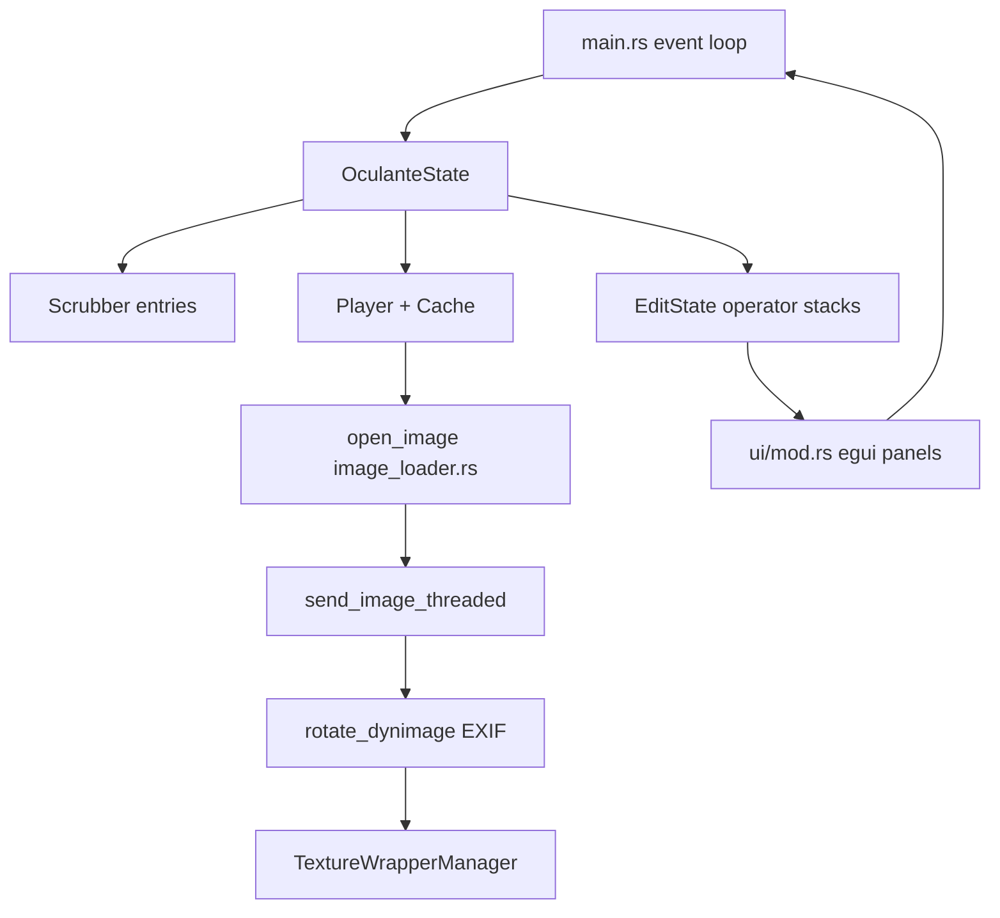
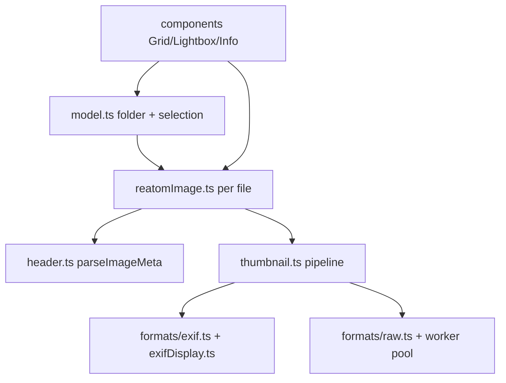

# Oculante Codebase Deep Dive

Research target: `/Users/artalar/code/oculante` (Oculante **0.9.2**, Rust 2021, [woelper/oculante](https://github.com/woelper/oculante)). The project is in **maintenance mode** with a rewrite tracked on `oculante-next`; this dive reflects **master** as shipped today.

Comparison baseline:

- Gallery: `/Users/artalar/code/reatom/examples/reatom-jsx-gallery`
- Prior nomacs research: `examples/reatom-jsx-gallery/docs/nomacs-*.md`, `nomacs-exif-reference.md`

Oculante is a **native GPU-accelerated** viewer/editor (notan + egui), not Qt. It competes with nomacs on metadata and folder navigation, but emphasizes **non-destructive operator stacks**, **lossless JPEG transforms**, **channel inspection**, and a **very wide codec table** in one static binary.

| Area | Oculante (Rust) | reatom-jsx-gallery (TS) |
|------|-----------------|-------------------------|
| UI | egui panels on notan/wgpu | Reatom JSX, CSS themes |
| Decode | `image_loader.rs` + crates | `image-engine/header.ts` + `formats/*` |
| EXIF read | `kamadak-exif` + `img-parts` | Custom TIFF parser `formats/exif.ts` |
| EXIF write | `fix_exif`, `img-parts` on save | Read-only |
| RAW preview | `quickraw::Export::export_thumbnail_data` | Custom IFD walk + worker `rawPreviewScan.*` |
| Full RAW develop | Commented-out quickraw demosaic path | Intentionally absent |
| Thumbs | Disk cache under OS cache dir | Blob URLs, no IDB cache |
| Edits | Operator stack + `.oculante` metafile | None |
| Folder nav | `Scrubber` + built-in file browser | FSA + `model.ts` linked list |

---

### Architecture

Oculante is a **single Cargo binary** (`src/main.rs`) with library modules in `src/lib.rs`. There is no separate “core.dll”; all subsystems are modules.

| Layer | Path | Responsibility |
|-------|------|----------------|
| Entry / loop | `src/main.rs` | notan app, input, load channel, metafile restore, GPU upload |
| State | `src/appstate.rs` | `OculanteState`: geometry, channels, scrubber, edit state, toasts |
| Load / decode | `src/image_loader.rs` | Extension dispatch, threaded `Frame` stream |
| Playback / cache | `src/utils.rs` (`Player`, `Frame`) | Threaded load, animation timing, LRU `Cache` |
| Edit | `src/image_editing.rs`, `src/paint.rs` | Operator stack, pixel ops, lossless JPEG |
| Thumbs | `src/thumbnails.rs`, `src/ui/thumbnail_rendering.rs` | Disk PNG cache, grid in file browser |
| File UI | `src/filebrowser.rs` | Modal browser, bookmarks, thumb grid |
| Flipbook | `src/scrubber.rs` | Directory index, wrap, prev/next |
| Compare | `src/comparelist.rs` | Per-path zoom/pan preservation |
| Info | `src/ui/info_ui.rs` | Histograms, EXIF, minimap, pixel picker |
| Settings | `src/settings.rs` | `~/.local/share/oculante` JSON persistence |
| GPU textures | `src/texture_wrapper.rs` | Texture lifecycle for notan |
| KTX/DDS | `src/ktx2_loader/` | Basis/UASTC, DDS, compressed uploads |
| Network | `src/net.rs` | `oculante -l port` TCP image receive |
| Bench | `benches/my_benchmark.rs` | Criterion hooks |

**Dependency highlights** (`Cargo.toml`): `notan` (egui + wgpu), `image` + `image-extras`, `quickraw`, `turbojpeg`, `kamadak-exif`, `img-parts`, `tiff`, `jxl-oxide`, `webp-animation`, `libblur`, `fast_image_resize`, `imageproc`, `evalexpr`, optional `libheif-rs`, `jpeg2k`, AVIF decoders.



**Gallery architecture (subset):**



Oculante centralizes **decode in one Rust match**; the gallery splits **header sniff** vs **format modules** and keeps **per-file Reatom atoms** for fine-grained UI updates—better for 10k+ web grids, absent in Oculante’s egui list model.

---

### Image Pipeline

#### Dispatch (`open_image`, `image_loader.rs` ~29–757)

1. Normalize extension; optionally reconcile with `file_format::FileFormat` (warn on mismatch unless “unchecked”: `svg`, `kra`, `tga`, `dng`).
2. `match extension` for specialized loaders; fallback `image_extras::register()` + `image::open`.
3. Return `Receiver<Frame>` — still, animation, or reset variants.

**Notable branches:**

| Extension group | Handler | Notes |
|-----------------|---------|-------|
| RAW list | `load_raw` → quickraw thumb | See RAW section |
| `tif`/`tiff` | `load_tiff` then `load_raw` fallback | DNG-as-TIFF path |
| `jpg` | `load_jpeg_turbojpeg` → `image::open` fallback | Samsung broken JPEG workaround |
| `gif` | `gif` + `gif-dispose` compositor | Per-frame delays to `Frame::Animation` |
| `webp` | `WebPDecoder`; animated path uses `webp-animation` | Broader than `image` crate alone |
| `jxl` | `load_jxl` on thread | Animation + float planes |
| `exr`/`hdr` | Custom tonemap (`tonemap_f32`, γ=2.2) | Float → 8-bit RGBA |
| `psd` | `psd` crate RGBA flatten | |
| `dds`/`ktx2` | `dds-rs`, `ktx2_loader` | GPU-oriented formats |
| `dcm` | `dicom-object` + `dicom-pixeldata` | Metadata in `ExtendedImageInfo::with_dicom` |
| `heif` | `libheif-rs` (feature) | Thread count + security limits from settings |

#### Threading and flipbook (`utils.rs` `Player`, `send_image_threaded` ~318–458)

- `Player::load_advanced` stops prior load, checks **in-memory cache** (`cache.rs`, default `max_cache: 30` images).
- On miss, spawns thread: `open_image` → iterate `Frame`s.
- **Still:** `rotate_dynimage` then send once and exit.
- **Animation:** cache frames, respect delay ms, cap loop at 500 iterations.
- **File watcher:** `check_modified` drops cache entry and reloads on mtime change.

**Scrubber** (`scrubber.rs`): builds sorted compatible filenames via `is_ext_compatible` / `SUPPORTED_EXTENSIONS`; `next`/`prev` with `wrap_folder` setting; used for mouse-wheel folder skip and keyboard navigation.

**Gallery:** no full-image memory cache; lightbox uses browser decode. Neighbor preload is possible but not implemented like nomacs `updateCacher`.

#### Orientation (`rotate_dynimage`, ~1047–1064)

```rust
// image_loader.rs — after decode, before display
di.apply_orientation(decoder.orientation()?);
```

Uses `image` crate `ImageReader` metadata (EXIF orientation tag), not a separate manual 1–8 state machine like nomacs `DkMetaDataT`. TurboJPEG path does **not** auto-rotate in decompress (RGB buffer); rotation applied in `send_image_threaded` for stills.

**Gallery:** `resolveImageOrientationStyle` + CSS `image-orientation: from-image` (`orientation.ts`); embedded thumbs may bake via canvas (`thumbnail.ts`, `orientationBaked`).

#### Operator stack (`image_editing.rs`)

Two stacks:

- **`image_op_stack`:** resize, crop, blur (`libblur` stack blur, adaptive threading), 3×3 filter, LUT (`lutgen`), perspective warp (`imageproc`), rotate, flip, chromatic aberration, etc.
- **`pixel_op_stack`:** brightness, contrast, HSV, expression (`evalexpr`), equalize, noise, channel swap, gradient map, MMult/MDiv alpha, etc.

`EditState` holds `result_image_op` and `result_pixel_op` caches; serialized to **`.oculante` JSON** beside image or directory (`edit_ui.rs`, `main.rs` ~888–935). Pixel processing uses **rayon** `par_chunks_mut` over RGB/RGBA buffers (~1699–1792) — SIMD via LLVM + rayon, not hand-written intrinsics.

**Lossless JPEG** (`lossless_tx`, ~1822–1857, feature `turbo`):

- Read file → `turbojpeg::transform` with MCU-aligned crop (`mcu_width`/`mcu_height`).
- Write back in place; shortcuts `[` `]` and edit UI panel `jpg_lossless_ui`.
- **No recompression** for rotate/flip; crop uses transform crop rect tied to operator stack.

**Gallery:** no in-browser lossless JPEG; would need WASM libjpeg-turbo or server-side tool.

---

### EXIF/Metadata

#### Read (`utils.rs` `ExtendedImageInfo::with_exif`, ~124–155)

1. Read full file to memory.
2. `img_parts::DynImage::from_bytes` → store `raw_exif` blob for later save.
3. `kamadak-exif::Reader::read_from_container` → populate `HashMap<String,String>` keyed by **tag name string** (`f.tag.to_string()`), values via `display_value().with_unit()`.
4. GIF skipped (no EXIF pass).

**UI:** `info_ui.rs` collapsible “EXIF” section; horizontally scrollable rows (changelog #184).

#### Write / preserve (`fix_exif`, ~972–980; save flows in `ui/mod.rs`, `edit_ui.rs`)

On export/save, if `raw_exif` present, re-embed via `img-parts` encoder. Supports **cross-format preservation** when container allows (`img-parts` abstraction). Changelog: “Preserve EXIF across formats” (ae855690).

**Contrast with gallery** (`nomacs-exif-reference.md` parity):

| Behavior | Oculante | Gallery |
|----------|----------|---------|
| Tag precedence IFD0 vs Photo | kamadak display order | Explicit `exif.ts` |
| Orientation write compose | Not exposed like nomacs `setOrientation` | N/A (read-only) |
| Large tag cap | None documented | `LARGE_TAG_DISPLAY_COUNT = 2000` |
| BMFF HEIC | libheif decode; EXIF via kamadak/img-parts | Browser image + limited engine EXIF |
| Metafile sidecar | `.oculante` edit JSON | None |
| DICOM tags | `with_dicom` WIP hash map | None |

**Histogram / inspection:** `ExtendedImageInfo::from_image` — 256-bin RGB histograms, transparent pixel count, **24-bit color cardinality** via bitset bucketing (`utils.rs` ~199–265). Gallery `ImageInfoPanel` shows parsed EXIF + HUD rows from `exifDisplay.ts`, not full histograms.

---

### RAW/Codecs

#### RAW (`load_raw`, ~784–818)

```rust
let raw_data = std::fs::read(img_location)?;
let (thumbnail_data, _orientation) = Export::export_thumbnail_data(&raw_data)?;
let i = image::load_from_memory(thumbnail_data)?;
Ok(i.to_rgba8())
```

- **quickraw** extracts embedded preview JPEG (or similar); orientation returned but **ignored** (`_orientation`).
- Commented block shows abandoned full demosaic (`DemosaicingMethod::SuperPixel`, 16-bit export) — same strategic choice as gallery preview-only.

**Extensions** (dedicated match ~391–398): `nef`, `cr2`, `dng`, `mos`, `erf`, `raf`, `arw`, `3fr`, `ari`, `srf`, `sr2`, `braw`, `r3d`, `nrw`, `raw`.

**TIFF fallback:** if `load_tiff` fails, retry `load_raw` — catches TIFF-container RAW.

**Gallery `raw.ts`:**

- Custom IFD walker: SubIFDs, DNG version, Sony preview tags, JPEG SOI heuristic, largest-area preview pick.
- Worker pool for large files (`rawPreviewScanPool.ts`).
- Formats typed: **`dng` | `arw` only** — narrower than Oculante/quickraw list.

**Porting insight:** Oculante trades control for **quickraw maintenance**; gallery trades **portability** for **explicit TIFF logic** aligned with nomacs Exiv2 preview sizing. Extending gallery CR2/NEF is **medium effort** (extend `RawFormat` + IFD heuristics), not quickraw FFI.

#### Other codecs vs gallery

| Format | Oculante | Gallery `header.ts` / formats |
|--------|----------|-------------------------------|
| JPEG | turbojpeg + fallback | `jpeg.ts`, browser decode |
| PNG | zune-png / image | `png.ts` meta |
| WebP | libwebp-sys path + animation | `webp.ts` partial |
| GIF | gif-dispose timing | `gif.ts` meta only |
| SVG | resvg/usvg | `svg.ts` viewBox meta |
| JXL | jxl-oxide thread | Not in engine |
| AVIF/HEIF | optional dav1d/libheif | Browser only |
| EXR/HDR | tonemap in loader | Not supported |
| PSD | psd crate | Not supported |
| KTX2/DDS | full module | Not supported |
| DICOM | load + metadata | Not supported |

---

### Thumbnails

**Disk cache** (`thumbnails.rs`):

- Path: `dirs::cache_dir()/oculante/thumbnails/{hash}_{file_size}.png`
- ID hashes path + file size (invalidates on replace-in-place).
- Generation: `open_image` (full decode path) → center crop to 4:3 → `ImageOperation::Resize` 120×90 bilinear → PNG write.
- Concurrency: max **4** threads, queue with 100ms spin if pool full.
- `get()` returns error “still processing” until file exists — UI polls.

**File browser** (`filebrowser.rs`, `thumbnail_rendering.rs`): shows cached PNG + caption height `THUMB_CAPTION_HEIGHT` (24px).

**Gallery** (`thumbnail.ts`):

1. `extractExifThumbnail` (JPEG)
2. `extractRawPreview` (RAW)
3. `createImageBitmap` scaled JPEG thumb
4. Optional EXIF orientation bake on embed path

No disk/IDB cache; `revokeThumbnail` for blob URLs. **Port:** IndexedDB keyed by `file.name + size + lastModified` mirrors Oculante’s `path_to_id` strategy.

**Crop policy difference:** Oculante center-crops to filmstrip aspect; gallery scales to fit `maxSize` with letterboxing on white canvas — nomacs-style black-border removal not present in either Oculante thumb path.

---

### UI/UX

**Framework:** notan immediate-mode GPU + egui (`ui/mod.rs`, `PANEL_WIDTH = 260`).

| Feature | Oculante module | Gallery analogue |
|---------|-----------------|------------------|
| Info panel | `info_ui.rs` | `ImageInfoPanel.tsx` |
| Edit panel | `edit_ui.rs` | None |
| Settings | `settings_ui.rs` | `SettingsPanel.tsx` |
| Palette extraction | `palette_ui.rs` + `quantette` | None |
| Top bar / scrub | `top_bar.rs`, `scrubber` | Lightbox controls |
| Zen mode | `toggle_zen_mode` | Partial fullscreen |
| Channel view | shortcuts R/G/B/A/U/C | None |
| Unpremultiply | MMult/MDiv operators | None |
| Compare mode | `CompareList` + Shift+C | None |
| File manager | `filebrowser.rs` modal/grid | FSA folder tree only |
| Flipbook | wheel + `Scrubber` + cache | keyboard/arrows in lightbox |
| Paint | `paint.rs` + brushes in `res/brushes/` | None |
| Measuring | `Measure` operator shapes | None |
| Metafile | `.oculante` per file/dir | None |
| Always on top | shortcut T | N/A web |
| Network listen | `net.rs` | N/A |
| stdin pipe | `oculante -s` | N/A |

**Compare list** (`comparelist.rs`): sorted `CompareItem` by path; stores `ImageGeometry` per file; **Shift+C** cycles while preserving zoom/pan — high-value desktop pattern; gallery could store geometry in `sessionStorage` per `fileId`.

**Themes:** `settings.rs` `ColorTheme` Light/Dark/System via `dark-light` crate; accent RGB configurable. Gallery: `theme.tsx` CSS variables + `reatomMediaQuery`.

---

### Performance

| Technique | Location | Notes |
|-----------|----------|-------|
| Release LTO | `Cargo.toml` `lto = "fat"`, `codegen-units = 1` | Small static binary ~25MB |
| Threaded decode | `send_image_threaded` | Stop channel cancels stale loads |
| Image LRU cache | `cache.rs` + `max_cache` | Clone `DynamicImage` on hit — memory heavy |
| TurboJPEG | `load_jpeg_turbojpeg` | Faster than pure Rust for stills |
| TIFF float decode | `par_iter` autoscale U16/F16/F32 | `autoscale` min-max per plane |
| Pixel operators | `rayon` `par_chunks_mut` | Parallel per-pixel stack |
| Blur | `libblur` adaptive threads | Stack blur on RGBA |
| Resize | `fast_image_resize` + rayon feature | Edit pipeline |
| Lazy loop / vsync | `main.rs` window flags per OS | Windows/Linux/macOS save CPU |
| Info panel sampling | `cumulative_pass_nr() % 5` | Don't sample every pixel every frame |
| Thumb pool cap | `MAX_THREADS = 4` | Avoid decode stampede |

**Gallery:**

- Header read cap + adaptive EXIF (`types.ts` `EXIF_READ_BYTES`)
- RAW worker transferable buffers
- `withAbort` thumb concurrency (`reatomImage.ts`)
- No LTO equivalent; wins on reactive granularity and zero install

**Benchmarks:** `benches/my_benchmark.rs` exists; `tests.rs` contains commented SIMD timing notes — not CI-gated performance contracts.

---

### Porting Priority Matrix

#### High (strong Oculante/nomacs value, feasible in browser, clear gap)

| Item | Rationale | Oculante source | Gallery status |
|------|-----------|-----------------|----------------|
| **Persistent thumbnail cache** | Oculante regen uses full `open_image`; cache makes rescans instant | `thumbnails.rs` `get_disk_cache_path`, `path_to_id` | Missing; IDB cache in playbook already (nomacs) |
| **Compare-mode geometry memory** | Preserve zoom/pan when A/B-ing shots | `comparelist.rs`, `CompareItem` | Missing |
| **Flipbook preload** | `Player` cache + adjacent file prefetch pattern | `Player::load`, `cache.rs` | Preload meta/thumb for lightbox neighbors only |
| **Extension mismatch warning** | `file_format` vs extension | `image_loader.rs` 57–76 | Could warn in `header.ts` when sniff ≠ ext |
| **RAW extension breadth** | quickraw supports many suffixes | `image_loader.rs` 391–398 | DNG/ARW/CR2/NEF/ORF/SR2 via TIFF IFD + 64 MB scan; exotic suffixes still gap |
| **Lossless orientation policy doc** | Oculante applies post-decode; gallery CSS-first | `rotate_dynimage` | Document double-apply risk per codec in `orientation.ts` |
| **Exposure/HUD helpers** | Already in nomacs port | N/A (use nomacs) | Done in `exifDisplay.ts` |

#### Medium (valuable, heavier effort)

| Item | Rationale | Oculante source | Gallery status |
|------|-----------|-----------------|----------------|
| **Lossless JPEG rotate/crop** | Signature feature; needs WASM turbojpeg | `lossless_tx`, `edit_ui.rs` `jpg_lossless_ui` | Not feasible in pure TS |
| **Operator stack / metafile** | `.oculante` JSON non-destructive edits | `EditState`, serde in `main.rs` | Large scope; JSON sidecar could store **gallery UI state** only |
| **Channel / unpremultiply view** | Inspect alpha-masked RGB | shortcuts + MMult/MDiv | Canvas shader or CSS filters partial |
| **Histogram + color count** | Info panel analytics | `ExtendedImageInfo::from_image` | WebGL or OffscreenCanvas histogram |
| **GIF/WebP animation timing** | `gif-dispose`, `webp-animation` | `image_loader.rs` 650–671, 446+ | Gallery meta only; lightbox static |
| **HEIF/JXL/AVIF engine path** | Native decoders with limits | `libheif`, `jxl-oxide` | Rely on browser; WASM optional |
| **File browser grid thumbs** | Integrated manager | `filebrowser.rs` + `thumbnails.rs` | Grid uses `loadThumbnail`; no disk cache |
| **Modified file reload** | mtime watcher clears cache | `Player::check_modified` | FSA re-pick folder; no watcher |
| **Palette generation** | `palette_ui`, `quantette` | Export swatch for design workflow | New feature |

#### Low (desktop-specific or poor web fit)

| Item | Rationale |
|------|-----------|
| **Full quickraw demosaic** | Commented 16-bit path; huge CPU/memory |
| **Paint + brush assets** | `paint.rs`, `res/brushes/*` |
| **TCP listen mode** | `net.rs` |
| **self_update crate** | Desktop updater |
| **KTX2/Basis/DDS pipeline** | GPU texture containers |
| **DICOM clinical workflow** | Regulatory/UI scope |
| **notan/egui editor UI** | Entire edit surface non-portable as-is |
| **trash crate delete** | OS integration (`Delete` shortcut) |
| **turbo build dep NASM** | Build-time; use WASM port if ever |

---

### Algorithm reference (key files)

| Algorithm | File (approx. lines) |
|-----------|----------------------|
| Extension dispatch | `image_loader.rs` 29–757 |
| RAW embedded preview | `image_loader.rs` 784–818, quickraw `Export` |
| TIFF float autoscale | `image_loader.rs` 820–910, `autoscale` |
| EXIF read + raw blob | `utils.rs` 124–155 |
| EXIF re-embed on save | `utils.rs` 972–980 |
| Orientation apply | `image_loader.rs` 1047–1064, `utils.rs` 409–411 |
| Lossless JPEG MCU crop | `image_editing.rs` 1822–1857 |
| Operator image vs pixel | `image_editing.rs` 284–300, 1226+, 1699+ |
| Parallel pixel ops | `image_editing.rs` 1702–1786 |
| Memory cache LRU | `cache.rs` 22–57 |
| Threaded load + animation | `utils.rs` 318–458 |
| Thumb crop + resize | `thumbnails.rs` 107–143 |
| Scrubber directory index | `scrubber.rs` 1–80 |
| Compare geometry store | `comparelist.rs` 1–80 |
| Metafile load/save | `main.rs` 888–935, `edit_ui.rs` 486–494 |
| Gallery EXIF parse | `formats/exif.ts` |
| Gallery RAW preview | `formats/raw.ts`, `rawPreviewScan.worker.ts` |
| Gallery thumb pipeline | `thumbnail.ts` |
| Gallery orientation | `orientation.ts`, `reatomImage.ts` |

---

### Summary comparison

Oculante and reatom-jsx-gallery both target **fast folder browsing** and **preview-first RAW**, but diverge on product shape: Oculante is a **desktop editor** with GPU preview, operator stacks, and lossless JPEG; the gallery is a **read-only PWA showcase** for Reatom with a **custom EXIF/RAW engine** tuned to nomacs semantics.

**Already aligned with Oculante/nomacs:** embedded preview preference, EXIF display helpers, orientation handling split (display vs thumb bake), adaptive EXIF read size, RAW worker for large files.

**Oculante-specific wins to cherry-pick:** disk thumbnail cache ID strategy, compare-list geometry, file-format mismatch warnings, flipbook cache sizing, EXIF preservation model via sidecar bytes (for future write consent).

**Gallery strengths Oculante lacks:** reactive per-image models, web installability, no NASM/turbo dependency, documented nomacs EXIF precedence in TS tests.

**Do not port wholesale:** egui edit UI, quickraw demosaic, turbojpeg in-browser (unless WASM), TCP listener, KTX/DDS stack.

---

### Cross-reference to nomacs docs

Use together:

| Doc | Use when |
|-----|----------|
| `nomacs-codebase-deep-dive.md` | EXIF precedence, LibRaw policy, TCP sync, duplicate filter |
| `nomacs-exif-reference.md` | Tag behavior spec for `exif.ts` tests |
| `nomacs-porting-playbook.md` | Phased effort estimates |
| This document | Rust codec table, operator stack, lossless JPEG, Oculante cache/compare |

Suggested follow-up artifact: `oculante-porting-playbook.md` (optional) linking matrix rows to GitHub issues on `woelper/oculante` vs gallery backlog.

---

