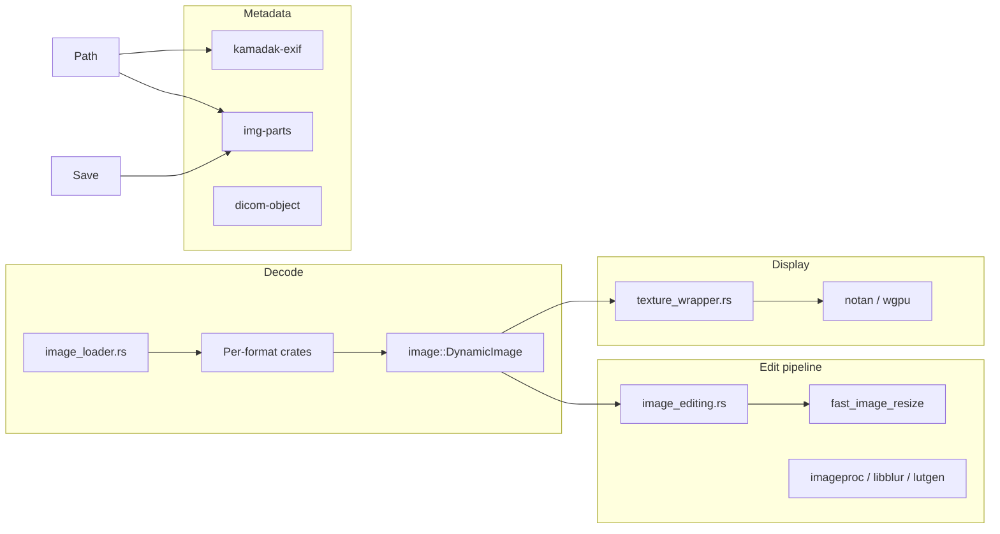

# Oculante Dependency Stack & Web Equivalents

Companion to [nomacs-dependency-stack.md](./nomacs-dependency-stack.md) and [nomacs-exif-reference.md](../../../nomacs-exif-reference.md). Analysis from `~/code/oculante/Cargo.toml`, `Cargo.lock`, and `src/*` (June 2026).

[Oculante](https://github.com/woelper/oculante) **0.9.2** is a Rust desktop image viewer (notan + egui). It is **MIT**-licensed (`Cargo.toml` `license = "MIT"`). Maintenance mode; rewrite tracked on `oculante-next`.

**Note:** Oculante does **not** depend on `rawloader` or LibRaw. RAW previews use **`quickraw`** (`Export::export_thumbnail_data`). nomacs uses LibRaw; Oculante is closer to the gallery’s embed-only RAW policy.

---

## Licensing

| Component | License | Notes |
|-----------|---------|-------|
| Oculante | MIT | App + most deps |
| `image`, `kamadak-exif`, `quickraw`, `fast_image_resize`, `turbojpeg`, etc. | Mostly MIT / Apache-2.0 | Check per-crate on crates.io |
| `libheif-rs` | Feature `heif` | libheif native (LGPL) when enabled |
| `jpeg2k` / OpenJPEG | Feature `j2k` | Native codec |
| Gallery `image-engine` | MIT (monorepo) | No npm image deps; zero third-party parsers |

Gallery can stay MIT-only if it avoids GPL/LGPL WASM (same guidance as nomacs doc).

---

## Cargo feature flags

| Feature | Enables | Default | Oculante use |
|---------|---------|---------|--------------|
| `default` | `turbo`, `avif_native`, `update`, `notan/shaderc`, `j2k`, `jxlcms` | yes | Release desktop build |
| `turbo` | `turbojpeg` | yes | Fast JPEG decode + lossless rotate/crop |
| `avif_native` | `avif-decode` | yes | AVIF when `dav1d` off |
| `dav1d` | `libavif-image` | no | Alternative AVIF path |
| `heif` | `libheif-rs` | no | HEIC/HEIF decode + security limits |
| `j2k` | `jpeg2k` | yes | JPEG 2000 (`.jp2`) |
| `jxlcms` | `jxl-oxide/lcms2` | yes | JXL color management |
| `hdr` | (empty) | no | Marker feature |
| `file_open` | `rfd` | no | Native file dialogs |
| `update` | `self_update` | yes | In-app updates |
| `lang_support` | — | no | i18n hook |
| `notan_glsl-to-spirv` | notan SPIR-V | no | Shader pipeline variant |

Ubuntu CI also builds with **no default features** to keep a minimal path working.

---

## Architecture (high level)

Entry: `open_image()` in `image_loader.rs` — extension + `file-format` sniffing, then format-specific decoders, unified `Frame` + `DynamicImage`. Thumbnails: `thumbnails.rs` → disk cache via `open_image` + `image::imageops::thumbnail`.

---

## Major crates (role, Oculante usage, web/gallery equivalent)

### `image` (0.25, `hdr`)

**Provides:** `DynamicImage`, encoders/decoders, `imageops` (resize, rotate), hub for BMP/ICO/TGA/HDR fallbacks.

**Oculante:** Central type through `texture_wrapper.rs`, `paint.rs`, `thumbnails.rs`, `utils.rs`, default branch in `image_loader.rs` after `image_extras::register()`.

**Gallery:** `createImageBitmap`, `OffscreenCanvas`, format modules (`jpeg.ts`, `png.ts`, …). No unified in-memory image type.

---

### `quickraw` (not `rawloader`)

**Provides:** Embedded RAW thumbnail export (no full demosaic in production path).

**Oculante:** `load_raw()` — `Export::export_thumbnail_data` → `image::load_from_memory` (`image_loader.rs` ~784–789). TIFF load failure falls back to RAW. Full demosaic code is commented out.

**Gallery:** `formats/raw.ts` — manual TIFF IFD walk, JPEG SOI scan, `rawPreviewScan.worker.ts` pool. Same **preview-only** policy; different implementation (no quickraw).

---

### `kamadak-exif` (imported as `exif`)

**Provides:** Read EXIF from containers; field display with units.

**Oculante:** `utils.rs` `ExtendedImageInfo::with_exif` — `exif::Reader::read_from_container`, `HashMap` for info panel. Complements `img-parts` raw bytes.

**Gallery:** `formats/exif.ts` + `exifDisplay.ts` — custom TIFF parser, nomacs-aligned orientation/flash tables.

**Gap:** Oculante gets readable strings from kamadak; gallery maps tag names manually. Neither matches Exiv2/XMP breadth of nomacs.

---

### `img-parts`

**Provides:** Read/write EXIF blobs on JPEG/PNG/WebP-like containers.

**Oculante:** `with_exif` stores `raw_exif`; `fix_exif()` re-embeds on save (`utils.rs` ~972–980). Edit UI calls `fix_exif` after transforms.

**Gallery:** No EXIF write-back. Read-only metadata.

---

### `fast_image_resize` (+ `rayon`)

**Provides:** SIMD-friendly resize (convolution filters).

**Oculante:** `image_editing.rs` — resize ops in non-destructive stack (`ResizeAlg::Convolution`).

**Gallery:** `thumbnail.ts` — `createImageBitmap` with `resizeWidth`/`resizeHeight`, then canvas `drawImage`. No convolution kernel choice.

---

### `turbojpeg` (feature `turbo`)

**Provides:** Fast JPEG decode; **lossless** transform (rotate, flip, crop).

**Oculante:** `load_jpeg_turbojpeg`, `lossless_tx()` in `image_editing.rs` / `edit_ui.rs` / `main.rs`.

**Gallery:** Browser JPEG decode only. No lossless structural edit.

---

### `tiff`

**Provides:** Full TIFF decoder (multi-bit-depth, autoscale to LDR).

**Oculante:** `load_tiff()` before RAW fallback; parallel tonemap via `rayon`.

**Gallery:** TIFF logic inside `raw.ts` for DNG/ARW/CR2/NEF/ORF/SR2 metadata and previews, not general multipage TIFF viewing.

---

### `jxl-oxide`, `zune-png`, `webp-animation`, `gif` + `gif-dispose`

**Provides:** JXL, PNG (zune), animated WebP/GIF with disposal.

**Oculante:** Dedicated branches in `image_loader.rs` (animation → `Frame` sequences).

**Gallery:** Static PNG/WebP/GIF meta + thumbs where browser decodes; no JXL, limited GIF frame analysis (`formats/gif.ts`).

---

### `libheif-rs` (feature `heif`)

**Provides:** HEIC/HEIF → RGBA, thread limits, `SecurityLimits` in `settings.rs`.

**Oculante:** `image_loader.rs` HEIF branch.

**Gallery:** Depends on browser HEIC support via `createImageBitmap`; no security limit knobs.

---

### AVIF: `avif-decode` vs `libavif-image`

**Oculante:** Default `avif_native`; optional `dav1d` feature swaps implementation.

**Gallery:** Browser AVIF when supported; no custom decoder.

---

### `exr`, `psd`, `dds-rs`, `ktx2` + `basis-universal` + `wgpu`

**Provides:** EXR tonemap, PSD composite, DDS, GPU texture containers.

**Oculante:** `image_loader.rs` + `ktx2_loader/` module.

**Gallery:** Not supported in `ImageFormat` union (`types.ts`).

---

### `resvg` / `usvg` / `tiny-skia`

**Provides:** SVG rasterization at scale.

**Oculante:** `svg` extension — 2× render, bundled Inter font.

**Gallery:** `formats/svg.ts` — dimensions from markup; display via browser SVG, not rasterized pipeline.

---

### `dicom-object` / `dicom-pixeldata`

**Oculante:** Decode pixels + metadata panel (`with_dicom` — WIP field list).

**Gallery:** No DICOM.

---

### `jpeg2k` (feature `j2k`)

**Oculante:** `.jp2` → RGB/RGBA buffers.

**Gallery:** None.

---

### Edit / analysis stack

| Crate | Oculante | Gallery |
|-------|----------|-----------|
| `imageproc` | Warp, geometric transforms | — |
| `libblur` | Stack blur | — |
| `lutgen` | Identity / LUT correction | — |
| `quantette` | Palette extraction UI | — |
| `palette` | Color math in edits | — |
| `evalexpr` | Formula pixel ops | — |
| `nalgebra` | Zoom/pan math | — |

---

### UI / platform (out of gallery scope)

- **notan** (wgpu backend, egui): window, textures, input.
- **egui_***, **rfd**, **arboard**, **trash**, **self_update**, **clap**, **font-kit**, etc.

---

## Full stack comparison table

| Layer | Oculante | reatom-jsx-gallery `image-engine` | Gap severity |
|-------|----------|-------------------------------------|--------------|
| License | MIT | MIT (in-tree) | — |
| UI | notan + egui | Reatom JSX + DOM | N/A |
| Common raster | `image` + `image_extras` | Browser + header parsers | Low for JPEG/PNG/WebP |
| RAW preview | `quickraw` thumb | `raw.ts` IFD + 64 MB JPEG scan (all listed RAW formats) | Low (same strategy) |
| RAW develop | Commented quickraw 16-bit | None | N/A (intentional) |
| EXIF read | kamadak-exif + img-parts bytes | `exif.ts` | Medium (maker notes, BMFF) |
| EXIF write | img-parts `fix_exif` | None | High if save feature |
| Lossless JPEG | turbojpeg | None | High |
| Resize quality | fast_image_resize convolution | Canvas / bitmap resize | Medium |
| HEIF/AVIF/JXL | Native crates / features | Browser-only | High on unsupported browsers |
| TIFF multipage | `tiff` crate | RAW-only TIFF subset | Medium |
| EXR/PSD/KTX2/DDS | Yes | No | High |
| DICOM | Yes | No | High |
| SVG | Rasterized resvg | DOM SVG | Low |
| Thumbnails | Disk PNG cache, 4 threads | Blob URLs, EXIF thumb path | Medium (no disk LRU) |
| Editing | Full stack | View/metadata only | High |
| Animated GIF/WebP | Full frame player | Basic GIF meta | Medium |

---

## Gap analysis (gallery vs Oculante)

**Parity / ahead of Oculante in the browser path**

- Zero native deps; fast startup for grid thumbnails.
- nomacs-aligned EXIF orientation composition (`orientation.ts`) and display helpers.
- RAW preview discovery with worker pool (`rawPreviewScanPool.ts`) — Oculante delegates to quickraw in-process.

**Major gaps**

1. **Format breadth:** No JXL, JP2, EXR, PSD, KTX2, DDS, DICOM, ICNS, KRA, etc.
2. **EXIF preservation on export:** Oculante’s `img-parts` + `fix_exif` pattern has no TS equivalent.
3. **Lossless JPEG operations:** turbojpeg transforms are a desktop-only advantage.
4. **High-quality downscale:** `fast_image_resize` vs default canvas filtering.
5. **HEIF security / limits:** libheif-rs settings vs unchecked browser decode.
6. **Non-destructive editing:** Oculante’s `image_editing.rs` stack (blur, LUT, warp, formulas).
7. **Flipbook / disk cache:** Oculante thumbnail cache + animation frames.

**Lower priority for gallery MVP**

- DICOM, KTX2, basis transcoding, palette quantization UI, self-update.

---

## Recommendations (gallery roadmap)

1. **Keep custom EXIF** for grid hot path; consider **exifr** (MIT) in a worker for HEIC/BMFF if browser decode exposes little metadata.
2. **Do not port** Oculante’s full `image_editing` stack unless product scope expands; document preview-only RAW explicitly (already aligned with quickraw usage).
3. **Thumbnail quality:** optional **Pica** or `resizeQuality: 'high'` where benchmarks matter; Oculante uses convolution via `fast_image_resize`.
4. **IndexedDB thumbnail cache** to mirror Oculante `thumbnails.rs` disk LRU.
5. **Lossless JPEG:** only if users need rotate-without-reencode; would need WASM turbojpeg or server-side tool — not browser-native.

---

## Quick reference: `src/` grep map

| Crate / alias | Primary files |
|---------------|---------------|
| `image` | `image_loader.rs`, `texture_wrapper.rs`, `thumbnails.rs`, `utils.rs`, `paint.rs` |
| `quickraw` | `image_loader.rs` (`load_raw`) |
| `exif` (kamadak) | `utils.rs` (`with_exif`) |
| `img-parts` | `utils.rs` (`DynImage`, `fix_exif`) |
| `fast_image_resize` | `image_editing.rs` |
| `turbojpeg` | `image_loader.rs`, `image_editing.rs`, `edit_ui.rs`, `main.rs` |
| `tiff` | `image_loader.rs` (`load_tiff`) |
| `resvg` / `usvg` | `image_loader.rs` (`svg`) |
| `quantette` | `ui/palette_ui.rs` |
| `notan` | `main.rs`, `ui/*`, `texture_wrapper.rs` |

---

## Relation to nomacs

| Concern | nomacs | Oculante | Gallery |
|---------|--------|----------|---------|
| RAW develop | LibRaw + OpenCV | quickraw thumb only | IFD embed only |
| EXIF engine | Exiv2 (GPL) | kamadak-exif (MIT) | TypeScript (MIT) |
| Modern codecs | Qt + KImageFormats | Rust crates per format | Web codecs |

Oculante sits between nomacs (heavy C++/Qt) and the gallery (browser-limited): **wide format support in Rust**, but **RAW preview without LibRaw**.

---

*Generated for reatom-jsx-gallery porting research. Oculante repo: `/Users/artalar/code/oculante`.*
