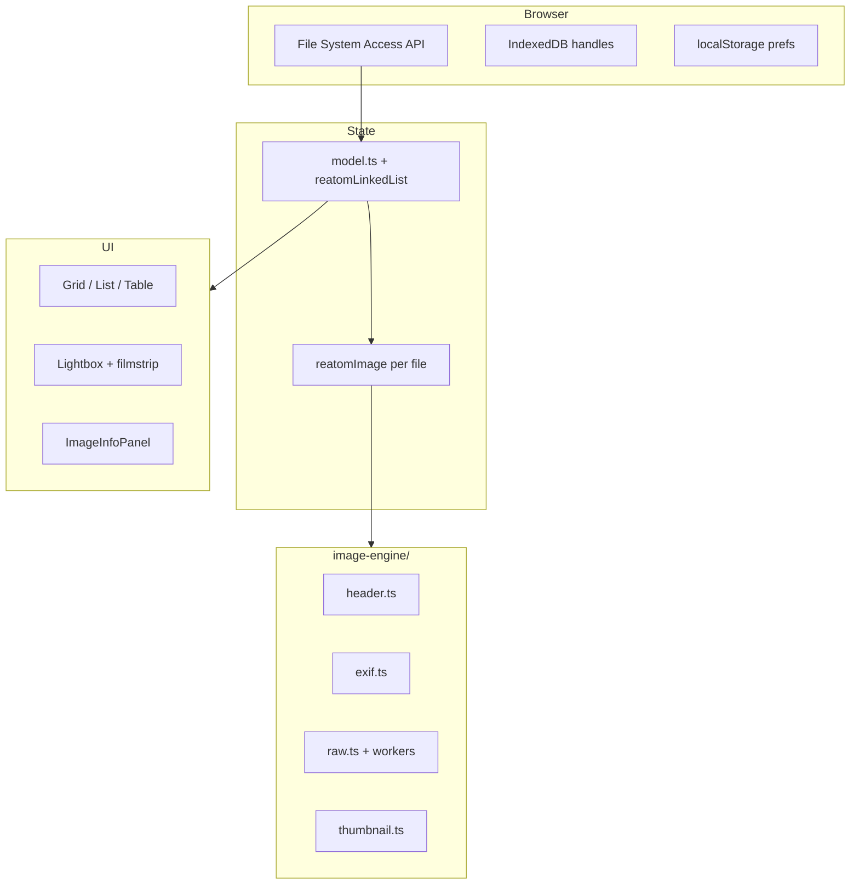
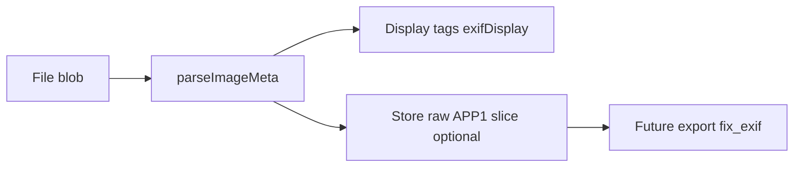
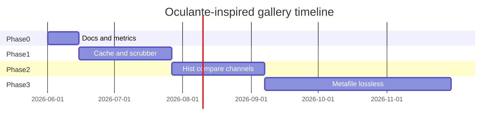
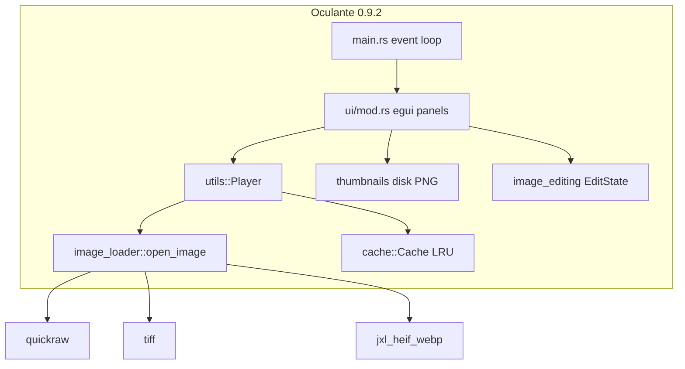

# Oculante → Reatom JSX Gallery: Porting Playbook

**Version:** 1.0 (June 2026)  
**Audience:** Engineers extending the gallery toward fast, format-rich, analysis-friendly viewing while staying web-native.  
**Sources:** Live codebase at `examples/reatom-jsx-gallery`, Oculante tree at `~/code/oculante` (v0.9.2), and cross-reference to [nomacs-porting-playbook.md](./nomacs-porting-playbook.md).

> **README snapshot:** [oculante-readme-snapshot.md](./oculante-readme-snapshot.md) (scraped upstream README). Merge rewrite (`oculante-next`, [#746](https://github.com/woelper/oculante/issues/746)) notes into §6 and §9 when tracking the rewrite branch.

### See also (research pack)

| Document | Contents |
|----------|----------|
| [nomacs-porting-playbook.md](./nomacs-porting-playbook.md) | Primary desktop reference (Qt/Exiv2); gallery architecture §2 |
| [nomacs-codebase-deep-dive.md](./nomacs-codebase-deep-dive.md) | nomacs loader/EXIF depth |
| [nomacs-exif-reference.md](./nomacs-exif-reference.md) | Orientation and display-map normative spec |
| [nomacs-dependency-stack.md](./nomacs-dependency-stack.md) | Desktop deps vs web/npm/WASM |
| [nomacs-issues-backlog.md](./nomacs-issues-backlog.md) | Community signals (nomacs GitHub) |
| [oculante-codebase-deep-dive.md](./oculante-codebase-deep-dive.md) | Loaders, EXIF, thumbs, edit stack |
| [oculante-issues-backlog.md](./oculante-issues-backlog.md) | Oculante GitHub taxonomy + backlog |
| [oculante-dependency-stack.md](./oculante-dependency-stack.md) | quickraw, kamadak-exif, turbojpeg vs gallery |

---

## 1. Executive Summary

Three viewers anchor this research: **Oculante** (Rust/egui, MIT), **nomacs** (Qt/Exiv2, GPLv3), and the **Reatom JSX Gallery** (TypeScript PWA, MIT example). They share a product shape—open a folder, browse thumbnails, inspect metadata, fullscreen view—but diverge on runtime, format stack, and editing scope.

**Oculante** is a hardware-accelerated (wgpu/notan) image lounge in **maintenance mode** until a rewrite ([issue #746](https://github.com/woelper/oculante/issues/746)). It optimizes for **fast startup**, **wide format coverage** (40+ extensions via dedicated Rust crates), **in-memory LRU cache** plus **disk thumbnail cache**, **pixel inspection** (histograms, channel isolation, unpremultiplied alpha), **non-destructive edit stacks** (`.oculante` metafiles), **lossless JPEG transforms** (turbojpeg), and **flipbook-style** folder scrubbing. EXIF is read with `kamadak-exif` and preserved on save via `img-parts`; RAW uses `quickraw` thumbnail export, not full demosaic.

**nomacs** remains the deeper **metadata policy** reference (Exiv2 IPTC/XMP, orientation precedence, thumb option flags, TCP multi-instance sync). The gallery already aligns with nomacs on EXIF orientation, flash maps, and RAW **preview-only** policy.

**Reatom JSX Gallery** is browser-first: File System Access API, per-file `reatomImage` models, custom `image-engine` (TypeScript TIFF/EXIF/RAW preview), 10 theme packs, Storybook/a11y CI. It does **not** ship GPU textures, lossless JPEG ops, edit operator stacks, or Oculante-scale format breadth.

**Strategic thesis:** Treat Oculante as a **performance and analysis specification**—cache tiers, flipbook navigation, histogram/channel UX, compare-at-zoom, metafile non-destructive workflow—while treating nomacs as **metadata fidelity** specification. The gallery should **emulate** Oculante’s inspection tools and cache discipline in web-safe form; **avoid** desktop-only decode sprawl without WASM budget; **differentiate** with reactive granularity, PWA install, and theme packs.

**Effort snapshot (person-weeks, one senior engineer):**

| Phase | Focus | Estimate |
|-------|--------|----------|
| 0 | Docs + measurement baselines | 1–2 |
| 1 | Cache + flipbook + histogram (read-only) | 4–6 |
| 2 | Compare mode + channel preview + format gaps | 4–6 |
| 3 | Metafile edits + lossless JPEG (optional write) | 8–12 |

**Three-way comparison (at a glance):**

| Dimension | Oculante | nomacs | Gallery |
|-----------|----------|--------|---------|
| Runtime | Rust + notan/egui | Qt6 C++ | Browser TS + Reatom JSX |
| License | MIT (some GPL assets in `res/`) | GPLv3 | MIT example |
| Metadata | kamadak-exif + img-parts preserve | Exiv2 full R/W | TS parser, read-only |
| RAW | quickraw embed thumb | LibRaw optional | IFD + worker JPEG scan |
| Thumbs | Disk PNG cache + full decode gen | Exiv2 + Qt + disk cache | EXIF → RAW → bitmap |
| Editing | Operator stack + metafile | Pixel + metadata write | Copy/download only |
| Analysis | Histogram, channels, picker | Histogram, some overlays | Info panel, no hist yet |
| Sync | TCP receive mode (`-l`) | TCP multi-instance | — (BroadcastChannel planned) |
| Maintenance | Maintenance / rewrite | Active | Example app |

---

## 2. Reatom JSX Gallery — Current Architecture (Brief)

Full detail lives in [nomacs-porting-playbook.md §2](./nomacs-porting-playbook.md#2-reatom-jsx-gallery--current-architecture). Summary for Oculante porters:

**Oculante mapping at this layer:**

| Oculante module | Gallery analogue | Gap |
|-----------------|------------------|-----|
| `Player` + `open_image` | `reatomImage` + `parseImageMeta` | No unified format router table |
| `Cache` (RAM LRU) | None | IndexedDB thumbs proposed (nomacs playbook §5.14) |
| `Thumbnails` (disk) | Regenerate each session | Missing persistent thumb store |
| `Scrubber` | `navigateLightbox` on linked list | No folder index bar / flipbook timing |
| `CompareList` | — | No compare-at-preserved zoom |
| `ExtendedImageInfo` | `ImageInfoPanel` + `exifDisplay` | No RGB histogram plots |
| `EditState` / `.oculante` | — | Out of scope MVP |

**Data flow contrast:** Oculante loads one **current** image into GPU textures with optional RAM cache (`max_cache` default 30). Gallery materializes **N** concurrent `reatomImage` pipelines with `hardwareConcurrency - 2` thumb gate—better for grid, heavier for 10k folders unless virtualized.

---

## 3. Oculante Strengths to Emulate

### 3.1 Format router and honest extension detection

`image_loader.rs` matches on normalized extension, then cross-checks `file_format::FileFormat::from_file` and warns on mismatch (unless extension is in `unchecked_extensions` like `svg`, `kra`, `tga`, `dng`). This prevents silent mis-decode when users rename files.

**Emulate:** In `header.ts`, optional magic-byte vs extension warning in dev mode; user-visible badge “loaded as TIFF” when extension lies.

### 3.2 RAW fast path aligned with gallery policy

`load_raw` uses `quickraw::Export::export_thumbnail_data` then `image::load_from_memory`—same **preview-only** stance as gallery `raw.ts`, but Oculante also returns orientation from quickraw (gallery reads EXIF IFD separately). Full demosaic code is commented out.

**Emulate:** Document `quickraw` vs custom IFD scan tradeoff; consider WASM quickraw for ARW/NEF families gallery IFD walk misses.

### 3.3 Two-tier caching

1. **RAM:** `cache.rs` — `HashMap<PathBuf, DynamicImage>` with LRU eviction by oldest `Instant` when `len > cache_size`.
2. **Disk:** `thumbnails.rs` — PNG files under `dirs::cache_dir()/oculante/thumbnails/`, key `hash(path) + file_size`, max **4** concurrent generators.

Gallery revokes blob URLs on dispose but does not persist thumbs—re-opening 5k folder re-parses EXIF. **High-value port:** IndexedDB schema from nomacs playbook §5.14 with Oculante’s `path + size` key idea.

### 3.4 Flipbook / scrubber UX

`scrubber.rs` builds sorted image list for parent directory, supports wrap, `ctrl+wheel` prev/next (README). `Player` watches directory mtime for reload. README “Flipbook” markets fast stepping with cache.

**Emulate:** `flipbookMode` atom: preload `lightboxPreloadImageUrl` **and** neighbor thumbs; optional timing overlay; respect `visible()` filter like lightbox neighbors.

### 3.5 Inspection and color science UX

- **Pixel picker** under cursor with RGBA, normalized, hex (`info_ui.rs`).
- **Minimap** with UV cursor (partially in info panel preview rect).
- **Per-channel display** R/G/B/A/U/C shortcuts (`utils::ColorChannel`).
- **Unpremultiplied / unassociated alpha** inspection (README premult screenshot)—unique vs nomacs/gallery.
- **Histograms** via `ExtendedImageInfo::from_image` + `egui_plot` in info UI.

**Emulate (Phase 2):** `HistogramPanel.tsx` sampling `fullImage` in worker; channel preview toggles as CSS/WebGL shaders on lightbox canvas.

### 3.6 Compare list with preserved geometry

`CompareList` stores `CompareItem { path, geometry }` where `ImageGeometry` captures zoom/pan. Switching compare images calls `load_advanced` with `Frame::CompareResult` to restore view—addresses nomacs [#1585](https://github.com/nomacs/nomacs/issues/1585)-class “overview sync” in a simpler model.

**Emulate:** `compareSlots` atom array (max 4 paths) + saved `lightboxZoom`/`lightboxPan` per slot; Shift+C cycle (Oculante shortcut).

### 3.7 EXIF preservation on export

`ExtendedImageInfo::with_exif` reads container EXIF via `kamadak-exif`, stores `raw_exif` bytes from `img_parts::DynImage` when possible; `fix_exif` re-applies after save. Fallback: raw buffer from exif reader for DNG “exotic” formats.

**Emulate for Phase 3 write:** Same **bytes preservation** policy before any gallery JPEG rewrite; never drop MakerNote silently.

### 3.8 Lossless JPEG operations

`lossless_tx` + turbojpeg transforms (rotate 90/180, flip) and crop UI in `edit_ui.rs`; shortcuts `[` `]`. Matches nomacs lossless rotate ambition without re-encoding DCT blocks.

**Emulate:** WASM turbojpeg or `jpeg-js` lossless path in worker; gate behind explicit “Lossless rotate” menu; gallery read-only until shrink guard exists (nomacs §12).

### 3.9 Non-destructive metafiles

`.oculante` JSON in image directory stores `EditState` stacks; reload on open (`main.rs` ~930). Original pixels untouched—excellent teaching pattern for web “sidecar edits.”

**Emulate:** `.gallery-edits.json` sidecar via FSA `readwrite`; store operator list (crop, rotate metadata-only), not full pixels.

### 3.10 Built-in file manager

`filebrowser.rs` modal with thumbnails, bookmarks (`folder_bookmarks`), favorites, search, drive list on Windows—cohesive “never leave app” flow.

**Emulate:** Folder tree already exists; add bookmark atom persisted to IndexedDB; in-app “Open another folder” without losing gallery state.

### 3.11 Privacy and network discipline

README pledge: no telemetry; network only for manual update check and optional `oculante -l port` receive mode (`net.rs` reads bytes → `image::load_from_memory`).

**Emulate:** Document gallery as same local-first story; `BroadcastChannel` for tabs, not arbitrary TCP (security).

### 3.12 Performance culture

- Release profile: `lto = fat`, `codegen-units = 1`.
- Thread pools: rayon in TIFF float decode, thumb pool capped at 4.
- `vsync` / `force_redraw` toggles in settings.

**Emulate:** Expose thumb concurrency and cache MiB in Settings; Performance API marks (nomacs playbook §5.18).

---

## 4. Oculante Weaknesses to Avoid

### 4.1 Maintenance and rewrite uncertainty

README states maintenance mode; `oculante-next` branch may obsolete APIs. **Avoid** coupling gallery roadmap to unstable Rust UI patterns; port **behaviors**, not egui code.

### 4.2 Thumbnail generation cost

Disk thumbs call `open_image` → **full decode** → crop center → resize (`thumbnails.rs`). No EXIF embed fast path unlike gallery/nomacs. Can thrash disk on huge folders.

**Avoid:** Blind full-decode thumb cache on web; keep gallery EXIF → RAW → bitmap order for grid.

### 4.3 Blocking “not yet present” thumb API

`Thumbnails::get` spawns thread and `bail!("Thumbnail not yet present.")`—UI must poll. Gallery’s `withAsyncData` is cleaner; don’t copy bail/poll pattern in UI code.

### 4.4 RAW and TIFF limits

- `load_tiff` uses `Limits::unlimited()`—OOM risk on hostile files.
- quickraw supports subset of cameras; README warns no true RAW standard.
- HEIF behind feature flag; macOS needs system `libheif`.

**Avoid:** Unlimited buffer reads in browser; keep `EXIF_READ_BYTES` and 64 MB RAW scan caps.

### 4.5 DICOM metadata bug pattern

`with_dicom` uses `||` where `&&` was likely intended for extension check—metadata path may never run. **Avoid** copying logic without tests.

### 4.6 GPL-licensed assets

README: LUTs in `res/LUT` are GPL; full source publication required. **Avoid** importing Oculante LUTs into MIT gallery without license scrub.

### 4.7 Clap version frozen

`main.rs` comment: do not update clap on macOS without testing. **Irrelevant to web**, but signals platform fragility—prefer standards-based APIs in gallery.

### 4.8 TCP receive mode security

`net.rs` binds `0.0.0.0:port` and decodes arbitrary bytes—fine for local tooling, dangerous as default. **Avoid** exposing in PWA; use explicit opt-in `BroadcastChannel` or WebRTC with consent.

### 4.9 Feature surface vs gallery MVP

Painting, LUTs, measuring tools, palette extraction, DICOM, KTX2, DDS—**do not** port wholesale. Use parity matrix (§10) for prioritization.

### 4.10 EXIF display uses tag names, not nomacs maps

Oculante inserts `f.tag.to_string()` keys—less friendly than gallery `exifDisplay.ts` / nomacs flash maps. Gallery already **ahead** on display; don’t regress to raw tag enums in UI.

---

## 5. Porting Playbook by Domain

### 5.1 Metadata

**Oculante today:** `kamadak-exif` read; `img-parts` for preserve-on-save; no IPTC/XMP panel split; GIF skips EXIF.

**Gallery today:** Custom TIFF walk; `exifDisplay.ts` HUD; no write.

**Target:**

1. Align orientation handling with [nomacs-exif-reference.md](./nomacs-exif-reference.md) (gallery §14 normative).
2. Add **raw EXIF byte preservation** field on image model for future write (mirror `raw_exif`).
3. On save/export (Phase 3), call equivalent of `fix_exif` after canvas encode.

**Files:** `formats/exif.ts`, `reatomImage.ts`, `ImageInfoPanel.tsx`.

---

### 5.2 RAW and TIFF

**Oculante:** Extension match → `load_raw` quickraw thumb; TIFF/DNG via `tiff` crate with float autoscale + tonemap; separate HEIF/JXL/AVIF crates.

**Gallery:** DNG/ARW IFD + worker SOI scan.

**Port strategy:**

| Tier | Action |
|------|--------|
| A | Keep embed preview; label “embedded preview (quickraw-class)” in UI |
| B | Evaluate quickraw WASM for formats IFD walk misses (CR2, NEF) |
| C | Float TIFF via `utif` in worker for scientific TIFF users |

**Avoid:** `Limits::unlimited()`—use byte caps per file type.

---

### 5.3 Thumbnails and cache

**Oculante disk key:** `DefaultHasher(path) + metadata.len()`.

**Proposed gallery key:** `${id}:${lastModified}:${maxSize}:${ignoreOrientation}` (nomacs playbook).

**Merge best of both:** Include **file size** in key like Oculante when FSA provides it—detect in-place replacements.

**Implementation steps:**

1. `ThumbnailCache.ts` IndexedDB store + LRU by total bytes (`thumbDiskSpace` MiB).
2. On hit, skip engine unless mtime/size changed.
3. `preloadThumbs`: lightbox open prefetches ±N neighbors (Oculante flipbook + nomacs `preloadThumbs`).
4. Do **not** use full-file decode as default web thumb path.

---

### 5.4 Lightbox and flipbook

**Current gallery:** Zoom/pan, filmstrip `thumbnailWindow`, slideshow, preload full URL.

**Oculante additions to port:**

- Scrub bar / position in folder ( `%index / count` ) — `show_scrub_bar` setting.
- `wrap_folder` atom (default true).
- `keep_view` when advancing (don’t reset zoom on next image).
- Compare mode (§3.6).
- Fit presets Key1–5 analogs → `lightboxZoom` presets atom.

**Files:** `Lightbox.tsx`, `model.ts`, new `ScrubberBar.tsx`.

---

### 5.5 Analysis tools

| Tool | Oculante | Gallery target |
|------|----------|----------------|
| RGB histogram | egui_plot 3 channels | Canvas or lightweight chart lib in worker |
| Unique color count | bit-packed hash in `from_image` | Optional debug panel |
| Alpha unpremult view | channel shader | WebGL fragment shader toggle |
| Pixel magnifier | info panel UV map | Extend `ImageInfoPanel` minimap |

**Phase 2 acceptance:** Histogram tracks selection; reduced-motion disables animation.

---

### 5.6 Editing and metafiles

**Out of scope MVP** except documenting path:

- Sidecar `.gallery-edits.json` with version field and operator list (serde-shaped like `EditState` but JSON-schema documented).
- Lossless JPEG: turbojpeg WASM only after legal + bundle review.
- **Never** auto-save over original without backup (nomacs shrink guard).

Oculante `Save directory edits` → one `.oculante` per folder: consider single `edits.manifest.json` keyed by file id for gallery.

---

### 5.7 File browser and bookmarks

Map `VolatileSettings.folder_bookmarks` → `folderBookmarks` atom (IndexedDB).

Map `favourite_images` → extend `favorite` localStorage or unified favorites store.

In-app browser: enhance `FolderTree` with search/filter chips (Oculante `search_term`).

---

### 5.8 Network and sync

| Mode | Oculante | Gallery |
|------|----------|---------|
| TCP image receive | `oculante -l port` | Not planned |
| Multi-tab | — | `BroadcastChannel` (nomacs §5.6) |
| stdin pipe | `cat img \| oculante -s` | Drag-drop only |

**Emulate concept:** “Receive mode” as hidden dev flag to paste image blob into lightbox—no open TCP in browser.

---

### 5.9 Performance

| Technique | Oculante | Gallery | Action |
|-----------|----------|---------|--------|
| RAM image cache | 30 images LRU | None | Optional `Map` of last N blob URLs for lightbox only |
| Disk thumb cache | Yes | No | Phase 1 IndexedDB |
| Decode threads | 4 thumb | hw−2 | Expose setting |
| GPU upload | wgpu texture | CSS/canvas | Keep 2D unless WebGL hist |
| Release LTO | Rust fat LTO | Vite tree-shake | Monitor bundle |

**Measurement:** Adopt nomacs playbook §5.18 protocol; add flipbook stepping FPS target.

---

### 5.10 Accessibility

Oculante: keyboard-heavy (`shortcuts.rs`), Zen mode, Always on top (desktop only).

Gallery: `shortcuts.tsx`, Storybook a11y—extend with Oculante channel keys documented in help overlay (R/G/B/A as **view** modes, not just metadata).

**Checklist:**

- [ ] Scrubber bar keyboard accessible
- [ ] Compare mode announces slot switch
- [ ] Histogram has text alternative table export

---

### 5.11 Mobile / PWA

Oculante: native ARM builds; no mobile app.

Gallery exceeds on installable PWA; fails on FSA—webkitdirectory fallback (nomacs playbook §5.20).

Oculante’s 25 MB static binary narrative → gallery “zero install URL” marketing.

---

## 6. Implementation Roadmap

### Phase 0 — Foundation (1–2 person-weeks)

- [ ] Add this playbook to docs index; link from README
- [ ] Baseline metrics on 3k JPEG folder (first thumb, resort ms)
- [ ] Document format matrix: Oculante README list vs `IMAGE_EXTENSIONS`

**Acceptance:** Team can answer “why not full decode thumbs” with pointer to §4.2.

---

### Phase 1 — Cache and navigation (4–6 person-weeks)

- [ ] IndexedDB thumbnail cache (path id + size + mtime)
- [ ] Folder scrubber UI + `wrap_folder` + `keep_view` prefs
- [ ] Neighbor thumb preload in lightbox
- [ ] Optional RAM cache for last 10 full images in lightbox only

**Acceptance:** Re-open 5k folder &lt;30% thumb CPU vs cold; scrubber tracks filtered visible set.

---

### Phase 2 — Analysis and compare (4–6 person-weeks)

- [ ] RGB histogram panel
- [ ] Compare slots with saved zoom/pan
- [ ] Channel isolation preview (CSS/WebGL)
- [ ] HEIC/JXL decode path audit vs Oculante crate list

**Acceptance:** Compare two ARW previews at same zoom; histogram matches reference PNG within sampling error.

---

### Phase 3 — Edits and lossless (8–12 person-weeks)

- [ ] `.gallery-edits.json` sidecar read/write
- [ ] Lossless JPEG rotate WASM + confirmations
- [ ] `raw_exif` preservation on export
- [ ] Plugin hook sketch (operators as JS modules)

**Acceptance:** Rotate JPEG losslessly, reopen, EXIF orientation consistent; original backed up.

---

## 7. Web-Only Differentiators

Features Oculante **cannot** match without becoming a different product—and where gallery should double down:

1. **Per-image reactive graph** — thousands of `reatomImage` cells update independently; Oculante is single-current-texture.
2. **Theme packs** — 10 art-directed skins (`theme.tsx`) vs Oculante accent RGB + light/dark/system.
3. **Zero-install demos** — static CDN deploy; Oculante needs binary + OS packages.
4. **Storybook contract** — component-level a11y vs Oculante manual QA.
5. **URL state serialization** — share `sortField`, `themePack`, filter in query string for bug reports.
6. **BroadcastChannel** — multi-tab sync without `0.0.0.0` TCP.
7. **Privacy default** — no manual update ping; no listen mode attack surface.
8. **Clipboard JPEG** — `copyImage.ts` for web pasteboard.
9. **Deterministic worker caps** — RAW scan 64 MB / 2 workers vs desktop unlimited TIFF.
10. **Teach Reatom** — `reatomLinkedList`, `withIndexedDb`, `withAsyncData` as living docs.

**Positioning line:**

> **Oculante speed, nomacs metadata discipline, web freedom.**

---

## 8. Appendix: File Mapping (Oculante → Gallery)

| Oculante path | Role | Gallery path | Status |
|---------------|------|--------------|--------|
| `src/image_loader.rs` | Format dispatch, decode | `image-engine/header.ts`, format modules | Partial |
| `src/thumbnails.rs` | Disk thumb cache | — (proposed `ThumbnailCache.ts`) | Missing |
| `src/cache.rs` | RAM LRU cache | — | Missing |
| `src/utils.rs` (`Player`, `ExtendedImageInfo`) | Load pipeline, EXIF, hist | `reatomImage.ts`, `exifDisplay.ts` | Partial |
| `src/scrubber.rs` | Folder navigation | `model.ts` `navigateLightbox` | Partial |
| `src/comparelist.rs` | Compare geometry | — | Missing |
| `src/filebrowser.rs` | In-app FS UI | `FolderTree.tsx`, `filesystem.ts` | Partial |
| `src/ui/info_ui.rs` | Inspector panel | `ImageInfoPanel.tsx` | Partial |
| `src/ui/edit_ui.rs` | Edit stack UI | — | Missing |
| `src/image_editing.rs` | Operators, lossless | — | Missing |
| `src/settings.rs` | JSON config | `model.ts` + localStorage | Partial |
| `src/shortcuts.rs` | Keymap | `shortcuts.tsx` | Partial |
| `src/net.rs` | TCP receive | — | N/A |
| `src/paint.rs` | Brush strokes | — | Out of scope |
| `src/ktx2_loader/*` | KTX2/DDS/Basis | — | Low |
| `src/main.rs` | App loop, CLI | `App.tsx` | Different |
| `kamadak-exif` | EXIF parse | `formats/exif.ts` | Gallery HUD richer |
| `img-parts` | EXIF preserve save | — | Phase 3 |
| `quickraw` | RAW thumb | `formats/raw.ts` | Overlap |
| `turbojpeg` | Lossless JPEG | — | Phase 3 WASM |

### Oculante dependency → web equivalent

| Crate / feature | Oculante use | Web substitute |
|-----------------|--------------|----------------|
| `notan` + wgpu | GPU draw | Canvas 2D / WebGL |
| `quickraw` | RAW thumb | `raw.ts` + optional WASM |
| `jxl-oxide` | JPEG XL | Browser JXL when available |
| `libheif-rs` | HEIC | `createImageBitmap` + exifr |
| `turbojpeg` | Lossless JPEG | WASM turbojpeg |
| `resvg` / `usvg` | SVG rasterize | `` or resvg-wasm |
| `dicom-*` | DICOM | Out of scope MVP |
| `rayon` | Parallel decode | Web Workers |
| `kamadak-exif` | Metadata | TS parser + exifr fallback |

### Gallery file index (quick reference)

| Path | Purpose |
|------|---------|
| `src/model.ts` | App state, lightbox, filters |
| `src/reatomImage.ts` | Per-file pipeline |
| `src/image-engine/thumbnail.ts` | Thumb strategies |
| `src/image-engine/formats/raw.ts` | DNG/ARW previews |
| `src/components/Lightbox.tsx` | Viewer |
| `src/components/ImageInfoPanel.tsx` | Metadata |
| `src/theme.tsx` | Theme packs |

---

## 9. References

### Primary references

- Oculante repository: https://github.com/woelper/oculante  
- Oculante README (formats, shortcuts, privacy): `~/code/oculante/README.md`  
- Maintenance / rewrite: https://github.com/woelper/oculante/issues/746  
- nomacs porting guide: [nomacs-porting-playbook.md](./nomacs-porting-playbook.md)  
- Gallery plan: `examples/reatom-jsx-gallery/plan.md`  

### Oculante source anchors

| Topic | File |
|-------|------|
| Format match + warning | `image_loader.rs` 29–82 |
| RAW thumb | `image_loader.rs` 784–818 |
| Disk thumbnails | `thumbnails.rs` 1–143 |
| RAM cache LRU | `cache.rs` 1–58 |
| EXIF read/preserve | `utils.rs` 124–155, 972+ |
| Compare list | `comparelist.rs` |
| Folder scrubber | `scrubber.rs` |
| Lossless JPEG | `ui/edit_ui.rs` 851+ |
| TCP receive | `net.rs` |
| Settings | `settings.rs` |

### External standards and tools

- kamadak-exif: https://github.com/kamadak/exif  
- img-parts (EXIF in JPEG/PNG): https://github.com/google/imgparts  
- quickraw: https://github.com/awgymer/quickraw  
- File System Access API: https://developer.mozilla.org/en-US/docs/Web/API/File_System_API  
- CSS `image-orientation`: MDN (gallery normative in nomacs-exif-reference)  

### GitHub issues (Oculante) to watch

| Theme | Search |
|-------|--------|
| Rewrite progress | `oculante-next` branch, #746 |
| RAW support | `quickraw` issues, README camera list |
| HEIF on Linux | `heif` feature flag |

### Research gaps (minimal TODOs)

- [ ] Merge `oculante-3.md` upload when available (rewrite architecture delta)
- [ ] Optional `oculante-codebase-deep-dive.md` sibling doc if team wants nomacs-parity depth
- [ ] Triangulate open Oculante issues into gallery backlog (same process as nomacs-issues-backlog.md)

---

## 10. Feature Parity Matrix (Oculante vs nomacs vs Gallery)

| Feature | Oculante | nomacs | Gallery | Phase |
|---------|----------|--------|---------|-------|
| Folder tree / browse | Yes | Yes | Yes | — |
| Grid/list/table | List/grid in FM | Yes | Yes | — |
| EXIF read | kamadak | Exiv2 full | TS subset | 1 |
| EXIF write / preserve | img-parts | Exiv2 | No / planned | 3 |
| IPTC/XMP | Limited | Yes | No | 1 |
| RAW develop | quickraw thumb only | LibRaw | Preview only | — |
| HEIC/AVIF/JXL | Native crates | kimageformats | Partial ext | 1–2 |
| Disk thumb cache | Yes | Yes | No | 1 |
| RAM image cache | Yes | Qt cache | No | 1 |
| Flipbook / scrub bar | Yes | Partial | Slideshow only | 1 |
| Histogram | Yes | Yes | No | 2 |
| Channel isolate | Yes | No | No | 2 |
| Compare at zoom | Yes | Partial | No | 2 |
| Lossless JPEG rotate | Yes | Partial | No | 3 |
| Edit metafile | `.oculante` | XMP sidecar | No | 3 |
| Painting | Yes | Yes | No | — |
| Themes | Light/dark/system | Light/dark | 10 packs | — |
| Multi-instance sync | TCP receive | TCP sync | BroadcastChannel | 3 |
| i18n | System fonts | 30+ locales | EN | 2 |
| PWA / zero install | No | No | Yes | — |
| Storybook/a11y CI | No | No | Yes | — |
| DICOM / KTX2 | Yes | No | No | — |
| Privacy telemetry | None | None | None | — |

Use §6 phases for sprint planning: Phase 1 is Oculante **cache + navigation**; nomacs still owns **metadata breadth**; Phase 2 is **analysis**; Phase 3 is **edit sidecars**.

---

## 11. Three-way metadata and orientation policy

**Precedence:** Follow nomacs-exif-reference (IFD0 before Exif sub-IFD). Oculante does not document precedence in code; kamadak returns fields as tagged.

**Display:** Gallery `exifDisplay.ts` wins over Oculante raw tag names—keep gallery maps when porting Oculante **ideas** only.

**Preserve-on-save:** Oculante `raw_exif` + `fix_exif` is the model for gallery Phase 3—stronger than nomacs shrink-guard alone.

**RAW orientation:** quickraw returns orientation with thumb; gallery should reconcile with EXIF tag to avoid double-rotation (nomacs HEIC notes).

---

## 12. Worked example: folder flipbook in gallery terms

1. User opens folder; `flatImages` populated; `imagesList` linked.
2. Enable `scrubberEnabled`; build **visible-only** path array from `imagesList` iteration (not raw `flatImages`).
3. `lightboxImage` index = position in visible array; scrub bar shows `3 / 120`.
4. ArrowRight: if `keepView`, retain `lightboxZoom`/`lightboxPan`; else fit-to-screen.
5. Preload `visible[i±1]` thumb from IndexedDB cache; full URL preload optional.
6. Compare mode: user adds current image to slot A; opens slot B from picker; switching applies stored pan/zoom per slot id.

Oculante equivalent: `Scrubber::next` + `Player` cache hit + `CompareList::insert` with `ImageGeometry`.

---

## 13. Risk register

| Risk | Likelihood | Impact | Mitigation |
|------|------------|--------|------------|
| Oculante rewrite invalidates mapping | Medium | Doc drift | Pin version 0.9.2; watch #746 |
| Full-decode thumb cache on web | High | OOM | EXIF-first policy (§4.2) |
| Lossless JPEG WASM size | Medium | Slow PWA | Lazy-load module |
| Compare state desync | Medium | UX bug | Store geometry per `ImageFile.id` |
| quickraw vs gallery RAW divergence | Medium | Missing previews | Golden ARW/NEF fixtures |

---

## 14. Agent coordination notes

When multiple research agents contribute:

- **nomacs agent** owns IPTC/XMP and Exiv2 parity → nomacs playbooks.
- **Oculante agent** owns cache/scrubber/compare/histogram → this document.
- **Gallery agent** updates §8 matrix and `image-engine/` comments.

Do not duplicate nomacs §2 architecture here—link [nomacs-porting-playbook.md §2](./nomacs-porting-playbook.md#2-reatom-jsx-gallery--current-architecture).

---

## 15. Closing recommendations

**Do first:** IndexedDB thumb cache + visible-folder scrubber + measure 10k grid (Phase 1).

**Emulate Oculante:** Flipbook navigation, compare-at-zoom, histogram/channel tools, EXIF byte preservation story.

**Emulate nomacs:** Metadata maps, orientation policy, XMP sidecar read (Phase 1 nomacs playbook).

**Defer:** KTX2, DICOM, painting, TCP receive, LibRaw-class develop.

**Celebrate:** PWA, Reatom reactivity, theme packs, Storybook—product story vs 25 MB binary.

**Maintenance:** On Oculante releases, diff `image_loader.rs` extension table and README format list; update §8 and §10. When `oculante-3.md` arrives, add §1 rewrite subsection and adjust Phase 3.

---

## 16. Oculante architecture primer (for porters)

**Threading model:** Image opens spawn channels (`mpsc`) returning `Receiver<Frame>`; UI thread polls frames and uploads to GPU via `texture_wrapper`. Thumbnail generation spawns `std::thread` with pool counter (max 4). Heavy TIFF float paths use `rayon` inside decode. This is **push-based streaming** unlike gallery’s `withAsyncData` pull/subscribe model—when porting, keep Reatom computeds; do not replicate channel polling in UI.

**Frame types:** `utils::Frame` supports stills, animation sequences (GIF/WebP), compare geometry payloads, and network-received images. Gallery only has static `HTMLImageElement` + slideshow timer—animation parity would need `<canvas>` frame clock or `ImageDecoder` API where available.

**Settings split:** `PersistentSettings` (`config.json`) vs `VolatileSettings` (`config_volatile.json`) separates stable prefs from recents/bookmarks/encoders—maps cleanly to gallery `withLocalStorage` vs `withIndexedDb` split for handles and favorites.

**CLI surface (`main.rs` + clap):** Path args open files; `-l PORT` listen mode; `-s` stdin pipe; feature flags gate HEIF and file dialogs. Gallery equivalents: query params for demo mode, hidden dev flags—never open raw TCP from PWA.

**Decoder tunables:** `DecoderSettings` includes HEIF `SecurityLimits`—gallery should expose max megapixels per decode in Settings when WASM HEIF lands, matching Oculante’s bounded HEIF decode philosophy.

---

## 17. Format coverage: Oculante README vs gallery `types.ts`

Oculante supports many formats the gallery will never decode in-browser without WASM. Use this table for **honest UI** (extension listed vs “preview only” vs “unsupported”).

| Extension family | Oculante backend | Gallery today | Recommended UX |
|------------------|------------------|---------------|----------------|
| jpg/png/webp/gif/avif | image / turbojpeg / webp-animation | Yes / partial AVIF | Full grid decode |
| svg | resvg rasterize | SVG inline in cell | Rasterize thumb in worker optional |
| jxl | jxl-oxide | Listed, weak EXIF | Decode when browser JXL stable |
| heic/heif | libheif optional | Browser-dependent | Show “needs Safari/Chrome” if fail |
| dng/arw/raw* | quickraw thumb | IFD + scan | Preview badge, no develop |
| tiff/tif | tiff crate float paths | Weak | Preview-only banner |
| exr/hdr | exr + tonemap | No | Defer |
| psd | psd crate | No | Defer |
| dcm/ima | dicom-rs | No | Defer |
| ktx2/dds | ktx2_loader / dds-rs | No | Defer (GPU texture formats) |
| ico/icns | image / icns | No | Low priority |
| farbfeld/qoi | image | No | Low |

`*` RAW list per README: nef, cr2, dng, mos, erf, raf, arw, 3fr, ari, srf, sr2, braw, r3d, nrw, raw.

**Policy:** Do not add extension to `IMAGE_EXTENSIONS` until thumb path exists—README drift already hurt gallery trust (nomacs playbook §2.7). Prefer Oculante-style **extension vs magic warning** over silent failure.

---

## 18. Settings crosswalk (Oculante → gallery atoms)

| Oculante `PersistentSettings` | Default | Gallery atom / constant | Notes |
|------------------------------|---------|-------------------------|-------|
| `max_cache` | 30 | — (proposed lightbox RAM cache) | Not grid cache |
| `wrap_folder` | true | new `wrapFolderNavigation` | Scrubber wrap |
| `keep_view` | false | new `keepLightboxView` | Zoom/pan on next |
| `show_scrub_bar` | false | new `showScrubBar` | Folder index UI |
| `auto_scale` | false | lightbox fit presets | Similar intent |
| `zoom_multiplier` | 1.0 | `lightboxZoom` step scale | |
| `ignoreExifOrientation` | — | `ignoreExifOrientation` | Already aligned with nomacs |
| `theme` | Dark | `themePack` + `themeMode` | Gallery richer |
| `decoders.heif` limits | security | future `maxDecodePixels` | Web safety |
| `shortcuts` | JSON map | `shortcuts.tsx` | Document diff in help |
| `info_enabled` / `edit_enabled` | — | info panel toggle | |

Volatile: `favourite_images` → `favorite`; `recent_images` → optional recents list; `folder_bookmarks` → new atom; `encoding_options` → download format prefs if batch export added.

---

## 19. Testing strategy (Oculante-inspired)

**Unit:** Gallery already has `exif.test.ts`, `orientation.test.ts`, `raw.test.ts`—extend with fixtures from Oculante `tests/` directory only where license permits (check image attribution in README).

**Integration:** Storybook stories for scrub bar, compare slots, histogram—mirror Oculante’s visual inspection tools for regression snapshots.

**Benchmark:** Copy Oculante bench idea (`benches/my_benchmark.rs`) as Vitest bench or manual script: cold open 500 JPEGs, warm open with IndexedDB cache hit rate target 80%.

**Manual QA borrowed from Oculante README:**

1. Channel toggle R/G/B/A on PNG with alpha—verify no premultiply surprise.
2. Compare two images at different zoom—switch slots, geometry holds.
3. Lossless rotate JPEG in Oculante vs gallery Phase 3—file size must not collapse &gt;50%.
4. Flipbook 200 images—RAM stable with cache size 30 equivalent.

---

## Document history

| Date | Change |
|------|--------|
| 2026-06-04 | Initial research book from `~/code/oculante` v0.9.2 + gallery src |

---

*This playbook is the canonical Oculante-inspired porting guide for the Reatom JSX Gallery. Update it when `image-engine/` or Oculante upstream behavior changes.*
