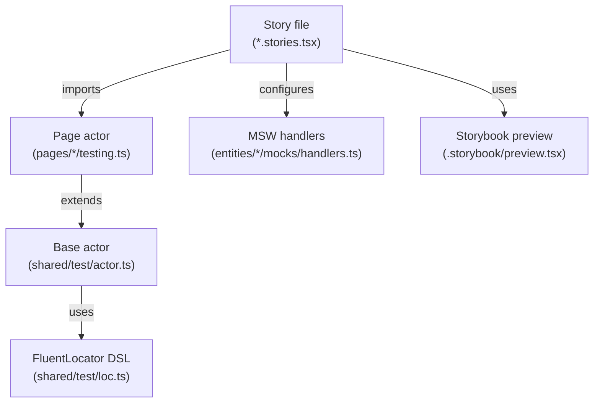

# E2E Testing Patterns: Actor + FluentLocator

A portable guide to the **codecept-style actor** and **fluent locator DSL** used for Storybook integration tests. Designed for AI agents writing tests in other projects.

## Core Philosophy

- Tests read like **user scenarios**, not DOM queries.
- The `I` object (the _actor_) is the only entry point for all interactions.
- Locators are **composable functions** with a fluent API for wait/maybe/all/within modifiers.
- No standalone `*.test.ts` files; all tests live inside Storybook stories.
- **Application-specific logic stays in the story file.** The story should spell out
  which buttons are pressed, which requests fail, and which logs are expected.
- Shared `testing.ts` helpers are for **system specifics only**:
  - shadow-root selectors
  - low-level DOM extraction
  - timer stabilization
  - browser and screenshot quirks
  - generic admin-shell controls like searching logs or clicking toolbar buttons
- Do **not** hide domain workflows in shared helpers. Avoid methods like:
  - `playWinningGame()`
  - `assertCheckoutRollbackFlow()`
  - `assertArticleLoaderFailureLogs()`

Instead, keep those steps inline in the story so future readers can understand
the application behavior without opening helper files.

## Architecture Overview



---

## 1. The Actor Pattern (`I.*`)

The actor is a codecept.js-inspired singleton that wraps all user interactions. Every test method is called through `I`, making tests declarative and self-documenting.

### Creating the base actor

```typescript
import { createActor } from 'shared/test'

const I = createActor()
```

### Initializing in a story

The actor **must** be initialized with the Storybook context via a `loaders` callback:

```typescript
const meta = preview.meta({
  title: 'Integration/Articles',
  component: App,
  parameters: { layout: 'fullscreen', initialPath: 'articles' },
  loaders: [(ctx) => void I.init(ctx)],
})
```

### Base actor methods

| Method             | Signature                              | Purpose                                                                |
| ------------------ | -------------------------------------- | ---------------------------------------------------------------------- |
| `I.see`            | `(locator) => Promise<HTMLElement>`    | Assert element is in the document                                      |
| `I.dontSee`        | `(fluentLocator) => Promise<void>`     | Assert element is **not** in the document (uses `.maybe()` internally) |
| `I.waitExit`       | `(fluentLocator) => Promise<void>`     | Poll until element disappears (uses `.maybe()` + `waitFor`)            |
| `I.click`          | `(locator) => Promise<void>`           | Click an element                                                       |
| `I.fill`           | `(locator, value) => Promise<void>`    | Clear + type into an input, then tab out                               |
| `I.clear`          | `(locator) => Promise<void>`           | Clear an input                                                         |
| `I.selectOption`   | `(locator, value) => Promise<void>`    | Click a select trigger, then click the matching option                 |
| `I.seeInField`     | `(locator, value) => Promise<void>`    | Assert an input has a specific value                                   |
| `I.scope`          | `(locator, callback) => Promise<void>` | Narrow all queries inside `callback` to a subtree                      |
| `I.resolveLocator` | `(locator) => Promise<HTMLElement>`    | Low-level: resolve a locator to a DOM element                          |

### Extending the actor with low-level helpers

Shared helpers may extend the actor, but only with low-level or cross-cutting
behavior. Keep business expectations out of them.

```typescript
import { createActor } from 'shared/test'

export const I = createActor().extend((actor) => ({
  clickAdminButton: async (name: string | RegExp) => {
    const target = Array.from(document.querySelectorAll('button')).find(
      (button) =>
        button instanceof HTMLButtonElement &&
        (typeof name === 'string'
          ? button.textContent?.includes(name)
          : name.test(button.textContent ?? '')),
    )
    if (!(target instanceof HTMLButtonElement)) {
      throw new Error(`Missing button ${String(name)}`)
    }
    await actor.click(() => target)
  },
}))
```

Then keep the application flow in the story itself:

```typescript
Default.test('plays the winning tic-tac-toe flow', async () => {
  await I.click(button('Top left cell'))
  await I.click(button('Middle left cell'))
  await I.click(button('Top center cell'))
  await I.click(button('Center cell'))
  await I.click(button('Top right cell'))

  await waitFor(() => {
    const logs = getVisibleLogs()
    expect(logs.map((log) => log.name)).toContain('winner')
    expect(logs.map((log) => log.content)).toContain('X')
  })
})
```

---

## 2. FluentLocator DSL

Locators are **callable objects** (functions with chainable methods). They are the only way to address elements.

### Factory functions

| Factory                 | Shorthand for               | Example                     |
| ----------------------- | --------------------------- | --------------------------- |
| `role(ariaRole, name?)` | `getByRole(role, { name })` | `role('button', 'Submit')`  |
| `text(value)`           | `getByText(value)`          | `text('Loading...')`        |
| `heading(name?)`        | `role('heading', name)`     | `heading('Dashboard')`      |
| `button(name?)`         | `role('button', name)`      | `button('Try again')`       |
| `link(name?)`           | `role('link', name)`        | `link(/Quarterly report/i)` |

All name arguments accept `string | RegExp`.

### Fluent modifiers

Each modifier returns a **new locator** (immutable chain):

| Modifier         | Effect                               | Underlying query prefix          |
| ---------------- | ------------------------------------ | -------------------------------- |
| _(none)_         | Synchronous, throws if missing       | `getBy*`                         |
| `.wait()`        | Retries until found (async)          | `findBy*`                        |
| `.maybe()`       | Returns `null` if missing (no throw) | `queryBy*`                       |
| `.all()`         | Returns `HTMLElement[]`              | `*AllBy*`                        |
| `.within(scope)` | Resolves inside a specific subtree   | scoped canvas                    |
| `.options(opts)` | Merge additional query options       | passed to underlying `*By*` call |

#### Modifier combinations

```typescript
role('listitem').all() // getAllByRole('listitem')
role('status', 'Loading ...').wait() // findByRole('status', { name: 'Loading ...' })
heading('Title').maybe() // queryByRole('heading', { name: 'Title' })
role('listitem').all().wait() // findAllByRole('listitem')
text('Done').all() // getAllByText('Done')
```

`.maybe()` + `.wait()` is **forbidden** (throws at build time).

### `.within()` scoping

Locators can be scoped to a DOM subtree via `.within()`. The scope argument can be:

- **A locator** (resolved first, then used as container):
  ```typescript
  text('No article selected').within(role('main'))
  ```
- **An HTMLElement** (captured from `I.see`):
  ```typescript
  const detail = await I.see(role('main'))
  await I.see(role('status', 'Loading article detail').within(detail))
  await I.dontSee(heading('Quarterly report').within(detail))
  ```
- **`'global'`** (escapes `I.scope` and searches from `document.body`):
  ```typescript
  role('option', value).within('global')
  ```

---

## 3. Stabilization Strategy

Async pages need stabilization before assertions. The primary mechanism is `I.waitExit`.

### Rule: wait for loading status to disappear

For any story that renders loaded content, add a `play` function:

```typescript
export const Default = meta.story({
  name: 'Default',
  play: () => I.waitExit(role('status')),
})
```

This waits until all `role="status"` elements (typically loading spinners) leave the DOM.

### When NOT to use `waitExit`

- **Loading-state stories** intentionally keep the spinner visible. Do **not** add `play: () => I.waitExit(...)` to them.
- **Detail requests triggered by user action**: click first, then `waitExit`, then assert:
  ```typescript
  await I.click(link(/Quarterly report/i))
  await I.waitExit(role('status'))
  await I.see(heading('Quarterly report'))
  ```

### When to use `.wait()`

Only for edge cases where `I.waitExit(role('status'))` does not apply:

```typescript
await I.see(role('status', 'Loading ...').wait())
```

---

## 4. Story Organization

### Naming conventions

| Variant              | Story name                                 | Test name prefix |
| -------------------- | ------------------------------------------ | ---------------- |
| Happy path (desktop) | `Default`                                  | _(none)_         |
| Happy path (mobile)  | `Default (Mobile)`                         | `[mobile]`       |
| Error state          | `<Feature> Load Server Error`              | _(none)_         |
| Error (mobile)       | `<Feature> Load Server Error (Mobile)`     | `[mobile]`       |
| Loading state        | `<Feature> Request Loading State`          | _(none)_         |
| Loading (mobile)     | `<Feature> Request Loading State (Mobile)` | `[mobile]`       |

### Story structure template

```typescript
import preview from '.storybook/preview'
import { App } from 'app/App'
import { featureList } from 'entities/feature/mocks/handlers'
import { featureActor as I } from 'pages/feature/testing'
import { button, heading, link, role, text } from 'shared/test'

const meta = preview.meta({
  title: 'Integration/Feature',
  component: App,
  parameters: { layout: 'fullscreen', initialPath: 'feature' },
  loaders: [(ctx) => void I.init(ctx)],
})

export default meta

// --- Happy path ---
export const Default = meta.story({
  name: 'Default',
  play: () => I.waitExit(role('status')),
})

Default.test('renders feature content', async () => {
  await I.see(heading('Feature heading'))
  await I.click(link(/Quarterly report/i))
  await I.waitExit(role('status'))
  await I.see(text('Quarterly report'))
})

// --- Mobile variant (reuse desktop params where possible) ---
export const DefaultMobile = meta.story({
  name: 'Default (Mobile)',
  globals: { viewport: { value: 'sm', isRotated: false } },
  play: () => I.waitExit(role('status')),
})

DefaultMobile.test('[mobile] renders feature content', async () => {
  await I.seeFeatureContent()
})

// --- Error variant ---
export const HandlesFeatureLoadServerError = meta.story({
  name: 'Feature Load Server Error',
  parameters: { msw: { handlers: { featureList: featureList.error } } },
  play: () => I.waitExit(role('status')),
})

HandlesFeatureLoadServerError.test('shows error state', async () => {
  await I.see(heading('Could not load feature'))
  await I.see(role('alert'))
  await I.click(button('Try again'))
})

// --- Error mobile (reuse error parameters) ---
export const HandlesFeatureLoadServerErrorMobile = meta.story({
  name: 'Feature Load Server Error (Mobile)',
  globals: { viewport: { value: 'sm', isRotated: false } },
  parameters: HandlesFeatureLoadServerError.input.parameters,
  play: () => I.waitExit(role('status')),
})

// --- Loading variant (no play/waitExit!) ---
export const KeepsLoadingWhenFeatureRequestNeverResolves = meta.story({
  name: 'Feature Request Loading State',
  parameters: { msw: { handlers: { featureList: featureList.loading } } },
})

KeepsLoadingWhenFeatureRequestNeverResolves.test(
  'keeps loading state for pending request',
  async () => {
    await I.seeLoading()
  },
)
```

---

## 5. MSW Mock Structure

Each entity exposes three handler variants:

```typescript
export const featureList = {
  default: http.get(url, async () => {
    await delay()
    return HttpResponse.json(mockData)
  }),
  error: http.get(url, () => to500()),
  loading: http.get(url, neverResolve),
}
```

| Variant    | Behavior                                                 |
| ---------- | -------------------------------------------------------- |
| `.default` | Successful response with realistic delay                 |
| `.error`   | Immediate 500 response                                   |
| `.loading` | Promise that never resolves (simulates infinite loading) |

Shared utilities in `shared/mocks/utils.ts`:

| Helper           | Description             |
| ---------------- | ----------------------- |
| `to400(msg?)`    | Throw HTTP 400          |
| `to404(msg?)`    | Throw HTTP 404          |
| `to500(msg?)`    | Throw HTTP 500          |
| `neverResolve()` | `new Promise(() => {})` |

Default handlers are aggregated centrally and loaded by Storybook preview. Stories override only specific handler keys via `parameters.msw.handlers`.

---

## 6. Scoping with `I.scope()`

`I.scope` narrows all locator resolution inside its callback to a specific DOM subtree:

```typescript
await I.scope(role('main'), async () => {
  await I.see(heading('Article Heading'))
  await I.see(text('Article content'))
})
```

Scopes can be nested (inner scope resolves relative to outer scope):

```typescript
await I.scope(role('main'), async () => {
  await I.scope(role('article'), async () => {
    await I.see(heading('Article Heading'))
    await I.dontSee(text('Section content'))
  })
  await I.see(text('Section content'))
})
```

Scope is **always restored** after the callback, even if it throws.

---

## 7. Responsive / Mobile Testing

Mobile stories set viewport globals and typically share parameters with their desktop counterpart:

```typescript
export const DefaultMobile = meta.story({
  name: 'Default (Mobile)',
  globals: { viewport: { value: 'sm', isRotated: false } },
  play: () => I.waitExit(role('status')),
})
```

To reuse desktop configuration:

```typescript
export const ErrorMobile = meta.story({
  name: 'Feature Load Server Error (Mobile)',
  globals: { viewport: { value: 'sm', isRotated: false } },
  parameters: ErrorDesktop.input.parameters,
  play: () => I.waitExit(role('status')),
})
```

---

## 8. Shared Locator Objects

For reusable locators, define a `loc` object alongside the actor:

```typescript
export const dashboardLoc = {
  heading: heading('Dashboard'),
  detailLoading: role('status', 'Loading connection detail'),
}
```

Import and use in tests:

```typescript
import {
  dashboardActor as I,
  dashboardLoc as loc,
} from 'pages/dashboard/testing'

await I.see(loc.heading)
```

---

## 9. Checklist: Adding a New Page Test

1. Create typed mock data in `entities/<entity>/mocks/data.ts`.
2. Add `default` / `error` / `loading` handlers in `entities/<entity>/mocks/handlers.ts`.
3. Register defaults in `app/mocks/handlers.ts`.
4. Create `pages/<page>/testing.ts` with page actor (`.extend(...)`) and optional `loc` object.
5. Create `app/integration/<Page>.stories.tsx` with **Default**, **Default (Mobile)**, **error**, and **loading** variants.
6. Add `play: () => I.waitExit(role('status'))` to all loaded-state and async error stories; omit it from persistent-loading stories.

---

## 10. Quick Reference Card

```typescript
// Locators
role('button', 'Submit') // by ARIA role + accessible name
text('Hello world') // by text content
heading('Dashboard') // shorthand for role('heading', ...)
button('Save') // shorthand for role('button', ...)
link(/Report/i) // shorthand for role('link', ...) with regex

// Modifiers
locator.wait() // async retry (findBy)
locator.maybe() // nullable (queryBy)
locator.all() // array (getAllBy / findAllBy)
locator.within(scopeOrElement) // restrict to subtree
locator.options({ level: 2 }) // extra query options

// Actor basics
await I.see(locator) // assert visible
await I.dontSee(locator) // assert absent
await I.waitExit(locator) // poll until gone
await I.click(locator) // user click
await I.fill(locator, 'text') // clear + type + tab
await I.scope(locator, fn) // narrow queries

// Stabilization
play: () => I.waitExit(role('status')) // story-level wait
await I.click(link(/Item/i)) // trigger navigation
await I.waitExit(role('status')) // wait for load
await I.see(heading('Item')) // assert result
```
