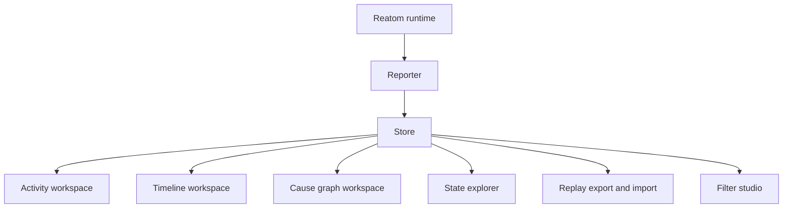

# @reatom/admin

Product-grade Reatom debugging workspace for live activity tracing and replay
analysis.

`@reatom/admin` turns the early tracing primitives in this repository into a
full investigation surface:

- live in-page devtools
- replayable exported sessions
- saved rules and reusable filter tags
- timeline analysis
- causal graph exploration
- state explorer and structured inspector panels

## What ships now



## Installation

```sh
npm install @reatom/admin
```

## Quick start

### Mount the full in-page devtools

```ts
import { createAdminDevtools } from '@reatom/admin'

const adminDevtools = createAdminDevtools({
  initVisibility: true,
  maxFrames: 20000,
  metadata: {
    app: 'checkout-web',
    environment: 'development',
  },
})
```

### Mount the admin application into your own host element

```ts
import { createAdminApp } from '@reatom/admin'

const target = document.getElementById('admin-root')!

const { admin, unmount } = createAdminApp(target, {
  maxFrames: 10000,
  metadata: {
    app: 'backoffice-console',
  },
})
```

## Core workflows

### 1. Live investigation

- open the **Activity** route
- search by atom name, state, params, or payload
- save reusable filter rules in the **Filter studio**
- inspect a frame to review:
  - structured state
  - payload / params
  - causal chain
  - recent history for the same atom

### 2. Replay analysis

- export a session from the header controls
- import it back as a replay
- continue working with the same:
  - activity feed
  - state explorer
  - timeline
  - causal graph

### 3. Filter curation

- create reusable **tags** from multiple predicates
- compose tags into nested **AND/OR** expressions
- save the result as a rule in one of four modes:
  - **show**
  - **hide**
  - **highlight**
  - **exclude**

## Product surfaces

### Activity workspace

- rich activity feed
- quick built-in filters
- structured inspector
- recent history view
- state explorer

### Timeline workspace

- bucket size controls
- zoom and offset controls
- focused bucket inspection
- jumps back into selected frames

### Cause graph workspace

- ancestor / descendant / full traversal
- depth limiting
- shortest path exploration
- synchronized frame selection

### Filter studio

- reusable saved rules
- nested expression editor
- custom predicate builder
- built-in quick tags for:
  - error
  - action
  - reactive
  - async
  - reject
  - fulfill

## Public API

```ts
import { createAdmin, createAdminApp, createAdminDevtools } from '@reatom/admin'
```

### `createAdmin(options?)`

Creates the full admin runtime without mounting a UI.

Useful when you want to drive the product from your own host shell or tests.

### `createAdminApp(target, options?)`

Mounts the product shell into a specific DOM element.

### `createAdminDevtools(options?)`

Creates the docked in-page devtools shell with resize, show, and hide
capabilities.

## Built-in test strategy

The package is designed to be tested with realistic user scenarios:

- unit tests for the reporter, store, filters, timeline, and graph
- Storybook interaction stories that simulate real debugging journeys
- browser scenario tests that validate:
  - layout geometry
  - responsive shell behavior
  - replay workflows
  - filter studio usability

## Repo root quickstart

From the workspace root, feature agents can use:

```sh
pnpm run admin:setup
pnpm run admin:storybook
pnpm run admin:test
```

`admin:setup` installs workspace dependencies and the Playwright Chromium
browser required by the Storybook and browser suites.

## Development scripts

```sh
pnpm --filter @reatom/admin storybook
pnpm --filter @reatom/admin test:unit
pnpm --filter @reatom/admin test:stories
pnpm --filter @reatom/admin test:browser
pnpm --filter @reatom/admin test
```
