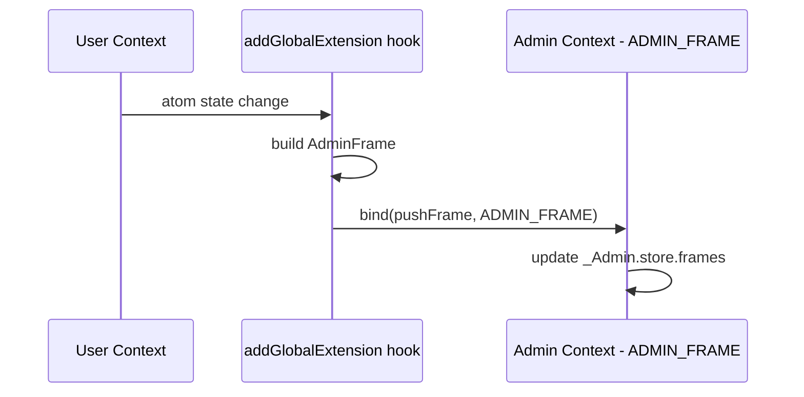

# @reatom/admin -- Technical Specification Document

## Vision

Two products built on shared infrastructure:

1. **Sentry Killer** -- remote error/event tracking dashboard that replays Reatom sessions from backend-stored logs
2. **Client Debugger** -- in-page devtools for live Reatom debugging during development

This TSD covers the **data layer (Epic 1)**: types, reporter, session, store, filters, timeline, cause graph, and public API. The view layer (Epic 2) will be planned separately.

---

## Architecture Overview

```mermaid
graph TB
  subgraph runtime [Reatom Runtime]
    Atoms[Atoms / Actions]
    GlobExt[addGlobalExtension]
  end

  subgraph admin [@reatom/admin]
    Reporter[Reporter]
    FrameStore[FrameStore - ring buffer]
    Session[Session Manager]
    Filters[Filter Engine]
    Timeline[Timeline / Analytics]
    CauseGraph[Cause Graph]
    PublicAPI[Public API - index.ts]
  end

  GlobExt -->|withMiddleware hook| Reporter
  Reporter -->|pushes AdminFrames + AdminAtoms| FrameStore
  Session -->|sessionId| Reporter
  FrameStore -->|AdminFrame array| Filters
  Filters -->|filtered + modes| Timeline
  Filters -->|filtered + modes| CauseGraph
  CauseGraph -->|graph nodes/edges| PublicAPI
  PublicAPI --> Reporter
  PublicAPI --> FrameStore
  PublicAPI --> Session
  PublicAPI --> Filters
  PublicAPI --> Timeline
  PublicAPI --> CauseGraph
```

The local debugger is simply the admin panel with the current session pre-selected and live updates enabled.

---

## Context Isolation (`src/root.ts`)

Reatom's core singletons (like `STACK`) are shared across the entire JS runtime. When a developer uses the admin devtools alongside their own app, the admin's internal atoms must NOT be captured by the admin's own reporter, and the admin's state must live in a separate context from user code.

This follows the same pattern established in `packages/devtools/src/root.ts`:

```ts
import { context } from '@reatom/core'

export const ADMIN_FRAME = context.start()
```

### How it works

1. `context.start()` creates a fresh isolated `RootState` with its own `Store` (WeakMap), queues, and frame. All admin-internal atoms created inside `ADMIN_FRAME.run(() => {...})` live in this separate store, invisible to the user's context.

2. The `addGlobalExtension` hook intercepts atoms/actions in the **user's** context. Inside the middleware, we use `bind(callback, ADMIN_FRAME)` to route captured data into the admin's context.

3. Admin atoms use the `_Admin.` prefix. The reporter's `addGlobalExtension` callback skips atoms with `_`-prefixed names via `isSkip()`, preventing infinite recursion.

4. `createAdmin()` wraps all internal setup in `ADMIN_FRAME.run(() => {...})`.



### Testing pattern

In tests, all admin modules are tested against the default global context (no `clearStack`, no `context.start`). Use `context.reset()` in `beforeEach` to ensure a clean slate:

```ts
import { context } from '@reatom/core'
import { beforeEach } from 'vitest'

beforeEach(() => {
  context.reset()
})
```

Each `createAdmin()` call in tests creates a fresh `ADMIN_FRAME` internally, so admin state is also fresh.

---

## Core Types (`src/types.ts`)

### AdminAtom

Serializable representation of a real atom/action. Registered once per unique atom, referenced by ID from AdminFrames.

```ts
interface AdminAtom {
  id: string
  name: string
  isReactive: boolean
}
```

The reporter maintains a `WeakMap<AtomLike, string>` to map runtime atoms to `AdminAtom.id`. Each unique atom is registered once; all its frames reference the same `AdminAtom.id`.

### AdminFrame

Serializable snapshot of a single frame execution. Uses ID-based links instead of object references.

```ts
interface AdminFrame {
  id: number
  timestamp: number
  sessionId: string
  atomId: string
  state: unknown
  error: unknown | null
  params: Array<unknown> | undefined
  payload: unknown | undefined
  pubIds: Array<number>
}
```

`pubIds` stores IDs of dependency AdminFrames, making the causal graph fully serializable. This mirrors how `Frame.pubs` works in core but uses numeric references. `atomId` references an `AdminAtom` for metadata lookup.

### AdminSession

```ts
interface AdminSession {
  id: string
  startedAt: number
  metadata: Record<string, unknown>
}
```

### Filter Types

```ts
type FilterTarget = 'name' | 'state' | 'params' | 'payload'

interface FilterPredicate {
  id: string
  type: 'text' | 'timeRange' | 'error' | 'cause' | 'session' | 'regex'
  target?: FilterTarget
  value: unknown
}

type CauseDirection = '>' | '<'

interface CausePredicate extends FilterPredicate {
  type: 'cause'
  direction: CauseDirection
  referencePattern: string
}

interface FilterTag {
  id: string
  name: string
  predicates: Array<FilterPredicate>
  builtIn: boolean
}

type LogicalOperator = 'AND' | 'OR'

interface FilterGroup {
  operator: LogicalOperator
  children: Array<FilterTagRef | FilterGroup>
}

interface FilterTagRef {
  tagId: string
  negated: boolean
}

type FilterMode = 'show' | 'hide' | 'highlight' | 'exclude'

interface FilterConfig {
  id: string
  expression: FilterGroup
  mode: FilterMode
}
```

Filter modes:

- **show**: only show matched frames
- **hide**: hide matched, show everything else
- **highlight**: show all, visually mark matched
- **exclude**: remove from datasource entirely (performance optimization)

### Cause Graph Types

```ts
interface CauseGraphNode {
  frameId: number
  atomId: string
  depth: number
}

interface CauseGraphEdge {
  fromFrameId: number
  toFrameId: number
}

interface CauseGraph {
  nodes: Array<CauseGraphNode>
  edges: Array<CauseGraphEdge>
  rootFrameId: number
}
```

---

## Reporter (`src/reporter/`)

Hooks into the runtime via `addGlobalExtension`, captures structured `AdminFrame` objects instead of console output.

- Uses `withMiddleware` to intercept atom/action calls in the user's context
- Uses `bind(callback, ADMIN_FRAME)` to route captured data into the admin's isolated context
- Captures `state`, `error`, `params`, `payload` from the middleware
- Maintains a `WeakMap<AtomLike, string>` to register `AdminAtom` entries on first encounter
- Resolves `pubIds` by maintaining a `WeakMap<Frame, number>` mapping runtime frames to AdminFrame IDs
- Uses `isSkip()` to ignore private atoms (`_`-prefixed)
- All admin-internal atoms use `_Admin.` prefix to avoid self-recording
- All internal atom creation happens inside `ADMIN_FRAME.run(() => {...})`
- Fires an `onFrame` callback for each captured frame (transport hook)
- Supports `match` filter for selective recording
- `dispose()` removes the global extension

### Reporter public API

- `_Admin.reporter.atoms` -- atom: `Map<string, AdminAtom>` registry of all seen atoms
- `_Admin.reporter.frames` -- ring buffer atom
- `_Admin.reporter.paused` -- boolean atom
- `_Admin.reporter.clear` -- action
- `_Admin.reporter.dispose` -- action
- `_Admin.reporter.onFrame` -- action (fires per frame)

---

## Session Manager (`src/session/`)

- `_Admin.session.current` -- atom holding `AdminSession`
- `_Admin.session.id` -- computed, extracts `current().id`
- `_Admin.session.start` -- action, creates a new session with UUID + timestamp
- Auto-starts on reporter init

---

## Frame Store (`src/store/`)

Central data management, works with both live reporter data and imported sessions.

- `_Admin.store.frames` -- atom: the master `Array<AdminFrame>` (from reporter or imported)
- `_Admin.store.maxFrames` -- atom: ring buffer capacity (default 10000)
- `_Admin.store.importSession` -- action: loads frames from JSON, tags with session ID
- `_Admin.store.exportSession` -- computed/action: serializes current frames + session metadata
- `_Admin.store.source` -- atom: `'live' | 'replay'`
- `_Admin.store.selectedFrameId` -- atom: currently selected frame ID or null
- `_Admin.store.selectedFrame` -- computed: resolved AdminFrame
- `_Admin.store.uniqueNames` -- computed: distinct atom names
- `_Admin.store.timeRange` -- computed: `[min, max]` timestamps
- `_Admin.store.frameIndex` -- computed: `Map<number, AdminFrame>` for O(1) lookup by ID

---

## Filter System (`src/filters/`)

### Predicates (`predicates.ts`)

Pure functions that test a single `AdminFrame` against a `FilterPredicate`:

- `matchText(frame, text, target, atomRegistry)` -- substring match in name/state/params/payload depending on `FilterTarget`
- `matchRegex(frame, pattern, target, atomRegistry)` -- regex match against the chosen target
- `matchTimeRange(frame, start, end)` -- timestamp within range
- `matchError(frame, atomRegistry)` -- has error AND is not an abort error; also match `.onReject` actions
- `matchCause(frame, direction, referencePattern, frameIndex, atomRegistry)` -- traverse `pubIds` graph:
  - `>` means "caused by": walk the `pubIds` of `frame` recursively, check if any ancestor matches `referencePattern`
  - `<` means "caused": find frames whose `pubIds` contain `frame.id` (reverse lookup)
- `matchSession(frame, sessionId)` -- session ID equality

### Tags (`tags.ts`)

Named, saveable filter presets:

- `_Admin.filters.tags` -- atom: `Array<FilterTag>`
- `_Admin.filters.createTag` -- action: creates a new named tag from predicates
- `_Admin.filters.updateTag` -- action
- `_Admin.filters.deleteTag` -- action
- Built-in tags (non-deletable):
  - `"error"`: matches `.onReject` actions (excluding abort errors)

### Expression (`expression.ts`)

Builds and evaluates logical expressions from tags:

- `_Admin.filters.expression` -- atom: the current `FilterGroup`
- `_Admin.filters.setExpression` -- action
- `evaluateExpression(frame, expression, tags, frameIndex)` -- recursive evaluator

### Engine (`engine.ts`)

Applies filter configs to the frame array:

- `_Admin.filters.configs` -- atom: `Array<FilterConfig>` (multiple configs coexist)
- `_Admin.filters.addConfig` -- action
- `_Admin.filters.removeConfig` -- action
- `_Admin.filters.updateConfig` -- action
- `_Admin.filters.activeDataSource` -- computed: frames after `exclude`-mode configs
- `_Admin.filters.visibleFrames` -- computed: frames after `show`/`hide` configs
- `_Admin.filters.highlightedIds` -- computed: `Set<number>` matched by `highlight` configs
- Session ID filter is implicitly always active (cannot be disabled)

### Search (`search.ts`)

- `_Admin.filters.searchQuery` -- atom: string
- `_Admin.filters.searchTarget` -- atom: `FilterTarget | 'all'`
- `_Admin.filters.searchResults` -- computed: frames matching search within `visibleFrames`

---

## Timeline & Analytics (`src/timeline/`)

- `_Admin.timeline.bucketSize` -- atom: ms per bucket
- `_Admin.timeline.buckets` -- computed: frames bucketed by time intervals
- `_Admin.timeline.zoom` -- atom: zoom level
- `_Admin.timeline.offset` -- atom: scroll offset timestamp
- `_Admin.timeline.visibleRange` -- computed: `[start, end]` timestamps
- `_Admin.timeline.frameGroups` -- computed: cluster frames that share the same timestamp (same transaction)

---

## Cause Graph (`src/cause-graph/`)

Dedicated module for building and querying causal relationship graphs. Powers a separate screen visualizing how frames connect through `pubIds` dependency chains.

### Pure Functions

- `buildAncestorGraph(frameId, frameIndex, atomRegistry)` -- walks `pubIds` upward recursively
- `buildDescendantGraph(frameId, frames, frameIndex, atomRegistry)` -- finds downstream effects
- `buildFullGraph(frameId, frames, frameIndex, atomRegistry)` -- combines ancestor + descendant
- `findPath(fromFrameId, toFrameId, frameIndex)` -- BFS shortest causal path

### Reactive State

- `_Admin.causeGraph.selectedRootId` -- atom: root frame ID for exploration
- `_Admin.causeGraph.direction` -- atom: `'ancestors' | 'descendants' | 'full'`
- `_Admin.causeGraph.graph` -- computed: `CauseGraph` from root + direction
- `_Admin.causeGraph.depthLimit` -- atom: max traversal depth
- `_Admin.causeGraph.pathFrom` -- atom: second frame ID for path-finding
- `_Admin.causeGraph.path` -- computed: shortest path or null

---

## Public API (`src/index.ts`)

```ts
interface AdminOptions {
  maxFrames?: number
  metadata?: Record<string, unknown>
  match?: (name: string) => boolean
  onFrame?: (frame: AdminFrame) => void
}

function createAdmin(options?: AdminOptions): Admin

interface Admin {
  reporter: { atoms, frames, paused, clear, dispose, onFrame }
  session: { current, id, start }
  store: { frames, importSession, exportSession, selectedFrameId, ... }
  filters: { tags, configs, expression, visibleFrames, highlightedIds, searchQuery, ... }
  timeline: { buckets, zoom, offset, visibleRange, ... }
  causeGraph: { selectedRootId, direction, graph, depthLimit, pathFrom, path }
  dispose: () => void
}
```

---

## Dependencies

- `@reatom/core` -- atoms, actions, addGlobalExtension, withMiddleware, isAbort, Frame, AtomLike
- `vitest` -- test runner (unit config for `.test.ts`)

---

## File Structure

```
packages/admin/
  src/
    root.ts
    types.ts
    reporter/
      index.ts
      index.test.ts
    session/
      index.ts
      index.test.ts
    store/
      index.ts
      index.test.ts
    filters/
      predicates.ts
      predicates.test.ts
      tags.ts
      tags.test.ts
      expression.ts
      expression.test.ts
      engine.ts
      engine.test.ts
      search.ts
      search.test.ts
      index.ts
    timeline/
      index.ts
      index.test.ts
    cause-graph/
      index.ts
      index.test.ts
    index.ts
  vitest.config.ts
  vitest.browser.config.ts
  package.json
  tsconfig.json
  TSD.md
```
