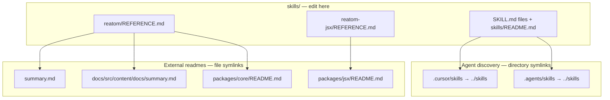

# Reatom agent skills

## Repository layout

**Edit only `skills/`.** Every other skills path and several external readmes are symlinks to files here.



| Path | Role |
|------|------|
| `skills/` | Canonical skill files — **only edit here** |
| `.cursor/skills/` | Symlink → `skills/` (Cursor discovery) |
| `.agents/skills/` | Symlink → `skills/` (Codex discovery) |

| Symlink | Points to |
|---------|-----------|
| `summary.md` | `skills/reatom/REFERENCE.md` |
| `docs/src/content/docs/summary.md` | `skills/reatom/REFERENCE.md` |
| `packages/core/README.md` | `skills/reatom/REFERENCE.md` |
| `packages/jsx/README.md` | `skills/reatom-jsx/REFERENCE.md` |

**Do not diff, merge, or sync symlink targets.** Paths like `summary.md` and `packages/core/README.md` are the same content as `skills/reatom/REFERENCE.md`. Comparing them wastes time and tokens.

---

Agent skills for [Reatom v1001](https://v1001.reatom.dev). Install with the [skills CLI](https://skills.sh/):

```bash
# All skills
npx skills add reatom/reatom

# Individual skills
npx skills add reatom/reatom --skill reatom
npx skills add reatom/reatom --skill reatom-async
npx skills add reatom/reatom --skill reatom-jsx
npx skills add reatom/reatom --skill reatom-review
```

| Skill           | Bundled reference                                                  |
| --------------- | ------------------------------------------------------------------ |
| `reatom`        | `REFERENCE.md` — compact v1001 API reference                       |
| `reatom-async`  | `REFERENCE.md` — async flows, cancellation, sampling, and Suspense |
| `reatom-jsx`    | `REFERENCE.md` — `@reatom/jsx` package docs                        |
| `reatom-review` | review checklist (loads `reatom` skill for API reference)          |

Full docs: [v1001.reatom.dev](https://v1001.reatom.dev)
